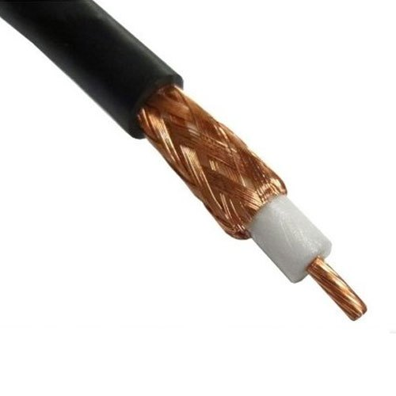

```
Autor: Mina Krivokuća
Februar 2021.

Skripta je pisana na osnovu snimaka predavanja prof. dr Aleksandra Kartelja i prezentacija.
```

- [Uvod u računarske mreže](#uvod-u-računarske-mreže)
  - [Počeci, širenje](#počeci-širenje)
  - [O računarskim mrežama](#o-računarskim-mrežama)
  - [Primeri upotreba mreža](#primeri-upotreba-mreža)
  - [Komunikacija](#komunikacija)
  - [1. Komponente mreže, tipovi veza, primeri mreža, mreže prema dimenziji, međumreže](#1-komponente-mreže-tipovi-veza-primeri-mreža-mreže-prema-dimenziji-međumreže)
      - [Komponente mreže](#komponente-mreže)
      - [Tipovi veze](#tipovi-veze)
      - [Primeri mreža](#primeri-mreža)
      - [Podela prema dimenziji](#podela-prema-dimenziji)
  - [Mreža-aplikacija interfejs](#mreža-aplikacija-interfejs)
  - [2. Protokoli i slojevi](#2-protokoli-i-slojevi)
  - [3. Referentni modeli protokola i slojeva, jedinice podataka, organizacije za standarde](#3-referentni-modeli-protokola-i-slojeva-jedinice-podataka-organizacije-za-standarde)
      - [Referentni modeli protokola i slojeva](#referentni-modeli-protokola-i-slojeva)
      - [Organizacije za standarde](#organizacije-za-standarde)
      - [Jedinice podataka](#jedinice-podataka)
- [Fizički sloj](#fizički-sloj)
  - [4. Uloga fizičkog sloja, pojednostavljen model, kašnjenja, BDP, primeri](#4-uloga-fizičkog-sloja-pojednostavljen-model-kašnjenja-bdp-primeri)
      - [Uloga](#uloga)
      - [Pojednostavljen model](#pojednostavljen-model)
      - [Kašnjenje](#kašnjenje)
      - [Primeri računanja kašnjenja](#primeri-računanja-kašnjenja)
      - [BDP - Bandwith-Delay Product](#bdp---bandwith-delay-product)
      - [BDP primer](#bdp-primer)
  - [5. (Žičani i optički) komunikacioni medijumi](#5-žičani-i-optički-komunikacioni-medijumi)
      - [Uvod](#uvod)
      - [Žičani komunikacioni medijumi](#žičani-komunikacioni-medijumi)
      - [Optički komunikacioni medijumi](#optički-komunikacioni-medijumi)
  - [6. Bežični komunikacioni medijumi](#6-bežični-komunikacioni-medijumi)
  - [Bežične ili žičane komunikacije - šta koristiti?](#bežične-ili-žičane-komunikacije---šta-koristiti)
  - [Komunikacioni sateliti](#komunikacioni-sateliti)


<div style="page-break-after: always"></div>


# Uvod u računarske mreže 

## Počeci, širenje

**Projekat Arpanet, 1970.** - Amerika, američka vojna agencija Darpa. Projekat je imao za cilj da stvori pouzdanije sisteme komunikacije od fiksne telefonije koje bi koristili tokom nezgodnih situacija. Motivacija je bila Hladni rat i strah od presečenih komunikacija - jer je fiksna telefonija bazirana na konceptu drveta i potpuno je hijerarhijska. Izbacivanjem nekog unutrašnjeg čvora ili grane drvo se preseca na dva dela. Takav sistem je bio relativno jednostavan za implementaciju i instalaciju, ali je predstavljao veliki problem u pouzdanosti i slabu tačku u situacijama gde je komunikacija i blagovremena sinhronizacija bila ključna. 

Ideja novog sistema nije bila previše deterministička - grafovi komunikacije nisu izgledali kao da su planirani, već su podsećali na slučajne grafove (princip: dodaj granu tamo gde misliš da treba, pravile su se prečice tamo gde se osećala potreba). Ideja je prvo prihvaćena od strane univerziteta u Americi, naučnicima se dopala ideja stalne međusobne komunikacije. Najpoznatiji softver koji je korišćen za pristup udaljenom čvoru je Teolnet (?). Najveća motivacija za širenje je bila laka dostupnost udaljenih baza znanja i informacija. Kao druga "aplikacija" pojavljuje se mejl.

<p align="center">
  
</p>

Na slici iznad je površna ilustracija izgleda Internet mreže 2005. godine. Ono što je jasno je da izgleda poprilično haotično i puna redudantnosti - što za nas znači da je razbijanje mreže na više delova presecanjem komunikacija značajno teže. Čvorovi koji deluju izolovaniji i manje povezani sa ostalima nisu nužno loše isplanirani - već su pre čvorovi koji pripadaju nekim vladinim organizacijama, vojsci, itd. Ovakvi čvorovi često imaju sisteme nezavisne komunikacije i za njih je bitno da budu i fizički udaljeni od ostalih, pored korišćenja drugačijih softvera i sistema enkripcije i zaštite.


## O računarskim mrežama

Vrlo složena i raznorodna računarska disciplina - zahteva ekspertizu različitih struka: fizičara, elektrotehničara, tehnologa, matematičara, hemičara, programera... Teško ih je učiti na monolitni način. 

* **Fizički sloj** - prenos signala, medijumi (komunikacija oprema, kablovi, hardver), teorija signala, bežični i žični prenos, optički kablovi, komunikacioni sateliti, sistem mobilne telefonije, kablovske televizije. Fizički sloj **se bavi omogućavanjem prenosa bitova između dve povezane tačke.**
* **Sloj veze podataka** - nadograđuje se na fizički sloj. Svaki naredni sloj koristi usluge prethodnog, i nijedan sloj ne mora da razmišlja o problemima koje je rešio prethodni. Sloj veze podataka koristi sistem za prenos bitova između tačaka koji je obezbedio fizički sloj (point to point protokol), a onda dodaje tom sistemu neke aspekte koji bi mu povećali pouzdanost i efikasnost. Konkretno, grupisaće bitove na određen način jer nema toliko smisla raditi nad pojedinačnim bitovima, pa se nad tim grupama bitova softverski vrši detekcija i korekcija grešaka. Dakle, podizanje pouzdanosti prenosa softverskim putem. Možemo zaključiti da je realan scenario u praksi da je fizički sloj loše implementiran (žice nisu dobro izolovane od šuma npr.), ali da se softverskim algoritmima to može ispraviti. Osim što povećava pouzdanost point to point komunikacije, sloj veze podataka povećava i njenu efikasnost, npr. postoje situacije u kojima jedna strana šalje drugoj veće količine podataka za koje druga strana nema odgovarajući softver da prihvati, što se rešava na nivou sloja veze podataka. Sloj veze podataka **isporučuje narednim slojevima pouzdan i efikasan sistem za prenos podataka između dve povezane tačke**.
* **Podsloj za upravljanje pristupom medijumima** - u slučaju nepostojanja point to point protokola, već je n korisnika povezano u neku topologiju mreže, tj. nije jasno ko šta kome šalje i kada šalje (moguće je da je medijum zauzet u trenutku kada se poruka šalje). Ovaj podsloj je tehnološki prevaziđen (zastareo) i danas postoje drugi načini za rešavanje ovakvih problema. U ovom podsloju je bitna upotreba MAC adrese (hardverski identifikator uređaja u lokalnoj mreži).
*  **Mrežni sloj** - koristi usluge sloja veze. Od ovog sloja pa nadalje radi se samo softverski. Dosta je apstraktniji od prethodnih slojeva i manje je opterećen elektrotehničkim detaljima. Na mrežnom sloju su ruteri. Glavna uloga mrežnog sloja (tj. rutera generalno) je da odredi optimalnu putanju u mreži kojom će se kretati paketi. Ovakav algoritam ne sme da bude centralizovan jer ukoliko bi postojali ruteri koji bi vršili usluge rutiranja za druge, ubrzo bi baš oni postali usko grlo (eng. *bottleneck*) jer bi većina zahteva stizalo upravo do njih, i odlazilo od njih. Ovakvi ruteri su prirodno distribuirani geografski i nalaze se relativno blizu svojih korisnika. Postoje ruteri i udaljeniji od krajnjeg korisnika, a oni služe uglavnom za povezivanje sa većim brojem sledećih rutera. Jedan ruter može da zna trenutno koja je najbolja putanja za paket koji mu je pristigao, ali ne može da naređuje drugim ruterima kako će dalje da ga rutiraju. Potrebno je implementirati odluke rutera tako da se odluka trenutnog poklapa sa odlukom koju bi doneo sledeći ruter u putanji ("razmišljaj globalno, deluj lokalno"). Mrežni sloj **se generalno bavi algoritmima rutiranja, upravljanja zagušenjem i povezivanjem različitih mreža**.
*  **Transportni sloj** - najveći sloj, najveći napor uložen u ovaj sloj. Transportni sloj omogućava da krajnje tačke nisu sami računari, već uvodimo novi logički nivo - procese. Cilj transportnog sloja je da **apstrahuje komunikaciju između dva procesa na takav način da mi kao korisnici ne razlikujemo komunikaciju između dva procesa na istom računaru, i dva procesa na različitom računaru (ako se izuzme kašnjenje)**. TCP/UDP protokoli.
*  **Aplikativni sloj** - koristi usluge transportnog sloja. Protokoli višeg nivoa. Potreba da se stvari koje se koriste na isti način definišu i automatizuju (mejl npr.). Definiše protokole za komunikaciju između aplikacija kao što su HTTP, FTP, i slično.

</br>

## Primeri upotreba mreža

* Poslovna - razmena datoteka, deljeni resursi (npr. štampači), sredstvo komunikacije (mejl, video konferencije), poslovne transakcije elektronskim putem, poslovanje sa potrošačima preko Interneta...
* Kućna - prostupanje udaljenim informacijama (filmovi, muzika, vesti, audio, video), razmena poruka, elektronska kupovina...
* Mobilna - pozivi, SMS, igrice, mape, pristup informacijama...

## Komunikacija

**Analogna komunikacija** - u kablovima za prenos nije ugrađeno prepoznavanje diskretnih brojeva (bajtova), već se radi sa kontinualnim zapisom preslikanom na promene napona. Na primer, ako hoćemo da prenesemo zvuk kao poruku između dva udaljena uređaja, taj zvuk se transformiše u promene napona, one prolaze kroz žicu i na drugoj strani postoji dekoder koji rekonstruiše originalni zvuk na osnovu promena napona.

S druge strane **digitalna komunikacija** je zasnovana na međuformatu i postoji više konverzija. Prvo analizator zvuka prevodi zvuk u neke brojeve (analogno-digitalna konverzija), brojeve šaljemo kroz mrežu i ti brojevi se čuvaju preko nekih flip flopova (digitalno-analogna konverzija), ponovo se dekodira u brojeve na drugoj strani (analogno-digitalna konverzija), pa nakon toga dekoder ponovo rekonstruiše zvuk na osnovu dobijenih brojeva (digitalno-analogna konverzija). Zaključak - konverzija se dešava više puta u oba smera. 

Može biti između dva čoveka, između čoveka i računara i između dva računara.

* **VoIP** - komunikacija između dva čoveka. Pozivi preko Interneta. Naziv VoIP je malo zastareo, pošto danas podrazumeva i slanje videa i video-pozive, ali se tradicionalno i dalje naziva VoIP. Vid je digitalne komunikacije. Razlika između mobilne telefonije i VoIP-a je što informacije putuju različitim kanalima - VoIP koristi Internet, a mobilna telefonija ima svoje kanale. Potrebno je obezbediti da paketi u VoIP-u što manje kasne, kao i da stignu ispravnim redosledom. Ređanje paketa ispravnim redosledom može dodatno povećati kašnjenje, pa se nekad preskaču paketi koji ne stignu na vreme, što dovodi do čudnih zvukova ili seckanja. Na velikim udaljenostima (npr. Srbija-Australija) se oseća kašnjenje i do par stotina milisekundi.
* **Deljenje resursa** - ekonomičan i logičan koncept, nikome ne treba sve vreme sve što poseduje. Ovo može da se odnosi i na deljenje štampača u okviru firme, a i na deljenje računarskih resursa (memorije, procesorske snage, diska, protoka...). Ne koriste svi sve resurse u isto vreme - što znači da bismo sa mnogo manjom procesorskom snagom mogli da opskrbimo više korisnika nego što bi bilo potrebno snage kada bi svako imao svoju zasebnu procesorsku jedinicu. Postoji šansa da se resursi preopterete ako ih svi korisnici okupiraju u isto vreme, ali to se statistički retko dešava kada se lepo procene potrebe korisnika. Dakle, ideja je da se obezbede isti resursi koje bi PC obezbedio istom broju korisnika, ali sa mnogo manje iskorišćene električne struje. Sistemi koji isporučuju te resurse su klaud sistemi, i njihova potrošnja električne struje je ogromna, ali je u svakom slučaju manja od potencijalne sume potrošene električne struje od strane svakog korisnika ponaosob u scenariju gde svako koristi samo svoje resurse. Nekada je postojala ideja o centralizovanim računarima u budućnosti gde bi svako kod kuće imao samo terminal, a koristio resurse udaljenog računara, ali nije zaživela. 

`Statističko multipleksiranje - deljenje mrežnog protoka među korisnicima na osnovu statistike zahteva. Potrebno je da znamo informacije
o raspodeli upotrebnih navika tog resursa krajnjih korisnika. 
Primer su Internet provajderi i korisnici u ISP mreži. Ako mreža ima protok od 100 Mbps, a svaki korisnik je aktivan samo 50% vremena, da li je zaista ova mreža može da podrži samo 20 korisnika, ili je to znatno veći broj? Pojednostavljena varijanta - imamo informacije o verovatnoći da kompletan protok bude iskorišćen. Binomnom raspodelom se može izračunati da čak i za 30 nezavisnih kosnika, šanse da će biti potrebno više od 100Mbps su i dalje jako male (2%). Dobit u ovom slučaju je 1.5x.`

<p align="center">
  
</p>

* **Dostavljanje sadržaja (content delivery)** - potreba da dostavimo neki nepromenljiv sadržaj većem broju korisnika. Trošak se uglavnom meri nekom funkcijom koja direktno zavisi od broja skokova sa čvora na čvor u mreži. Ako je svakoj grani dodeljena težina 1, za skokove kažemo da su hopovi. Ukoliko bi sadržaj putovao od izvora do svakog korisnika ponaosob, broj hopova je značajno veliki. Dakle, ideja je da se naprave kopije sadržaja u nekim čvorovima kako bi se smanjila dužina putanje kojom sadržaj putuje. Kako to izgleda:


<p align="center">
  
</p>

* **Komunikacija između računara** - elektronsko poslovanje, rezervacija karata, itd. Omogućava automatsku obradu informacija nad nezavisnim sistemima.
* **Povezivanje računara sa uređajima** - razvoji senzora, očitavanje informacija sa njih. Područje primene u konstantnom razvoju (IoT - Internet of Things, pametni uređaji), zahteva jake mrežne resurse. Npr. frižider koji čita vlažnost i temperaturu, smart satovi. 


**Vrednost povezivanja** - Metkalfov (čovek koji je osmislio Ethernet) zakon, 1980. Vrednost mreže sa N čvorova je proporcionalna vrednosti N<sup>2</sup>. Velika mreža je vrednija nego više malih sa istim ukupnim brojem čvorova, to jest, veze su te koje nose informativnost, a ne čvorovi.

<p align="center">
  
</p>

## 1. Komponente mreže, tipovi veza, primeri mreža, mreže prema dimenziji, međumreže

#### Komponente mreže

Mreže se sastoje iz čvorova, veza i aplikacija. 

<p align="center">
  
</p>


Listovi (krajnji računari) mogu biti krajnji korisnici ili serverski računari, a unutrašnji čvorovi ruteri. Mi se bavimo ruterima (i sličnim uređajima koji su unutrašnji čvorovi, pomenućemo kasnije). 


<p align="center">
  
</p>

1. **Aplikacija**, korisnik - koristi mrežu (Skype, iTunes, Amazon)
2. **Završni čvor**, računar, serverski računar, izvor, uređaj - podržava aplikaciju (laptop, mobilni telefon, dekstop računar)
3. **Ruter** ili usmerivač, unutrašnji čvor - prosleđuje poruke između čvorova (pristupna tačka, kablovski/DSL modem)
4. **Veza** ili kanal - spaja čvorove (žične, bežične)

#### Tipovi veze

Podela po smeru toka informacija:

* Simpleks veza - jednosmerna, nema povratnih informacija. Primer: televizor.
* Polu-dupleks - moguća komunikacija u oba smera, ali ne istovremeno. Primer: voki-toki, radio stanice. Koristi se jedan frekvencioni opseg za slanje i primanje, što znači da se istovremenim korišćenjem signali mogu izmešati i nastao bi neki signal koji nije preterano koristan.
* Puni dupleks - moguća komunikacija u oba smera istovremeno. Primer: mobilna telefonija (istovremeno pričanje) ili mogućnost downloada/uploada istovremeno. Koristi se frekvenciona podela. 

Podela po mobilnoj fleksibilnosti:

* Bežične - na ovom predmetu mislimo na mreže u kojima ne postoji tačno određen smer (vektor) u kom se šalju poruke (za razliku od lasera npr. koji je usmeren), već se one emituju. Prihvataju je svi čvorovi u opsegu. Korisnik može da se kreće i da i dalje ne izgubi vezu, što ne bi bilo moguće da je veza usmerena.
* Žične 

#### Primeri mreža

- WiFi - bežična tehnologija, lokalna mreža
- Ethernet - žična tehnologija, lokalna mreža
- ISP mreže - mreža provajdera/usluge, nešto su veće, obuhvataju veće regije
- Kablovska/DSL
- Mobilna telefonija (2G, 3G, 4G, 5G)
- Bluetooth

#### Podela prema dimenziji

| Tip | Dimenzija | Primer |
|-----|-----------|--------|
| PAN (Personal Area Network) | neposredna blizina | Bluetooth |
| LAN (Local Area Network) | kancelarija, sprat, zgrada | WiFi, Ethernet |
| MAN (Metropolitan Area Network) | grad | kablovska, DSL|
| WAN (Wide Area Network) | država | veliki ISP, npr. Telekom, SBB |
| Internet (mreža svih mreža) | planeta | Internet |


**Međumreža ili Internet**, se dobija povezivanjem više različitih mreža. Međumreža je bilo koja heterogena mreža, tj. mreža koja se sastoji iz podmreža koje imaju jasnu razliku u tehnologiji izrade, topologiji i drugim aspektima. Hibrid različitih mreža.  
**Internet** (velikim slovom) je Internet koji svi koristimo. Međumreža.


## Mreža-aplikacija interfejs

Utvrđeno dobri načini organizovanja mreža. Apstraktni sloj, model upotrebe mreže iz aspekta transportnog sloja. Softverske apstrakcije na mreži.

**Klijent-server koncept upotrebe (model)**

Zasniva se na tome da imamo računare koji nude neke usluge, i računare koji zahtevaju neke usluge. Serveri su obično hardverski bolje i naprednije mašine kako bi mogli da usluže veći broj klijenata (zahteva) istovremeno. Najveći deo posla se izvršava na serveru, dok se na klijentu izvršava samo prikaz (grafički deo). Dakle, aplikacije implementirane na klijentu nemaju nešto specijalnu/naprednu logiku, dok se na serveru dešavaju algoritmi koji zahtevaju jaku procesorsku moć. 

Da bi klijent-server model funkcionisao, potrebno je da klijent-server sa implementacijom ne ide do nivoa bitova, priča direktno sa fizičkim slojem ili karticom, već će pričati sa slojem ispod - transportnim slojem, i koristi njegove usluge, tj. sokete. Socket API je programski interfejs - objekat - koji ima dupleks, tj. tokove podataka (input i output stream). To je mrežni API koji se koristi za pisanje svih Internet aplikacija i deo je svih poznatijih operativnih sistema. Soket postoji sa obe strane konekcije, i sa klijentske i sa serverske strane, i oba imaju odlazni i dolazni tok podataka. Socket API omogućava da se ostvari konekcija sa suprotnom stranom ne razmišljajući o aspektima ispod - bitovima, korekciji i detekciji grešaka, brzini slanja i primanja, itd. Soketi su vrlo univerzalan način razmišljanja koji se može posvetiti sa načinom komuniciranja između dva procesa. Dakle, ako bi dva procesa na istom računaru ostvarila komunikaciju, to bi izgledalo isto kao i korišćenje Socket API-ja za povezivanje na udaljeni računar. Output stream iz servera je zakačen za input stream klijenta, i obrnuto. Omogućena je pouzdana komunikacija u oba smera.

Za strimove su zakačene različite metode, nesimetrične jer se prirodno klijent i server ne ponašaju isto. Server se ponaša pasivno, a klijent aktivno. Klijent inicira komunikaciju, a server nikad samoinicijativno ne šalje zahtev. Ideja je da se server kreira, podesi i počne da radi, i čeka da se nešto desi, dok klijent čim se kreira treba da se zakači negde.

| Operacija | Značenje | Gde? |
|-----------|----------|------|
| SOCKET | Kreira komunikacionu tačku | oba |
| BIND | Pridružuje soketu lokalnu adresu | server |
| LISTEN | Označava da je soket spreman da prihvata konekcije | server |
| ACCEPT | Pasivno prihvata i uspostavlja dolaznu konekciju | server |
| CONNECT | Aktivno pokušava da ostvari konekciju | klijent |
| SEND | Šalje podatke preko uspostavljene konekcije | oba |
| RECEIVE | Prihvata podatke preko uspostavljene konekcije | oba |
| CLOSE| Zatvara konekciju | oba |

**Upotreba soketa, tok komunikacije**

Bitno je da server bude aktivan pre klijenta, tj. da bude aktivan u trenutku kada klijent želi na njega da se zakači. Klijent inicira komunikaciju, tj. šalje se zahtev od strane klijenta, i zatim server šalje odgovor koji klijentu stiže. Veza se prekida. Ovaj proces se često dešava iterativno.

<p align="center">
  
</p>

Blokirajuće komande čekaju na dešavanje i ne koriste računarske resurse.
Kada stigne zahtev za konekciju na server, accept se odblokirava, prihvata konekciju i kao povratnu vrednost ima deskriptor konekcije u kom se nalaze informacije o klijentu koji želi da se zakači od kojih su najbitniji adresa i port. Nakon toga, server odlučuje da li prihvata tog klijenta i odbacuje zahtev za konekciju. Serveri se najčešće implementiraju višenitno kako bi prihvatao više klijenata istovremeno. 

Aplikacije komuniciraju bez realne predstave šta je unutar mreže. `Tracert` komanda prikazuje putanju koju paketi prolaze od nas, pa do udaljenog računara (servera).

## 2. Protokoli i slojevi

Mrežama odgovara modularnost. Modularnost omogućava podelu odgovornosti, lakše održavanje, detekciju i popravljanje grešaka. Računarske mreže su kompleksne i nemoguće ih je implementirati monlitno, i na nivou hardvera i na nivou softvera. Mreža mora da obavlja razne zadatke za aplikacije:

* Pravi i prekida konekciju
* Pronalazi putanju za transfer podataka
* Pouzdano šalje podatke
* Šalje podatke proizvoljne veličine
* Brzinu slanja prilagođava mogućnostima mreže
* Deli protok među korisnicima
* Omogućava siguran prenos tokom tranzita
* Omogućava novo dodavanje računara i uređaja (čvorova)
* ...
  

Modularnost je u računarskim mrežama sprovedena upotrebom protokola i slojeva. Dakle, protokoli i slojevi su glavni mehanizam struktuiranja koji mreži daje modularnost.

Slojevi su disjunktne grupe funkcionalnosti koje se realizuju. Potrebno je razjasniti i raščlaniti šta kom sloju pripada, ali i odrediti redosled slojeva od nižeg ka višem, pri čemu se treba voditi time da se na nižim slojevima realizuju neke primitivnije funkcionalnosti, a na višim slojevima apstraktnije. Takođe, niži slojevi pružaju usluge višim slojevima, tj. viši slojevi neće sve raditi ispočetka nego će se obratiti sloju ispod i od njega zahtevati uslugu.

Što se protokola tiče, svaka instanca protokola komunicira virtuelno samo sa svojim parnjakom (peer) na istom sloju (!) upotrebom dogovorenih metoda. U stvarnosti, oni ne komuniciraju direktno, već svaka instanca koristi usluge (services) sloja koji je ispod.

<p align="center">
  
</p>

Dakle, ako pretpostavimo da X komuniciraju na nivou poruka, a Y na nivou bajtova (X su viši slojevi, Y su niži), možemo reći da instanca protokola X samo virtuelno komunicira sa svojim parnjakom. Zašto? Jer ono što se zapravo dešava je da X instanca šalje poruku svom nižem sloju (Y od instance) koji prevodi poruku u bajtove, i zatim ih šalje Y sloju parnjaka koji te bajtove prima. Parnjak se oslanja na sloj Y ispod njega, preuzima i iščitava poruku koja mu je prosleđena. Dakle, ne postoji fizička komunikacija u protokolu X, već samo u protokolu Y. Protokol Y je fizički protokol.


Neki od primera realnih protokola:
- HTTP na aplikativnom sloju
- TCP na transportnom sloju
- IP na mrežnom sloju
- IEEE 802.11 (Wifi) na sloju veze

Protokol stek je čest naziv za skup protokola u upotrebi. Npr. skup protokola koji koristi web browser na računaru koji je putem WiFi-a povezan na Internet.

Mehanizam slaganja slojeva protokola: niži sloj pravi omotač oko sadržaja višeg sloja i dodaje sopstvene informacije poruci, kao slanje pošte u koverti u kom slučaju poštari nemaju pristup unutrašnjosti koverte. Svaki sloj dodaje svoje zaglavlje.

<p align="center">
  
</p>

Mehanizam slaganja slojeva protokola je vid enkapsulacije.

`-------------` 

`Multipleksiranje i demultipleksiranje - konfuzan deo koji prof. dr. Kartelj ima u prezentacijama, ali je preskočio da objasni na času, informacije su uzete iz drugih izvora.`

Priprema segmenata koji se prosleđuju mrežnom sloju je proces **multipleksiranja** (kombinovanja), a njihovo primanje od strane mrežnog sloja, raspakivanje i prosleđivanje protokolima višeg sloja je **demultipleksiranje**. 

Proces multipleksiranja se odvija tokom slanja podataka - podaci se preuzimaju od aplikacijskih procesa i enkapsuliraju se zaglavljem, čime se od njih prave segmenti. Ovi segmenti se predaju mrežnom sloju. Sa druge strane, ti primljeni segmenti se od strane mrežnog sloja na osnovu odgovarajućeg polja u zaglavlju predaju odgovarajućem procesu - što je demultipleksiranje.

`-------------`

Prednosti raslojavanja:
- elegantniji sistem, prikrivanje informacija i ponovna upotreba
- povezivanje različitih sistema
- lakše uočavanje problema i identifikacija problematičnog sloja ili protokola
- lakše debagovanje

Mane raslojavanja:
- previše raslojavanja dovodi do više komunikacije između slojeva, što je dodatni trošak, gubi se na performansama
- prikrivanje informacija, jer neke aplikacije možda žele da znaju stvari koje im nisu dostupne, npr. da li se podaci prenose putem kabla ili bežično

## 3. Referentni modeli protokola i slojeva, jedinice podataka, organizacije za standarde

#### Referentni modeli protokola i slojeva

Ključna pitanja kod dizajna modela su koju funkcionalnost implementira svaki sloj i kako ih najbolje povezati. Referentni modeli odgovaraju na njih. Najpoznatiji referentni modeli:

* OSI model sa 7 slojeva - internacionalni standard za povezivanje sistema. Uticajan, ali ne i previše korišćen u praksi.

<p align="center">
  
</p>

* Internet (TCP/IP) model - 4 sloja, zasnovan na praksi. Poslednji sloj, tj. sloj veze grupiše funkcionalnosti tradicionalnog sloja veze i fizičkog sloja. Isprepletane su aktivnosti uređaja koji moduliraju i demoduliraju signal i mrežne kartice koja radi  detekciju i korekciju grešaka, usaglašavanje brzina slanja i primanja, itd.

<p align="center">
  
</p>


#### Organizacije za standarde

Neke poznatije organizacije koje se bave standardizacijom i protokolima:

| Organizacija | Oblast | Primeri standarda|
|--------------|--------|------------------|
|ITU (International Communication Union)|Telekomunikacije|G.992, ADSL, H.264, MPEG4|
|IEEE (Institute of Electrical and Electronics Engineers)|Komunikacije i reprezentacije podataka|802.3,Ethernet, 802.11, WiFi|
|IETF (Internet Engineering Task Force)|Internet, aplikativni protokoli niskog nivoa|RFC 2616, HTTP/1.1, RFC 1034/1035, DNS|
|W3C (World Wide Web Consortium)|Veb, aplikativni protokoli visokog nivoa|HTML5, CSS|

#### Jedinice podataka

| Sloj | Jedinica | Opis |
|------|----------|--|
|Aplikativni|Poruka| Predstavlja neku smislenu jedinicu za korisnika, npr. HTML sadržaj ili GET zahtev|
|Transportni|Segment| Nemaju semantiku, potrebno ih je rekonstruisati, uklopiti, spojiti da bi se dobilo značenje|
|Mrežni|Paket| Još manje značenja...|
|Sloj veze|Okvir| Još manje... |
|Fizički|Bit| 0 značenja|


<div style="page-break-after: always"></div>


Kako će se posmatrati hijerarhija slojeva i protokola na kursu/u skripti:

<p align="center">
  
</p>

<div style="page-break-after: always"></div>


# Fizički sloj

## 4. Uloga fizičkog sloja, pojednostavljen model, kašnjenja, BDP, primeri 

#### Uloga

Najjednostavniji opis nadležnosti fizičkog sloja je slanje bitova između dve tačke povezane komunikacionim medijumom. 

Najbitnije teme koje se tiču fizičkog sloja:
- **Karakteristike prenosnog medijuma** - električna žica, optički kabl, bežično slanje.
- **Slanje signala** - protok, matematička pozadina, entropija, slabljenje, šum.
- **Tehnike modulacije i multipleksiranja** - prenos signala, reprezentacija bitova, šum.
- **Prirodna (gornja) ograničenja** - Najkvist-Šenon teorema, teorija informacija, npr. koliko bitova možemo najviše da prosledimo kroz određeni komunikacioni kanal imajući u vidu njegove fizičke karakteristike, veza između fizičkih i informacionih karakteristika, tj. između analognog i digitalnog sveta.

#### Pojednostavljen model

Svojstva kojima se opisuje svaki komunikacioni kanal:
- **Protok** (ili brzina, kapacitet) - nije fizička veličina u tradicionalnom smislu, već informaciona (digitalna). Ne govori se o metrima u sekundi, već o broju bita u sekundi. Može se uspostaviti veza između informacionih veličina i fizičkog sveta, tako da je brzina vezana za neke fizičke karakteristike poput frekvencije, komunikacionog kanala, opsega frekvencija, brzine svetlosti i slično.
- **Kašnjenje** - mora da postoji jer brzina prenosa nije beskonačna. Gornja (fizička, matematička) granica bi bila brzina svetlosti. Meri se u sekundama.
- **Da li kanal emituje**
- **Raspodela verovatnoća grešaka** 

#### Kašnjenje

Ukupno kašnjenje podrazumeva vreme potrebno da poruka stigne sa polazne adrese na ciljnu adresu, odnosno od pošiljaoca do primaoca. Kašnjenje ima dve bitne komponente:
- **kašnjenje prenosa (transmission delay)** - vreme potrebno da se M-bitovna poruka postavi na komunikacioni kanal. Vezano je sa količinom informacija koje šaljemo i sa brzinom prenosa komunikacionog kanala. Dakle, ako imamo malu brzinu prenosa u komunikacionom kanalu, a šaljemo veliku poruku, prirodno je da će vreme trajanja prenosa biti duže. Kašnjenje prenosa računamo kao <p align="center">  </p> to jest tako što dužinu poruke (M) izraženu u bitovima (b) delimo sa brzinom komunikacionog kanala (B) izražene u bitima po sekundi (b/s). Možemo ga shvatiti kao apsorpcionu moće komunikacionog kanala, tj. koliko informacija on može da uhvati.
- **kašnjenje propagacije (propagation delay, ping)** - vreme potrebno da bitovi prođu kroz komunikacioni kanal. Ne zavisi od brzine prenosa ili manipulacija veličinama poruka, već je inherentna karakteristika komunikacionog kanala i posledica gornje fizičke granice - brzine svetlosti. Svi moderni komunikacioni sistemi su zasnovani na elektromagnetnim talasima čija je brzina kretanja reda veličine brzine svetlosti, odnosno između <sup>2</sup>/<sub>3</sub>C i C (zavisi da li je u pitanju WiFi, optika...). Dakle, kašnjenje propagacije je neminovno i primetno je prilikom slanja na veće daljine. Računamo je kao <p align="center">  </p> gde je brzina signala u opsegu (<sup>2</sup>/<sub>3</sub>C, C)
- **ukupno kašnjenje** dobijamo sabiranjem pomenuta dva: <p align="center">  </p>
  


| Oznaka | Vrednost | Oznaka | Vrednost|
|--------|----------|--------|---------|
|K(ilo)|10<sup>3</sup>|m(ili)|10<sup>-3</sup>|
|M(ega)|10<sup>6</sup>|μ(micro)|10<sup>-6</sup>|
|G(iga)|10<sup>9</sup>|n(ano)|10<sup>-9</sup>|

#### Primeri računanja kašnjenja

* Dialup sa telefonskim modemom (slanje ka račuanru u istom gradu): 
  * P = 5ms, B = 56kb/s, M = 1250B
  * L = 5ms + (1250x8)/(56 x 10<sup>3</sup>)s = 5ms + 179ms = 184 ms
  
  Treba imati u vidu da se zvuk koji šaljemo telefonskim komunikacionim kanalom ne kreće brzinom zvuka, već brzinom električne struje zbog primarnog konvertovanja u promene napona radi putovanja kroz kanal.

* Širokopojasna veza - kablovska ili DSL (slanje kroz državu)
  * P = 50ms, B = 10Mb/s, M = 1250B
  * L = 50ms + (1250x8)/(10 x 10<sup>6</sup>)s = 50ms + 1ms= 51 ms

Dakle, dugačka veza ili mali protok proizvode veće kašnjenje. Obično jedna od komponenti kašnjenja (P ili T) biva dominantna. Kod Dialup-a, usko grlo je komunikacioni kanal, a kod kablovske/DSL-a je to ping. 

Ono što je bitno napomenuti i imati u vidu je da se ping odnosi samo na inicijalno kašnjenje, to jest kašnjenje prvog bita koji stiže. Svi ostali bitovi koji stižu za njim imaju samo apsolutno, ali ne i relativno kašnjenje. Kod kašnjenja fajlova to nije značajno, ali u realtime sistemu jeste, npr. VoIP, video pozivi, live stream.

#### BDP - Bandwith-Delay Product

Predstavlja umnožak protoka i kašnjenja. Prosto rečeno - koliko smo popunili komunikacioni kanal, tj. količina podataka prisutnih na kanalu u nekom momentu. Ako bismo posmatrali podatak kao materiju, onda je ovo zapremina materije. Meri se u bitovima. Mali je za kanale u lokalnim mrežama, npr. WiFi, a veliki za "velike debele" (long fat networks, sa BDP-om većim od 10<sup>5</sup> bitova) kanale.

BDP = B x D, gde je B vreme zadržavanja na komunikacionom kanalu, a D propusni opseg.

#### BDP primer

* Slanje od Perta do Sidneja dugačkim optičkim kanalom.
  * B = 40Mb/s, D = 50ms 
  * BDP = 40 x 10<sup>6</sup> x 50 x 10<sup>-3</sup>b = 2000Kb = 250KB
  * Ovo se smatra velikim BDP-om.

## 5. (Žičani i optički) komunikacioni medijumi

#### Uvod

Medijum propagira signal sa informacijama u vidu bitova. Tri osnovna tipa:
- žičani
- optički (kablovi)
- bežični

Žičani i optički su samo naizgled slični, ali suština im je potpuno različita i bitno ih je izdvojiti u zasebne tipove. 

Četvrti tip je tip koji podrazumeva fizički transport memorija na kojima se nalaze podaci (slanje diskova poštom, transport kamionom :D). Kutija sa 1000 diskova od po 800Gb se može isporučiti za jedan dan (86400s). Protok je, dakle, oko 70 Gb/s, što će jako teško ostvariti bilo koja mreža. Dobre strane su pouzdanost, cena. Problem je pre svega ping, koji je ovom slučaju kašnjenje od 86400s, što niko ne želi.

#### Žičani komunikacioni medijumi

Zasnovani na prenosu jedne varijante elektromagnetnog talasa, tj. prenosu električne struje manjih i većih frekvencija.

1. **Upredena parica (UTP - unshielded twisted pair)** - veoma čest, koristi se za LAN kablove i kod telefonskih linija. Inicijalno bio zamišljen kao komunikacioni medijum za prenos telefonskog signala u doba ekspanzije fiksne telefonije, ali su vremenom unapređivane tako da podržavaju i prenos podataka. Zapravo je i prva pomenuta mreža (početak skripte, Darpa priča) koristila upredene parice. Vremenom su i kompanije koje pružaju usluge fiksne telefonije polako počele da se bave i pružanjem usluga Interneta. Tako nastaje ADSL. 
Upredene parice su izuvrtane (zbog umanjivanja smetnji) bakarne žice za izolacionim slojem okolo, sve zajedno obložene još jednim, glavnim izolacionim slojem. UTP kabl kategorije 5 sa 4 upredena para:
<p align="center">  </p>

2. **Koaksijalni kabl** - dosta veći prenosni kapacitet i bolje performanse. Nastao u doba ekspanzije kablovske televizije, za čiji se prenos primarno koristio. Inicijalno, po svom dizajnu su imali manje smetnji i bili sjajni u prenosu video signala, samim tim su i imali veliki propusni opseg. Koristi se i danas.
U sredini je deblja bakarna žica, oko nje izolacioni materijal, oko njega metalna mrežica koja, poput faradejevog kaveza, služi da spreči spoljne signale da ulaze unutra i da spreči kretanje signala u suprotnom smeru. Oko nje je još jedna izolaciona plastična opna.
<p align="center">  </p>

3. **Električne žice za prevođenje struje** - praktičan za upotrebu i skoro svuda je već instaliran (retko koje mesto na svetu gde ljudi žive nema struju :D). Loš je u svim ostalim aspektima. Dizajn samih žica nije povoljan po prenos podataka - imaju ogroman šum, puno grešaka. Ali, čak i kroz nepouzdan komunikacioni medijum moguće je pouzdano prenositi podatke, ne u tehnološkom smislu, već je moguće nadomestiti ove nedostatke na logičkom nivou, npr. tako što će se slati redudantni podaci na osnovu kojih će se sa druge strane oni rekonstruisati u ispravno stanje.
<p align="center">  </p>

#### Optički komunikacioni medijumi

Liče spolja na žičane, ali su potpuno drugačiji. Optička vlakna su dugačka, tanka i čista vlakna stakla. Tehnološki proces pravljenja optičkih kablova je katastrofalno komplikovan i znatno su skuplji u odnosu na ostale. Ono što je poželjno kod njih i zbog čega su danas dominantni su sjajne performanse po pitanju protoka (zbog velikog opsega frekvencija) i kašnjenja.
Prenos podataka se vrši tako što sa strane pošiljaoca imamo izvor svetlosti, ta svetlost se propušta kroz optičko vlakno. Unutra je ona zarobljena i kreće se, pravolinijski i udara u zidove. Sa suprotne strane postoji fotodetektor, tj. inverzni mehanizam koji kodiranu svetlost dekodira i prebacuje nazad u podatke.
<p align="center">  </p>
Postoje i određeni gubici - ako se koriste za velike udaljenosti, na određene pozicije postavljaju se pojačivači koji stanje podataka vraćaju na originalno, ili blisko originalnom stanju.
Dva tipa vlakana:


1. Višemodalno vlakno - jeftinije, kraće dužine. Obično se dovodi do krajnjih korisnika. Svetlost se sudara sa zidovima.
2. Unimodalno - skuplje, dužine do 100km. Jako tanko, svetlost praktično ide pravo, ali je nezgodno postaviti ga.


Česta je praksa da se vlakna pakuju, pogotovo kada se optičkim kablovima povezuju međusobno gradovi.

<p align="center">  </p>

<p align="center">  </p>

2007. godina, sve najbitniji putevi komunikacije su optika, uključujući i veze između svih kontinenata, a i one preko okeana:

<p align="center">  </p>

Sistem za zaštitu prekookeanskih kablova je skup i komplikovan. Uglavnom je moguća autodijagnostika i reparacija, ali često je potrebno i doći i popraviti. Na slici se vidi da kablova ima dosta, ali ih je ipak teško provući kroz neke države iz političkih razloga - npr. kroz države Afrike. Kako su prekookeanski jako skupi, kompanije koje su ih provukle skupo naplaćuju saobraćaj koji kroz njih teče. Novac počinje od malih korisnika, odlazi do malih internet provajdera, oni plaćaju putarine npr. evropskim provajderima.

## 6. Bežični komunikacioni medijumi

Potpuno drugačiji od žičanih. Usmerena bežična komunikacija su laseri, veoma efikasni

Na računarskim mrežama, ipak, govorimo o neusmerenom bežičnom prenosu - pošiljalac emituje signal kroz prostor u svim pravcima, potencijalno veliki broj primalaca. 

**Elektromagnetni spektar** - spektar elektromagnetnih talasa u rastućem poretku prema frekvenciji. Generalno značajan opseg je između 10<sup>4</sup> i 10<sup>16</sup>, a za mreže su najznačajniji WiFi, 3G, 4G, 5G.

X zraci i gama zraci bi potencijalno mogli da budu sjajni prenosnici, ali su jako štetni.

<p align="center">  </p>

Iz komercijalnog aspekta, većina frekvencija su već licencirane/dodeljene na upotrebu, i to se radi pažljivo kako ne bi došlo do mešanja signala. Velika je potražnja i često se prodaju na aukcijama za najveće ponude. 

<p align="center">  </p>

Postoje i neke nedodeljeni delovi spektra (bendovi) koji nisu licencirani, što znači da ljudi mogu da ih koriste za svoje namene. To je najčešće komunikacija 2G, 3G, 4G, 5G, WiFi mrežama.

<p align="center">  </p>


**Radiotalasi**

Iz aspekta računarskih mreža ne preterano bitni, imaju mali prenosni kapacitet koji je korelisan sa opsegom frekvencija koji je moguć. Mogu da prolaze kroz zgrade, ali im signal slabi iz raznih razloga, biva apsorbovan, zbog odbijanja, itd.

Dva podtipa:

1. zemaljski - imaju niže frekvencije i antene bi za njih trebalo da se postavljaju tako da pokrivaju određeno područje i svojim pozicijama prate zakrivljenost zemlje.
<p align="center">  </p>

2. nezemaljski - više frekvencije, antene se usmeravaju prema jonosferi tako da se talasi odbijaju od nje. Koriste se da šalju signale na veće udaljenosti.
<p align="center">  </p>


**Mikrotalasi**

Najznačiji za računarske mreže. Imaju veliki frekventni opseg i koriste se često za zatvorene namene poput WiFi, kao i za otvorene poput 3G i satelite. Signal slabi i reflektuje se od objekata iz okruženja. Jačina varira zbog udaljenosti, sabiranja signala, itd. 

**Svetlost**

Svetlosni signali se mogu koristiti kao komunikacioni medijum (ne misli se na optička vlakna). Svetlost je vrlo usmeren talas i ima veliki frekventni opseg (protok u elektroinženjerskom smislu). Može se iskoristiti upotrebom lasera i fotodetektora. Ovaj metod je nepouzdan jer čak i vremenske prilike, kapljice kiše npr. bi mogle da poremete odlazni ugao, i time bi podaci do fotodetektora stigli u nekoj izmenjenoj varijanti.

<p align="center">  </p>


## Bežične ili žičane komunikacije - šta koristiti?

Bežične:
- jednostavne za postavljanje i jeftine
- prirodno podržavaju mobilnost
- prirodno podržavaju emitovanje
- mešanje signala se mora razrešavati
- jačina signala, pa samim tim i protok izuzetno varira

Žičane/optika:
- lako se projektuje na fiksni protok duž odabranih ruta
- skup za postavljanje, posebno na većim udaljenostima
- nije projektovan za mobilnosti ili emitovanje

Bežične treba koristiti ukoliko postoje potrebe emitovanja, ili mobilnosti mreže. Žične ipak imaju najstabilniji protok i treba ih koristiti kad god je to moguće.

## Komunikacioni sateliti

