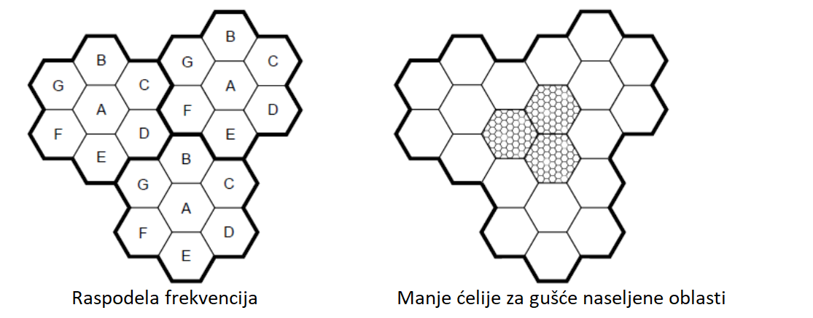
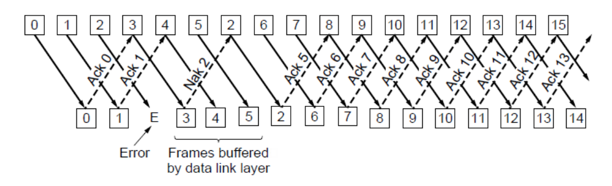
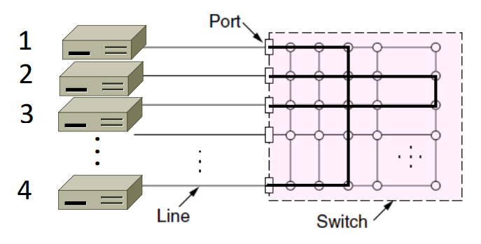

```
Autor: Mina Krivokuća
Februar 2021.

Skripta je pisana na osnovu snimaka predavanja prof. dr Aleksandra Kartelja i prezentacija.
```

- [Uvod u računarske mreže](#uvod-u-računarske-mreže)
  - [Počeci, širenje](#počeci-širenje)
  - [O računarskim mrežama](#o-računarskim-mrežama)
  - [Primeri upotreba mreža](#primeri-upotreba-mreža)
  - [Komunikacija](#komunikacija)
  - [1. Komponente mreže, tipovi veza, primeri mreža, mreže prema dimenziji, međumreže](#1-komponente-mreže-tipovi-veza-primeri-mreža-mreže-prema-dimenziji-međumreže)
      - [Komponente mreže](#komponente-mreže)
      - [Tipovi veze](#tipovi-veze)
      - [Primeri mreža](#primeri-mreža)
      - [Podela prema dimenziji](#podela-prema-dimenziji)
  - [Mreža-aplikacija interfejs](#mreža-aplikacija-interfejs)
  - [2. Protokoli i slojevi](#2-protokoli-i-slojevi)
  - [3. Referentni modeli protokola i slojeva, jedinice podataka, organizacije za standarde](#3-referentni-modeli-protokola-i-slojeva-jedinice-podataka-organizacije-za-standarde)
      - [Referentni modeli protokola i slojeva](#referentni-modeli-protokola-i-slojeva)
      - [Organizacije za standarde](#organizacije-za-standarde)
      - [Jedinice podataka](#jedinice-podataka)
- [Fizički sloj](#fizički-sloj)
  - [4. Uloga fizičkog sloja, pojednostavljen model, kašnjenja, BDP, primeri](#4-uloga-fizičkog-sloja-pojednostavljen-model-kašnjenja-bdp-primeri)
      - [Uloga](#uloga)
      - [Pojednostavljen model](#pojednostavljen-model)
      - [Kašnjenje](#kašnjenje)
      - [Primeri računanja kašnjenja](#primeri-računanja-kašnjenja)
      - [BDP - Bandwith-Delay Product](#bdp---bandwith-delay-product)
      - [BDP primer](#bdp-primer)
  - [5. (Žičani i optički) komunikacioni medijumi](#5-žičani-i-optički-komunikacioni-medijumi)
      - [Uvod](#uvod)
      - [Žičani komunikacioni medijumi](#žičani-komunikacioni-medijumi)
      - [Optički komunikacioni medijumi](#optički-komunikacioni-medijumi)
  - [6. Bežični komunikacioni medijumi](#6-bežični-komunikacioni-medijumi)
  - [Bežične ili žičane komunikacije - šta koristiti?](#bežične-ili-žičane-komunikacije---šta-koristiti)
  - [7. Komunikacioni sateliti](#7-komunikacioni-sateliti)
      - [Geostacionirani sateliti](#geostacionirani-sateliti)
      - [Nisko-orbitni sateliti](#nisko-orbitni-sateliti)
      - [Satelit ili optika?](#satelit-ili-optika)
  - [8. Signali, prenos, frekvenciona reprezentacija, signal u žičanim, optičkim, bežičnim medijumima](#8-signali-prenos-frekvenciona-reprezentacija-signal-u-žičanim-optičkim-bežičnim-medijumima)
      - [Signali, prenos i frekvenciona reprezentacija](#signali-prenos-i-frekvenciona-reprezentacija)
      - [Signal preko žice](#signal-preko-žice)
      - [Signal preko optike](#signal-preko-optike)
      - [Signal u bežičnim medijumima](#signal-u-bežičnim-medijumima)
  - [9. Modulacija i multipleksiranje signala](#9-modulacija-i-multipleksiranje-signala)
      - [Modulacija](#modulacija)
      - [Demodulacija](#demodulacija)
      - [Modulacija preko nosača](#modulacija-preko-nosača)
      - [Multipleksiranje](#multipleksiranje)
  - [10. Prirodna ograničenja prenosa signala](#10-prirodna-ograničenja-prenosa-signala)
      - [Najkvistov limit](#najkvistov-limit)
      - [Šenonov kapacitet](#šenonov-kapacitet)
      - [Žičane i bežične komunikacije](#žičane-i-bežične-komunikacije)
  - [11. Pregled relevantnijih sistema komunikacija](#11-pregled-relevantnijih-sistema-komunikacija)
      - [Sistem fiksne telefonije](#sistem-fiksne-telefonije)
      - [Generacije sistema mobilne telefonije](#generacije-sistema-mobilne-telefonije)
- [Sloj veze](#sloj-veze)
  - [12. Sloj veze, uloga, komunikacija sa slojem ispod i iznad, kratko objašnjenje spiska aktivnosti na sloju veze](#12-sloj-veze-uloga-komunikacija-sa-slojem-ispod-i-iznad-kratko-objašnjenje-spiska-aktivnosti-na-sloju-veze)
  - [13. Uokvirivanje u sloju veze](#13-uokvirivanje-u-sloju-veze)
  - [14. Kodiranje grešaka u sloju veze](#14-kodiranje-grešaka-u-sloju-veze)
      - [Pristup - dodavanje redundantnosti](#pristup---dodavanje-redundantnosti)
      - [Hamingovo rastojanje](#hamingovo-rastojanje)
  - [15. Detekcija grešaka u sloju veze](#15-detekcija-grešaka-u-sloju-veze)
      - [Provera parnosti](#provera-parnosti)
      - [Kontrolni zbirovi](#kontrolni-zbirovi)
      - [Ciklička provera redundanse (CRC)](#ciklička-provera-redundanse-crc)
  - [16. Korekcija grešaka u sloju veze](#16-korekcija-grešaka-u-sloju-veze)
  - [17. Sloj veze, tipovi servisa, okruženje, utopijski jednosmerni protokol](#17-sloj-veze-tipovi-servisa-okruženje-utopijski-jednosmerni-protokol)
    - [Tipovi servisa](#tipovi-servisa)
    - [Utopijski jednosmerni protokol](#utopijski-jednosmerni-protokol)
  - [18. Kontrola toka, ARQ, pauze (tajmauti), duplikati, protokol "stani i čekaj" za savršen i nesavršen kanal](#18-kontrola-toka-arq-pauze-tajmauti-duplikati-protokol-stani-i-čekaj-za-savršen-i-nesavršen-kanal)
    - [Kontrola toka](#kontrola-toka)
    - [Protokol "stani i čekaj" za savršen kanal](#protokol-stani-i-čekaj-za-savršen-kanal)
    - [ARQ](#arq)
    - [Protokol "stani i čekaj" za nesavršen kanal](#protokol-stani-i-čekaj-za-nesavršen-kanal)
  - [19. Protokol kliznih prozora u sloju veze, "1-bitni", "vrati se N", "selektivno ponavljanje"](#19-protokol-kliznih-prozora-u-sloju-veze-1-bitni-vrati-se-n-selektivno-ponavljanje)
    - [Koncept kliznih prozora](#koncept-kliznih-prozora)
    - [1-bitni protokol kliznih prozora](#1-bitni-protokol-kliznih-prozora)
    - ["Vrati se N" protokol](#vrati-se-n-protokol)
    - [Protokol selektivnog ponavljanja](#protokol-selektivnog-ponavljanja)
  - [20. MAC podsloj, uloga, alokacija kanala, ALOHA protokol](#20-mac-podsloj-uloga-alokacija-kanala-aloha-protokol)
    - [Uloga](#uloga-1)
    - [Alokacija kanala](#alokacija-kanala)
    - [ALOHA protokol](#aloha-protokol)
  - [21. CSMA, CSMA/CD, BEB](#21-csma-csmacd-beb)
    - [CSMA - Carrier Sense Multiple Access](#csma---carrier-sense-multiple-access)
    - [CSMA/CD](#csmacd)
    - [BEB - binarno eksponencijalno odlaganje](#beb---binarno-eksponencijalno-odlaganje)
  - [22. MAC protokoli zasnovani na redosledu. Token Ring.](#22-mac-protokoli-zasnovani-na-redosledu-token-ring)
    - [MAC protokoli zasnovani na redosledu.](#mac-protokoli-zasnovani-na-redosledu)
    - [IBM token ring](#ibm-token-ring)
    - [Prednosti i mane protokola sa redosledom](#prednosti-i-mane-protokola-sa-redosledom)
  - [23. MAC protokoli za bežične mreže](#23-mac-protokoli-za-bežične-mreže)
    - [Jedno rešenje: MACA (Multiple Access with Collision Avoidance)](#jedno-rešenje-maca-multiple-access-with-collision-avoidance)
  - [24. Klasični Eternet - IEEE 802.3](#24-klasični-eternet---ieee-8023)
  - [25. Moderni (komutirani) Eternet](#25-moderni-komutirani-eternet)
- [Mrežni sloj](#mrežni-sloj)
  - [26. Mrežni sloj, uloga, motivacija, rutiranje i prosleđivanje (ukratko), tipovi servisa na mrežnom sloju, objašnjenja i njihov uporedni odnos](#26-mrežni-sloj-uloga-motivacija-rutiranje-i-prosleđivanje-ukratko-tipovi-servisa-na-mrežnom-sloju-objašnjenja-i-njihov-uporedni-odnos)
    - [Uloga i motivacija](#uloga-i-motivacija)
    - [(Čime se ruteri bave?) Rutiranje i prosleđivanje](#čime-se-ruteri-bave-rutiranje-i-prosleđivanje)
    - [Tipovi servisa na mrežnom sloju, objašnjenja i uporedni odnos](#tipovi-servisa-na-mrežnom-sloju-objašnjenja-i-uporedni-odnos)
    - [IPv4 (Internet protokol)](#ipv4-internet-protokol)
  - [27. IP adrese i prefiksi](#27-ip-adrese-i-prefiksi)
  - [28. IP prosleđivanje](#28-ip-prosleđivanje)
  - [29. ARP i DHCP](#29-arp-i-dhcp)
    - [DHCP (Dynamic Host Configuration Protocol)](#dhcp-dynamic-host-configuration-protocol)
    - [ARP (Address Resolution Protocol)](#arp-address-resolution-protocol)
  - [30. ICMP i NAT](#30-icmp-i-nat)
    - [ICMP (Internet Control Message Protocol)](#icmp-internet-control-message-protocol)
    - [NAT (Network Address Translation Protocol)](#nat-network-address-translation-protocol)
  - [31. Rutiranje, mehanizmi alokacije protoka, modeli isporuke, ciljevi rutiranja, principi dizajna algoritama rutiranja, rutiranje sa najkraćim putevima (najmanjim troškom), Dajkstrin algoritam.](#31-rutiranje-mehanizmi-alokacije-protoka-modeli-isporuke-ciljevi-rutiranja-principi-dizajna-algoritama-rutiranja-rutiranje-sa-najkraćim-putevima-najmanjim-troškom-dajkstrin-algoritam)
    - [Mehanizmi alokacije protoka](#mehanizmi-alokacije-protoka)
    - [Modeli isporuke](#modeli-isporuke)
    - [Ciljevi rutiranja](#ciljevi-rutiranja)
    - [Principi za dizajn algoritama rutiranja](#principi-za-dizajn-algoritama-rutiranja)
    - [Rutiranje sa najkraćim putevima](#rutiranje-sa-najkraćim-putevima)
    - [Dajkstrin algoritam](#dajkstrin-algoritam)
  - [32. Rutiranje zasnovano na vektoru razdaljine](#32-rutiranje-zasnovano-na-vektoru-razdaljine)
    - [DV rutiranje (Distance Vector Routing)](#dv-rutiranje-distance-vector-routing)
    - [Karakteristike](#karakteristike)
  - [33. Plavljenje](#33-plavljenje)
  - [34. Rutiranje zasnovano na stanju veza (Link state routing)](#34-rutiranje-zasnovano-na-stanju-veza-link-state-routing)
  - [35. Višeciljno rutiranje sa najkraćim putevima (ECMP)](#35-višeciljno-rutiranje-sa-najkraćim-putevima-ecmp)
  - [36. Hijerarhijsko rutiranje](#36-hijerarhijsko-rutiranje)
- [Transportni sloj](#transportni-sloj)
  - [37. Transportni sloj, uloga, tipovi servisa i njihovo poređenje](#37-transportni-sloj-uloga-tipovi-servisa-i-njihovo-poređenje)
    - [Uloga](#uloga-2)
    - [Tipovi servisa i njihovo poređenje](#tipovi-servisa-i-njihovo-poređenje)
  - [28. Socket API, primer jednostavnog klijent-servera (pseudokod), portovi](#28-socket-api-primer-jednostavnog-klijent-servera-pseudokod-portovi)
    - [Socket API](#socket-api)
    - [Primer jednostavnog klijent-servera (pseudokod)](#primer-jednostavnog-klijent-servera-pseudokod)
    - [Portovi](#portovi)
  - [39. UDP](#39-udp)
  - [40. Uspostava i prekid veze na transportnom sloju (uopšteno)](#40-uspostava-i-prekid-veze-na-transportnom-sloju-uopšteno)
    - [Uspostava veze](#uspostava-veze)
    - [Prekid veze](#prekid-veze)
  - [41. Protokoli kliznih prozora na transportnom sloju](#41-protokoli-kliznih-prozora-na-transportnom-sloju)
  - [42. Kontrola toka podataka na transportnom sloju](#42-kontrola-toka-podataka-na-transportnom-sloju)


<div style="page-break-after: always"></div>


# Uvod u računarske mreže 

## Počeci, širenje

**Projekat Arpanet, 1970.** - Amerika, američka vojna agencija Darpa. Projekat je imao za cilj da stvori pouzdanije sisteme komunikacije od fiksne telefonije koje bi koristili tokom nezgodnih situacija. Motivacija je bila Hladni rat i strah od presečenih komunikacija - jer je fiksna telefonija bazirana na konceptu drveta i potpuno je hijerarhijska. Izbacivanjem nekog unutrašnjeg čvora ili grane drvo se preseca na dva dela. Takav sistem je bio relativno jednostavan za implementaciju i instalaciju, ali je predstavljao veliki problem u pouzdanosti i slabu tačku u situacijama gde je komunikacija i blagovremena sinhronizacija bila ključna. 

Ideja novog sistema nije bila previše deterministička - grafovi komunikacije nisu izgledali kao da su planirani, već su podsećali na slučajne grafove (princip: dodaj granu tamo gde misliš da treba, pravile su se prečice tamo gde se osećala potreba). Ideja je prvo prihvaćena od strane univerziteta u Americi, naučnicima se dopala ideja stalne međusobne komunikacije. Najpoznatiji softver koji je korišćen za pristup udaljenom čvoru je Teolnet (?). Najveća motivacija za širenje je bila laka dostupnost udaljenih baza znanja i informacija. Kao druga "aplikacija" pojavljuje se mejl.

<p align="center">
  
</p>

Na slici iznad je površna ilustracija izgleda Internet mreže 2005. godine. Ono što je jasno je da izgleda poprilično haotično i puna redundantnosti - što za nas znači da je razbijanje mreže na više delova presecanjem komunikacija značajno teže. Čvorovi koji deluju izolovaniji i manje povezani sa ostalima nisu nužno loše isplanirani - već su pre čvorovi koji pripadaju nekim vladinim organizacijama, vojsci, itd. Ovakvi čvorovi često imaju sisteme nezavisne komunikacije i za njih je bitno da budu i fizički udaljeni od ostalih, pored korišćenja drugačijih softvera i sistema enkripcije i zaštite.


## O računarskim mrežama

Vrlo složena i raznorodna računarska disciplina - zahteva ekspertizu različitih struka: fizičara, elektrotehničara, tehnologa, matematičara, hemičara, programera... Teško ih je učiti na monolitni način. 

* **Fizički sloj** - prenos signala, medijumi (komunikacija oprema, kablovi, hardver), teorija signala, bežični i žični prenos, optički kablovi, komunikacioni sateliti, sistem mobilne telefonije, kablovske televizije. Fizički sloj **se bavi omogućavanjem prenosa bitova između dve povezane tačke.**
* **Sloj veze podataka** - nadograđuje se na fizički sloj. Svaki naredni sloj koristi usluge prethodnog, i nijedan sloj ne mora da razmišlja o problemima koje je rešio prethodni. Sloj veze podataka koristi sistem za prenos bitova između tačaka koji je obezbedio fizički sloj (point to point protokol), a onda dodaje tom sistemu neke aspekte koji bi mu povećali pouzdanost i efikasnost. Konkretno, grupisaće bitove na određen način jer nema toliko smisla raditi nad pojedinačnim bitovima, pa se nad tim grupama bitova softverski vrši detekcija i korekcija grešaka. Dakle, podizanje pouzdanosti prenosa softverskim putem. Možemo zaključiti da je realan scenario u praksi da je fizički sloj loše implementiran (žice nisu dobro izolovane od šuma npr.), ali da se softverskim algoritmima to može ispraviti. Osim što povećava pouzdanost point to point komunikacije, sloj veze podataka povećava i njenu efikasnost, npr. postoje situacije u kojima jedna strana šalje drugoj veće količine podataka za koje druga strana nema odgovarajući softver da prihvati, što se rešava na nivou sloja veze podataka. Sloj veze podataka **isporučuje narednim slojevima pouzdan i efikasan sistem za prenos podataka između dve povezane tačke**.
* **Podsloj za upravljanje pristupom medijumima** - u slučaju nepostojanja point to point protokola, već je n korisnika povezano u neku topologiju mreže, tj. nije jasno ko šta kome šalje i kada šalje (moguće je da je medijum zauzet u trenutku kada se poruka šalje). Ovaj podsloj je tehnološki prevaziđen (zastareo) i danas postoje drugi načini za rešavanje ovakvih problema. U ovom podsloju je bitna upotreba MAC adrese (hardverski identifikator uređaja u lokalnoj mreži).
*  **Mrežni sloj** - koristi usluge sloja veze. Od ovog sloja pa nadalje radi se samo softverski. Dosta je apstraktniji od prethodnih slojeva i manje je opterećen elektrotehničkim detaljima. Na mrežnom sloju su ruteri. Glavna uloga mrežnog sloja (tj. rutera generalno) je da odredi optimalnu putanju u mreži kojom će se kretati paketi. Ovakav algoritam ne sme da bude centralizovan jer ukoliko bi postojali ruteri koji bi vršili usluge rutiranja za druge, ubrzo bi baš oni postali usko grlo (eng. *bottleneck*) jer bi većina zahteva stizalo upravo do njih, i odlazilo od njih. Ovakvi ruteri su prirodno distribuirani geografski i nalaze se relativno blizu svojih korisnika. Postoje ruteri i udaljeniji od krajnjeg korisnika, a oni služe uglavnom za povezivanje sa većim brojem sledećih rutera. Jedan ruter može da zna trenutno koja je najbolja putanja za paket koji mu je pristigao, ali ne može da naređuje drugim ruterima kako će dalje da ga rutiraju. Potrebno je implementirati odluke rutera tako da se odluka trenutnog poklapa sa odlukom koju bi doneo sledeći ruter u putanji ("razmišljaj globalno, deluj lokalno"). Mrežni sloj **se generalno bavi algoritmima rutiranja, upravljanja zagušenjem i povezivanjem različitih mreža**.
*  **Transportni sloj** - najveći sloj, najveći napor uložen u ovaj sloj. Transportni sloj omogućava da krajnje tačke nisu sami računari, već uvodimo novi logički nivo - procese. Cilj transportnog sloja je da **apstrahuje komunikaciju između dva procesa na takav način da mi kao korisnici ne razlikujemo komunikaciju između dva procesa na istom računaru, i dva procesa na različitom računaru (ako se izuzme kašnjenje)**. TCP/UDP protokoli.
*  **Aplikativni sloj** - koristi usluge transportnog sloja. Protokoli višeg nivoa. Potreba da se stvari koje se koriste na isti način definišu i automatizuju (mejl npr.). Definiše protokole za komunikaciju između aplikacija kao što su HTTP, FTP, i slično.

</br>

## Primeri upotreba mreža

* Poslovna - razmena datoteka, deljeni resursi (npr. štampači), sredstvo komunikacije (mejl, video konferencije), poslovne transakcije elektronskim putem, poslovanje sa potrošačima preko Interneta...
* Kućna - prostupanje udaljenim informacijama (filmovi, muzika, vesti, audio, video), razmena poruka, elektronska kupovina...
* Mobilna - pozivi, SMS, igrice, mape, pristup informacijama...

## Komunikacija

**Analogna komunikacija** - u kablovima za prenos nije ugrađeno prepoznavanje diskretnih brojeva (bajtova), već se radi sa kontinualnim zapisom preslikanom na promene napona. Na primer, ako hoćemo da prenesemo zvuk kao poruku između dva udaljena uređaja, taj zvuk se transformiše u promene napona, one prolaze kroz žicu i na drugoj strani postoji dekoder koji rekonstruiše originalni zvuk na osnovu promena napona.

S druge strane **digitalna komunikacija** je zasnovana na međuformatu i postoji više konverzija. Prvo analizator zvuka prevodi zvuk u neke brojeve (analogno-digitalna konverzija), brojeve šaljemo kroz mrežu i ti brojevi se čuvaju preko nekih flip flopova (digitalno-analogna konverzija), ponovo se dekodira u brojeve na drugoj strani (analogno-digitalna konverzija), pa nakon toga dekoder ponovo rekonstruiše zvuk na osnovu dobijenih brojeva (digitalno-analogna konverzija). Zaključak - konverzija se dešava više puta u oba smera. 

Može biti između dva čoveka, između čoveka i računara i između dva računara.

* **VoIP** - komunikacija između dva čoveka. Pozivi preko Interneta. Naziv VoIP je malo zastareo, pošto danas podrazumeva i slanje videa i video-pozive, ali se tradicionalno i dalje naziva VoIP. Vid je digitalne komunikacije. Razlika između mobilne telefonije i VoIP-a je što informacije putuju različitim kanalima - VoIP koristi Internet, a mobilna telefonija ima svoje kanale. Potrebno je obezbediti da paketi u VoIP-u što manje kasne, kao i da stignu ispravnim redosledom. Ređanje paketa ispravnim redosledom može dodatno povećati kašnjenje, pa se nekad preskaču paketi koji ne stignu na vreme, što dovodi do čudnih zvukova ili seckanja. Na velikim udaljenostima (npr. Srbija-Australija) se oseća kašnjenje i do par stotina milisekundi.
* **Deljenje resursa** - ekonomičan i logičan koncept, nikome ne treba sve vreme sve što poseduje. Ovo može da se odnosi i na deljenje štampača u okviru firme, a i na deljenje računarskih resursa (memorije, procesorske snage, diska, protoka...). Ne koriste svi sve resurse u isto vreme - što znači da bismo sa mnogo manjom procesorskom snagom mogli da opskrbimo više korisnika nego što bi bilo potrebno snage kada bi svako imao svoju zasebnu procesorsku jedinicu. Postoji šansa da se resursi preopterete ako ih svi korisnici okupiraju u isto vreme, ali to se statistički retko dešava kada se lepo procene potrebe korisnika. Dakle, ideja je da se obezbede isti resursi koje bi PC obezbedio istom broju korisnika, ali sa mnogo manje iskorišćene električne struje. Sistemi koji isporučuju te resurse su klaud sistemi, i njihova potrošnja električne struje je ogromna, ali je u svakom slučaju manja od potencijalne sume potrošene električne struje od strane svakog korisnika ponaosob u scenariju gde svako koristi samo svoje resurse. Nekada je postojala ideja o centralizovanim računarima u budućnosti gde bi svako kod kuće imao samo terminal, a koristio resurse udaljenog računara, ali nije zaživela. 

`Statističko multipleksiranje - deljenje mrežnog protoka među korisnicima na osnovu statistike zahteva. Potrebno je da znamo informacije
o raspodeli upotrebnih navika tog resursa krajnjih korisnika. 
Primer su Internet provajderi i korisnici u ISP mreži. Ako mreža ima protok od 100 Mbps, a svaki korisnik je aktivan samo 50% vremena, da li je zaista ova mreža može da podrži samo 20 korisnika, ili je to znatno veći broj? Pojednostavljena varijanta - imamo informacije o verovatnoći da kompletan protok bude iskorišćen. Binomnom raspodelom se može izračunati da čak i za 30 nezavisnih kosnika, šanse da će biti potrebno više od 100Mbps su i dalje jako male (2%). Dobit u ovom slučaju je 1.5x.`

<p align="center">
  
</p>

* **Dostavljanje sadržaja (content delivery)** - potreba da dostavimo neki nepromenljiv sadržaj većem broju korisnika. Trošak se uglavnom meri nekom funkcijom koja direktno zavisi od broja skokova sa čvora na čvor u mreži. Ako je svakoj grani dodeljena težina 1, za skokove kažemo da su hopovi. Ukoliko bi sadržaj putovao od izvora do svakog korisnika ponaosob, broj hopova je značajno veliki. Dakle, ideja je da se naprave kopije sadržaja u nekim čvorovima kako bi se smanjila dužina putanje kojom sadržaj putuje. Kako to izgleda:


<p align="center">
  
</p>

* **Komunikacija između računara** - elektronsko poslovanje, rezervacija karata, itd. Omogućava automatsku obradu informacija nad nezavisnim sistemima.
* **Povezivanje računara sa uređajima** - razvoji senzora, očitavanje informacija sa njih. Područje primene u konstantnom razvoju (IoT - Internet of Things, pametni uređaji), zahteva jake mrežne resurse. Npr. frižider koji čita vlažnost i temperaturu, smart satovi. 


**Vrednost povezivanja** - Metkalfov (čovek koji je osmislio Ethernet) zakon, 1980. Vrednost mreže sa N čvorova je proporcionalna vrednosti N<sup>2</sup>. Velika mreža je vrednija nego više malih sa istim ukupnim brojem čvorova, to jest, veze su te koje nose informativnost, a ne čvorovi.

<p align="center">
  
</p>

## 1. Komponente mreže, tipovi veza, primeri mreža, mreže prema dimenziji, međumreže

#### Komponente mreže

Mreže se sastoje iz čvorova, veza i aplikacija. 

<p align="center">
  
</p>


Listovi (krajnji računari) mogu biti krajnji korisnici ili serverski računari, a unutrašnji čvorovi ruteri. Mi se bavimo ruterima (i sličnim uređajima koji su unutrašnji čvorovi, pomenućemo kasnije). 


<p align="center">
  
</p>

1. **Aplikacija**, korisnik - koristi mrežu (Skype, iTunes, Amazon)
2. **Završni čvor**, računar, serverski računar, izvor, uređaj - podržava aplikaciju (laptop, mobilni telefon, dekstop računar)
3. **Ruter** ili usmerivač, unutrašnji čvor - prosleđuje poruke između čvorova (pristupna tačka, kablovski/DSL modem)
4. **Veza** ili kanal - spaja čvorove (žične, bežične)

#### Tipovi veze

Podela po smeru toka informacija:

* Simpleks veza - jednosmerna, nema povratnih informacija. Primer: televizor.
* Polu-dupleks - moguća komunikacija u oba smera, ali ne istovremeno. Primer: voki-toki, radio stanice. Koristi se jedan frekvencioni opseg za slanje i primanje, što znači da se istovremenim korišćenjem signali mogu izmešati i nastao bi neki signal koji nije preterano koristan.
* Puni dupleks - moguća komunikacija u oba smera istovremeno. Primer: mobilna telefonija (istovremeno pričanje) ili mogućnost downloada/uploada istovremeno. Koristi se frekvenciona podela. 

Podela po mobilnoj fleksibilnosti:

* Bežične - na ovom predmetu mislimo na mreže u kojima ne postoji tačno određen smer (vektor) u kom se šalju poruke (za razliku od lasera npr. koji je usmeren), već se one emituju. Prihvataju je svi čvorovi u opsegu. Korisnik može da se kreće i da i dalje ne izgubi vezu, što ne bi bilo moguće da je veza usmerena.
* Žične 

#### Primeri mreža

- WiFi - bežična tehnologija, lokalna mreža
- Ethernet - žična tehnologija, lokalna mreža
- ISP mreže - mreža provajdera/usluge, nešto su veće, obuhvataju veće regije
- Kablovska/DSL
- Mobilna telefonija (2G, 3G, 4G, 5G)
- Bluetooth

#### Podela prema dimenziji

| Tip | Dimenzija | Primer |
|-----|-----------|--------|
| PAN (Personal Area Network) | neposredna blizina | Bluetooth |
| LAN (Local Area Network) | kancelarija, sprat, zgrada | WiFi, Ethernet |
| MAN (Metropolitan Area Network) | grad | kablovska, DSL|
| WAN (Wide Area Network) | država | veliki ISP, npr. Telekom, SBB |
| Internet (mreža svih mreža) | planeta | Internet |


**Međumreža ili Internet**, se dobija povezivanjem više različitih mreža. Međumreža je bilo koja heterogena mreža, tj. mreža koja se sastoji iz podmreža koje imaju jasnu razliku u tehnologiji izrade, topologiji i drugim aspektima. Hibrid različitih mreža.  
**Internet** (velikim slovom) je Internet koji svi koristimo. Međumreža.


## Mreža-aplikacija interfejs

Utvrđeno dobri načini organizovanja mreža. Apstraktni sloj, model upotrebe mreže iz aspekta transportnog sloja. Softverske apstrakcije na mreži.

**Klijent-server koncept upotrebe (model)**

Zasniva se na tome da imamo računare koji nude neke usluge, i računare koji zahtevaju neke usluge. Serveri su obično hardverski bolje i naprednije mašine kako bi mogli da usluže veći broj klijenata (zahteva) istovremeno. Najveći deo posla se izvršava na serveru, dok se na klijentu izvršava samo prikaz (grafički deo). Dakle, aplikacije implementirane na klijentu nemaju nešto specijalnu/naprednu logiku, dok se na serveru dešavaju algoritmi koji zahtevaju jaku procesorsku moć. 

Da bi klijent-server model funkcionisao, potrebno je da klijent-server sa implementacijom ne ide do nivoa bitova, priča direktno sa fizičkim slojem ili karticom, već će pričati sa slojem ispod - transportnim slojem, i koristi njegove usluge, tj. sokete. Socket API je programski interfejs - objekat - koji ima dupleks, tj. tokove podataka (input i output stream). To je mrežni API koji se koristi za pisanje svih Internet aplikacija i deo je svih poznatijih operativnih sistema. Soket postoji sa obe strane konekcije, i sa klijentske i sa serverske strane, i oba imaju odlazni i dolazni tok podataka. Socket API omogućava da se ostvari konekcija sa suprotnom stranom ne razmišljajući o aspektima ispod - bitovima, korekciji i detekciji grešaka, brzini slanja i primanja, itd. Soketi su vrlo univerzalan način razmišljanja koji se može poistovetiti sa načinom komuniciranja između dva procesa. Dakle, ako bi dva procesa na istom računaru ostvarila komunikaciju, to bi izgledalo isto kao i korišćenje Socket API-ja za povezivanje na udaljeni računar. Output stream iz servera je zakačen za input stream klijenta, i obrnuto. Omogućena je pouzdana komunikacija u oba smera.

Za strimove su zakačene različite metode, nesimetrične jer se prirodno klijent i server ne ponašaju isto. Server se ponaša pasivno, a klijent aktivno. Klijent inicira komunikaciju, a server nikad samoinicijativno ne šalje zahtev. Ideja je da se server kreira, podesi i počne da radi, i čeka da se nešto desi, dok klijent čim se kreira treba da se zakači negde.

| Operacija | Značenje | Gde? |
|-----------|----------|------|
| SOCKET | Kreira komunikacionu tačku | oba |
| BIND | Pridružuje soketu lokalnu adresu | server |
| LISTEN | Označava da je soket spreman da prihvata konekcije | server |
| ACCEPT | Pasivno prihvata i uspostavlja dolaznu konekciju | server |
| CONNECT | Aktivno pokušava da ostvari konekciju | klijent |
| SEND | Šalje podatke preko uspostavljene konekcije | oba |
| RECEIVE | Prihvata podatke preko uspostavljene konekcije | oba |
| CLOSE| Zatvara konekciju | oba |

**Upotreba soketa, tok komunikacije**

Bitno je da server bude aktivan pre klijenta, tj. da bude aktivan u trenutku kada klijent želi na njega da se zakači. Klijent inicira komunikaciju, tj. šalje se zahtev od strane klijenta, i zatim server šalje odgovor koji klijentu stiže. Veza se prekida. Ovaj proces se često dešava iterativno.

<p align="center">
  
</p>

Blokirajuće komande čekaju na dešavanje i ne koriste računarske resurse.
Kada stigne zahtev za konekciju na server, accept se odblokirava, prihvata konekciju i kao povratnu vrednost ima deskriptor konekcije u kom se nalaze informacije o klijentu koji želi da se zakači od kojih su najbitniji adresa i port. Nakon toga, server odlučuje da li prihvata tog klijenta i odbacuje zahtev za konekciju. Serveri se najčešće implementiraju višenitno kako bi prihvatao više klijenata istovremeno. 

Aplikacije komuniciraju bez realne predstave šta je unutar mreže. `Tracert` komanda prikazuje putanju koju paketi prolaze od nas, pa do udaljenog računara (servera).

## 2. Protokoli i slojevi

Mrežama odgovara modularnost. Modularnost omogućava podelu odgovornosti, lakše održavanje, detekciju i popravljanje grešaka. Računarske mreže su kompleksne i nemoguće ih je implementirati monlitno, i na nivou hardvera i na nivou softvera. Mreža mora da obavlja razne zadatke za aplikacije:

* Pravi i prekida konekciju
* Pronalazi putanju za transfer podataka
* Pouzdano šalje podatke
* Šalje podatke proizvoljne veličine
* Brzinu slanja prilagođava mogućnostima mreže
* Deli protok među korisnicima
* Omogućava siguran prenos tokom tranzita
* Omogućava novo dodavanje računara i uređaja (čvorova)
* ...
  

Modularnost je u računarskim mrežama sprovedena upotrebom protokola i slojeva. Dakle, protokoli i slojevi su glavni mehanizam struktuiranja koji mreži daje modularnost.

Slojevi su disjunktne grupe funkcionalnosti koje se realizuju. Potrebno je razjasniti i raščlaniti šta kom sloju pripada, ali i odrediti redosled slojeva od nižeg ka višem, pri čemu se treba voditi time da se na nižim slojevima realizuju neke primitivnije funkcionalnosti, a na višim slojevima apstraktnije. Takođe, niži slojevi pružaju usluge višim slojevima, tj. viši slojevi neće sve raditi ispočetka nego će se obratiti sloju ispod i od njega zahtevati uslugu.

Što se protokola tiče, svaka instanca protokola komunicira virtuelno samo sa svojim parnjakom (peer) na istom sloju (!) upotrebom dogovorenih metoda. U stvarnosti, oni ne komuniciraju direktno, već svaka instanca koristi usluge (services) sloja koji je ispod.

<p align="center">
  
</p>

Dakle, ako pretpostavimo da X komuniciraju na nivou poruka, a Y na nivou bajtova (X su viši slojevi, Y su niži), možemo reći da instanca protokola X samo virtuelno komunicira sa svojim parnjakom. Zašto? Jer ono što se zapravo dešava je da X instanca šalje poruku svom nižem sloju (Y od instance) koji prevodi poruku u bajtove, i zatim ih šalje Y sloju parnjaka koji te bajtove prima. Parnjak se oslanja na sloj Y ispod njega, preuzima i iščitava poruku koja mu je prosleđena. Dakle, ne postoji fizička komunikacija u protokolu X, već samo u protokolu Y. Protokol Y je fizički protokol.


Neki od primera realnih protokola:
- HTTP na aplikativnom sloju
- TCP na transportnom sloju
- IP na mrežnom sloju
- IEEE 802.11 (Wifi) na sloju veze

Protokol stek je čest naziv za skup protokola u upotrebi. Npr. skup protokola koji koristi web browser na računaru koji je putem WiFi-a povezan na Internet.

Mehanizam slaganja slojeva protokola: niži sloj pravi omotač oko sadržaja višeg sloja i dodaje sopstvene informacije poruci, kao slanje pošte u koverti u kom slučaju poštari nemaju pristup unutrašnjosti koverte. Svaki sloj dodaje svoje zaglavlje.

<p align="center">
  
</p>

Mehanizam slaganja slojeva protokola je vid enkapsulacije.

`-------------` 

`Multipleksiranje i demultipleksiranje - konfuzan deo koji prof. dr. Kartelj ima u prezentacijama, ali je preskočio da objasni na času, informacije su uzete iz drugih izvora.`

Priprema segmenata koji se prosleđuju mrežnom sloju je proces **multipleksiranja** (kombinovanja), a njihovo primanje od strane mrežnog sloja, raspakivanje i prosleđivanje protokolima višeg sloja je **demultipleksiranje**. 

Proces multipleksiranja se odvija tokom slanja podataka - podaci se preuzimaju od aplikacijskih procesa i enkapsuliraju se zaglavljem, čime se od njih prave segmenti. Ovi segmenti se predaju mrežnom sloju. Sa druge strane, ti primljeni segmenti se od strane mrežnog sloja na osnovu odgovarajućeg polja u zaglavlju predaju odgovarajućem procesu - što je demultipleksiranje.

`-------------`

Prednosti raslojavanja:
- elegantniji sistem, prikrivanje informacija i ponovna upotreba
- povezivanje različitih sistema
- lakše uočavanje problema i identifikacija problematičnog sloja ili protokola
- lakše debagovanje

Mane raslojavanja:
- previše raslojavanja dovodi do više komunikacije između slojeva, što je dodatni trošak, gubi se na performansama
- prikrivanje informacija, jer neke aplikacije možda žele da znaju stvari koje im nisu dostupne, npr. da li se podaci prenose putem kabla ili bežično

## 3. Referentni modeli protokola i slojeva, jedinice podataka, organizacije za standarde

#### Referentni modeli protokola i slojeva

Ključna pitanja kod dizajna modela su koju funkcionalnost implementira svaki sloj i kako ih najbolje povezati. Referentni modeli odgovaraju na njih. Najpoznatiji referentni modeli:

* OSI model sa 7 slojeva - internacionalni standard za povezivanje sistema. Uticajan, ali ne i previše korišćen u praksi.

<p align="center">
  
</p>

* Internet (TCP/IP) model - 4 sloja, zasnovan na praksi. Poslednji sloj, tj. sloj veze grupiše funkcionalnosti tradicionalnog sloja veze i fizičkog sloja. Isprepletane su aktivnosti uređaja koji moduliraju i demoduliraju signal i mrežne kartice koja radi  detekciju i korekciju grešaka, usaglašavanje brzina slanja i primanja, itd.

<p align="center">
  
</p>


#### Organizacije za standarde

Neke poznatije organizacije koje se bave standardizacijom i protokolima:

| Organizacija | Oblast | Primeri standarda|
|--------------|--------|------------------|
|ITU (International Communication Union)|Telekomunikacije|G.992, ADSL, H.264, MPEG4|
|IEEE (Institute of Electrical and Electronics Engineers)|Komunikacije i reprezentacije podataka|802.3,Ethernet, 802.11, WiFi|
|IETF (Internet Engineering Task Force)|Internet, aplikativni protokoli niskog nivoa|RFC 2616, HTTP/1.1, RFC 1034/1035, DNS|
|W3C (World Wide Web Consortium)|Veb, aplikativni protokoli visokog nivoa|HTML5, CSS|

#### Jedinice podataka

| Sloj | Jedinica | Opis |
|------|----------|--|
|Aplikativni|Poruka| Predstavlja neku smislenu jedinicu za korisnika, npr. HTML sadržaj ili GET zahtev|
|Transportni|Segment| Nemaju semantiku, potrebno ih je rekonstruisati, uklopiti, spojiti da bi se dobilo značenje|
|Mrežni|Paket| Još manje značenja...|
|Sloj veze|Okvir| Još manje... |
|Fizički|Bit| 0 značenja|


<div style="page-break-after: always"></div>


Kako će se posmatrati hijerarhija slojeva i protokola na kursu/u skripti:

<p align="center">
  
</p>

<div style="page-break-after: always"></div>


# Fizički sloj

## 4. Uloga fizičkog sloja, pojednostavljen model, kašnjenja, BDP, primeri 

#### Uloga

Najjednostavniji opis nadležnosti fizičkog sloja je slanje bitova između dve tačke povezane komunikacionim medijumom. 

Najbitnije teme koje se tiču fizičkog sloja:
- **Karakteristike prenosnog medijuma** - električna žica, optički kabl, bežično slanje.
- **Slanje signala** - protok, matematička pozadina, entropija, slabljenje, šum.
- **Tehnike modulacije i multipleksiranja** - prenos signala, reprezentacija bitova, šum.
- **Prirodna (gornja) ograničenja** - Najkvist-Šenon teorema, teorija informacija, npr. koliko bitova možemo najviše da prosledimo kroz određeni komunikacioni kanal imajući u vidu njegove fizičke karakteristike, veza između fizičkih i informacionih karakteristika, tj. između analognog i digitalnog sveta.

#### Pojednostavljen model

Svojstva kojima se opisuje svaki komunikacioni kanal:
- **Protok** (ili brzina, kapacitet) - nije fizička veličina u tradicionalnom smislu, već informaciona (digitalna). Ne govori se o metrima u sekundi, već o broju bita u sekundi. Može se uspostaviti veza između informacionih veličina i fizičkog sveta, tako da je brzina vezana za neke fizičke karakteristike poput frekvencije, komunikacionog kanala, opsega frekvencija, brzine svetlosti i slično.
- **Kašnjenje** - mora da postoji jer brzina prenosa nije beskonačna. Gornja (fizička, matematička) granica bi bila brzina svetlosti. Meri se u sekundama.
- **Da li kanal emituje**
- **Raspodela verovatnoća grešaka** 

#### Kašnjenje

Ukupno kašnjenje podrazumeva vreme potrebno da poruka stigne sa polazne adrese na ciljnu adresu, odnosno od pošiljaoca do primaoca. Kašnjenje ima dve bitne komponente:
- **kašnjenje prenosa (transmission delay)** - vreme potrebno da se M-bitovna poruka postavi na komunikacioni kanal. Vezano je sa količinom informacija koje šaljemo i sa brzinom prenosa komunikacionog kanala. Dakle, ako imamo malu brzinu prenosa u komunikacionom kanalu, a šaljemo veliku poruku, prirodno je da će vreme trajanja prenosa biti duže. Kašnjenje prenosa računamo kao <p align="center">  </p> to jest tako što dužinu poruke (M) izraženu u bitovima (b) delimo sa brzinom komunikacionog kanala (B) izražene u bitima po sekundi (b/s). Možemo ga shvatiti kao apsorpcionu moć komunikacionog kanala, tj. koliko informacija on može da uhvati.
- **kašnjenje propagacije (propagation delay, ping)** - vreme potrebno da bitovi prođu kroz komunikacioni kanal. Ne zavisi od brzine prenosa ili manipulacija veličinama poruka, već je inherentna karakteristika komunikacionog kanala i posledica gornje fizičke granice - brzine svetlosti. Svi moderni komunikacioni sistemi su zasnovani na elektromagnetnim talasima čija je brzina kretanja reda veličine brzine svetlosti, odnosno između <sup>2</sup>/<sub>3</sub>c i c (zavisi da li je u pitanju WiFi, optika...). Dakle, kašnjenje propagacije je neminovno i primetno je prilikom slanja na veće daljine. Računamo je kao <p align="center">  </p> gde je brzina signala u opsegu (<sup>2</sup>/<sub>3</sub>c, c)
- **ukupno kašnjenje** dobijamo sabiranjem pomenuta dva: <p align="center">  </p>
  


| Oznaka | Vrednost | Oznaka | Vrednost|
|--------|----------|--------|---------|
|K(ilo)|10<sup>3</sup>|m(ili)|10<sup>-3</sup>|
|M(ega)|10<sup>6</sup>|μ(micro)|10<sup>-6</sup>|
|G(iga)|10<sup>9</sup>|n(ano)|10<sup>-9</sup>|

#### Primeri računanja kašnjenja

* Dialup sa telefonskim modemom (slanje ka račuanru u istom gradu): 
  * P = 5ms, B = 56kb/s, M = 1250B
  * L = 5ms + (1250x8)/(56 x 10<sup>3</sup>)s = 5ms + 179ms = 184 ms
  
  Treba imati u vidu da se zvuk koji šaljemo telefonskim komunikacionim kanalom ne kreće brzinom zvuka, već brzinom električne struje zbog primarnog konvertovanja u promene napona radi putovanja kroz kanal.

* Širokopojasna veza - kablovska ili DSL (slanje kroz državu)
  * P = 50ms, B = 10Mb/s, M = 1250B
  * L = 50ms + (1250x8)/(10 x 10<sup>6</sup>)s = 50ms + 1ms= 51 ms

Dakle, dugačka veza ili mali protok proizvode veće kašnjenje. Obično jedna od komponenti kašnjenja (P ili T) biva dominantna. Kod Dialup-a, usko grlo je komunikacioni kanal, a kod kablovske/DSL-a je to ping. 

Ono što je bitno napomenuti i imati u vidu je da se ping odnosi samo na inicijalno kašnjenje, to jest kašnjenje prvog bita koji stiže. Svi ostali bitovi koji stižu za njim imaju samo apsolutno, ali ne i relativno kašnjenje. Kod kašnjenja fajlova to nije značajno, ali u realtime sistemu jeste, npr. VoIP, video pozivi, live stream.

#### BDP - Bandwith-Delay Product

Predstavlja umnožak protoka i kašnjenja. Prosto rečeno - koliko smo popunili komunikacioni kanal, tj. količina podataka prisutnih na kanalu u nekom momentu. Ako bismo posmatrali podatak kao materiju, onda je ovo zapremina materije. Meri se u bitovima. Mali je za kanale u lokalnim mrežama, npr. WiFi, a veliki za "velike debele" (long fat networks, sa BDP-om većim od 10<sup>5</sup> bitova) kanale.

BDP = B x D, gde je B propusni opseg, a D vreme zadržavanja na komunikacionom kanalu.

#### BDP primer

* Slanje od Perta do Sidneja dugačkim optičkim kanalom.
  * B = 40Mb/s, D = 50ms 
  * BDP = 40 x 10<sup>6</sup> x 50 x 10<sup>-3</sup>b = 2000Kb = 250KB
  * Ovo se smatra velikim BDP-om.

## 5. (Žičani i optički) komunikacioni medijumi

#### Uvod

Medijum propagira signal sa informacijama u vidu bitova. Tri osnovna tipa:
- žičani
- optički (kablovi)
- bežični

Žičani i optički su samo naizgled slični, ali suština im je potpuno različita i bitno ih je izdvojiti u zasebne tipove. 

Četvrti tip je tip koji podrazumeva fizički transport memorija na kojima se nalaze podaci (slanje diskova poštom, transport kamionom :D). Kutija sa 1000 diskova od po 800Gb se može isporučiti za jedan dan (86400s). Protok je, dakle, oko 70 Gb/s, što će jako teško ostvariti bilo koja mreža. Dobre strane su pouzdanost, cena. Problem je pre svega ping, koji je ovom slučaju kašnjenje od 86400s, što niko ne želi.

#### Žičani komunikacioni medijumi

Zasnovani na prenosu jedne varijante elektromagnetnog talasa, tj. prenosu električne struje manjih i većih frekvencija.

1. **Upredena parica (UTP - unshielded twisted pair)** - veoma čest, koristi se za LAN kablove i kod telefonskih linija. Inicijalno bio zamišljen kao komunikacioni medijum za prenos telefonskog signala u doba ekspanzije fiksne telefonije, ali su vremenom unapređivane tako da podržavaju i prenos podataka. Zapravo je i prva pomenuta mreža (početak skripte, Darpa priča) koristila upredene parice. Vremenom su i kompanije koje pružaju usluge fiksne telefonije polako počele da se bave i pružanjem usluga Interneta. Tako nastaje ADSL. 
Upredene parice su izuvrtane (zbog umanjivanja smetnji) bakarne žice za izolacionim slojem okolo, sve zajedno obložene još jednim, glavnim izolacionim slojem. UTP kabl kategorije 5 sa 4 upredena para:
<p align="center">  </p>

2. **Koaksijalni kabl** - dosta veći prenosni kapacitet i bolje performanse. Nastao u doba ekspanzije kablovske televizije, za čiji se prenos primarno koristio. Inicijalno, po svom dizajnu su imali manje smetnji i bili sjajni u prenosu video signala, samim tim su i imali veliki propusni opseg. Koristi se i danas.
U sredini je deblja bakarna žica, oko nje izolacioni materijal, oko njega metalna mrežica koja, poput faradejevog kaveza, služi da spreči spoljne signale da ulaze unutra i da spreči kretanje signala u suprotnom smeru. Oko nje je još jedna izolaciona plastična opna.
<p align="center">  </p>

3. **Električne žice za prevođenje struje** - praktičan za upotrebu i skoro svuda je već instaliran (retko koje mesto na svetu gde ljudi žive nema struju :D). Loš je u svim ostalim aspektima. Dizajn samih žica nije povoljan po prenos podataka - imaju ogroman šum, puno grešaka. Ali, čak i kroz nepouzdan komunikacioni medijum moguće je pouzdano prenositi podatke, ne u tehnološkom smislu, već je moguće nadomestiti ove nedostatke na logičkom nivou, npr. tako što će se slati redundantni podaci na osnovu kojih će se sa druge strane oni rekonstruisati u ispravno stanje.
<p align="center">  </p>

#### Optički komunikacioni medijumi

Liče spolja na žičane, ali su potpuno drugačiji. Optička vlakna su dugačka, tanka i čista vlakna stakla. Tehnološki proces pravljenja optičkih kablova je katastrofalno komplikovan i znatno su skuplji u odnosu na ostale. Ono što je poželjno kod njih i zbog čega su danas dominantni su sjajne performanse po pitanju protoka (zbog velikog opsega frekvencija) i kašnjenja.
Prenos podataka se vrši tako što sa strane pošiljaoca imamo izvor svetlosti, ta svetlost se propušta kroz optičko vlakno. Unutra je ona zarobljena i kreće se, pravolinijski i udara u zidove. Sa suprotne strane postoji fotodetektor, tj. inverzni mehanizam koji kodiranu svetlost dekodira i prebacuje nazad u podatke.
<p align="center">  </p>
Postoje i određeni gubici - ako se koriste za velike udaljenosti, na određene pozicije postavljaju se pojačivači koji stanje podataka vraćaju na originalno, ili blisko originalnom stanju.
Dva tipa vlakana:


1. Višemodalno vlakno - jeftinije, kraće dužine. Obično se dovodi do krajnjih korisnika. Svetlost se sudara sa zidovima.
2. Unimodalno - skuplje, dužine do 100km. Jako tanko, svetlost praktično ide pravo, ali je nezgodno postaviti ga.


Česta je praksa da se vlakna pakuju, pogotovo kada se optičkim kablovima povezuju međusobno gradovi.

<p align="center">  </p>

<p align="center">  </p>

2007. godina, sve najbitniji putevi komunikacije su optika, uključujući i veze između svih kontinenata, a i one preko okeana:

<p align="center">  </p>

Sistem za zaštitu prekookeanskih kablova je skup i komplikovan. Uglavnom je moguća autodijagnostika i reparacija, ali često je potrebno i doći i popraviti. Na slici se vidi da kablova ima dosta, ali ih je ipak teško provući kroz neke države iz političkih razloga - npr. kroz države Afrike. Kako su prekookeanski jako skupi, kompanije koje su ih provukle skupo naplaćuju saobraćaj koji kroz njih teče. Novac počinje od malih korisnika, odlazi do malih internet provajdera, oni plaćaju putarine npr. evropskim provajderima.

## 6. Bežični komunikacioni medijumi

Potpuno drugačiji od žičanih. Usmerena bežična komunikacija su laseri, veoma efikasni

Na računarskim mrežama, ipak, govorimo o neusmerenom bežičnom prenosu - pošiljalac emituje signal kroz prostor u svim pravcima, potencijalno veliki broj primalaca. 

**Elektromagnetni spektar** - spektar elektromagnetnih talasa u rastućem poretku prema frekvenciji. Generalno značajan opseg je između 10<sup>4</sup> i 10<sup>16</sup>, a za mreže su najznačajniji WiFi, 3G, 4G, 5G.

X zraci i gama zraci bi potencijalno mogli da budu sjajni prenosnici, ali su jako štetni.

<p align="center">  </p>

Iz komercijalnog aspekta, većina frekvencija su već licencirane/dodeljene na upotrebu, i to se radi pažljivo kako ne bi došlo do mešanja signala. Velika je potražnja i često se prodaju na aukcijama za najveće ponude. 

<p align="center">  </p>

Postoje i neke nedodeljeni delovi spektra (bendovi) koji nisu licencirani, što znači da ljudi mogu da ih koriste za svoje namene. To je najčešće komunikacija 2G, 3G, 4G, 5G, WiFi mrežama.

<p align="center">  </p>


**Radiotalasi**

Iz aspekta računarskih mreža ne preterano bitni, imaju mali prenosni kapacitet koji je korelisan sa opsegom frekvencija koji je moguć. Mogu da prolaze kroz zgrade, ali im signal slabi iz raznih razloga, biva apsorbovan, zbog odbijanja, itd.

Dva podtipa:

1. zemaljski - imaju niže frekvencije i antene bi za njih trebalo da se postavljaju tako da pokrivaju određeno područje i svojim pozicijama prate zakrivljenost zemlje.
<p align="center">  </p>

2. nezemaljski - više frekvencije, antene se usmeravaju prema jonosferi tako da se talasi odbijaju od nje. Koriste se da šalju signale na veće udaljenosti.
<p align="center">  </p>


**Mikrotalasi**

Najznačiji za računarske mreže. Imaju veliki frekventni opseg i koriste se često za zatvorene namene poput WiFi, kao i za otvorene poput 3G i satelite. Signal slabi i reflektuje se od objekata iz okruženja. Jačina varira zbog udaljenosti, sabiranja signala, itd. 

**Svetlost**

Svetlosni signali se mogu koristiti kao komunikacioni medijum (ne misli se na optička vlakna). Svetlost je vrlo usmeren talas i ima veliki frekventni opseg (protok u elektroinženjerskom smislu). Može se iskoristiti upotrebom lasera i fotodetektora. Ovaj metod je nepouzdan jer čak i vremenske prilike, kapljice kiše npr. bi mogle da poremete odlazni ugao, i time bi podaci do fotodetektora stigli u nekoj izmenjenoj varijanti.

<p align="center">  </p>


## Bežične ili žičane komunikacije - šta koristiti?

Bežične:
- jednostavne za postavljanje i jeftine
- prirodno podržavaju mobilnost
- prirodno podržavaju emitovanje
- mešanje signala se mora razrešavati
- jačina signala, pa samim tim i protok izuzetno varira

Žičane/optika:
- lako se projektuje na fiksni protok duž odabranih ruta
- skup za postavljanje, posebno na većim udaljenostima
- nije projektovan za mobilnosti ili emitovanje

Bežične treba koristiti ukoliko postoje potrebe emitovanja, ili mobilnosti mreže. Žične ipak imaju najstabilniji protok i treba ih koristiti kad god je to moguće.

## 7. Komunikacioni sateliti

Sateliti su efikasni za emitovanja i komunikaciju bilo kada i bilo gde. Dakle, primarna upotreba je za emitovanje, a ne za slanje podataka između dve tačke. Tipovi satelita:

1. Geostacionarni (GEO) 
2. Srednje-orbitni (MEO) 
3. Nisko-orbitni (LEO)

Sats needed je koliko je potrebno tih satelita da bi se pokrila zemljina kora:

<p align="center">  </p>


#### Geostacionirani sateliti

Značajno drugačiji od druga dva tipa. Obično se postavlja na visine oko 35000km, što je poprilično daleko od Zemljine površine. Ima istu ugaonu brzinu kretanja kao i Zemlja. Drugim rečima, pomera se za isti ugao u jedinici vremena, što znači da će u datom momentu kada se postavi u odgovarajuću poziciju uvek biti iznad iste tačke na Zemlji. Druga dva tipa nemaju ovu sposobnost, već mora da postoji mreža koordinisanih satelita kako bi se pokrila određena površina.

Da bi se sateliti ispravno koristili, potrebno je da postoji nešto što satelitu šalje informaciju, a satelit se onda ponaša kao relej - reflektuje tu informaciju ka drugim prijemnicima. Primer za ovo su satelitske televizije - RTS usmerava svoju antenu (mikrostanicu) prema satelitu, koja je otpremnik signala. Satelit emituje taj signal određenom području koji zemaljska antena ne bi mogla da obuhvati. Antene (mikrostanice) primaju signal nazad. Često se koriste centralni uređaji - habovi, koji su u stvari zemaljske antene visokog učinka i služe da olakšaju komunikaciju između običnih antena (mikrostanica) i satelite, a i između mikrostanica međusobno. 

<p align="center">  </p>


#### Nisko-orbitni sateliti

Nisu geostacionirani, ali ako ih ima više, mogu da garantuju stalnu pokrivenost na odabranim regijama. Imaju brži odziv u odnosu na GEO, jer su bliži Zemlji.

#### Satelit ili optika?

Satelit:
- nakon lansiranja satelita, komunikacija se može brzo uspostaviti bilo gde i bilo kada
- emitovanje na velika područja
- ograničeni protok i mešanje signala

Optika:
- ogroman protok duž velikih udaljenosti
- instalacija skupa i komplikovana

## 8. Signali, prenos, frekvenciona reprezentacija, signal u žičanim, optičkim, bežičnim medijumima

#### Signali, prenos i frekvenciona reprezentacija

Signal koji mi želimo da pošaljemo je digitalni signal. Analogni signali kodiraju digitalne. U prirodi je vrlo teško da propagacijom dobijemo signal nekog pravilnog ili smislenog oblika, i uvek je ono što dobijemo diferencijabilno. Ono što očekujemo da izvedemo izgleda otprilike ovako:

<p align="center">  </p>

Način kodiranja ciljanog digitalnog signala u analogni signal je putem Furijeove analize. U suštini, radimo deo po deo frekvencije koja će na svakom svom delu imati sumu nekih sinusa i kosinusa. Svaki sinus i kosinus će biti vezan za konkretan interval. Kvalitet dobijene reprezentacije zavisi od broja sabiraka koje koristimo u sumi. Što više "ovih sinusa i kosinusa" imamo, to je vernija reprezentacija.

`----- TODO: ovde fali poneka slika i dodatno objašnjenje, nije ni meni jasno -----`

Dakle, ako želimo da pošaljemo neki signal sa visokim stepenom preciznosti, to će se desiti na uštrb broja signala koje želimo da pošaljemo. Ako uštedimo na kvalitetu, možemo ih poslati više. Može se desiti i da je prijemnik loš i da ne može da rekonstruiše signal. Praksa je da se šalju signali dovoljno kvalitetni u odnosu na njegove tehničke mogućnosti.

#### Signal preko žice

1. Signal kasni - brzina je ~<sup>2</sup>/<sub>3</sub>c, a ne beskonačna.
2. Signal slabi sa porastom udaljenosti i mora se pojačavati.
3. Frekvencija iznad neke granice brže slabe, i to ne linearno
4. Dešava se šum zbog spoljnih efekata.

U elektroinženjerstvu: protok = širina frekvencionog opsega (Hz)

U računarstvu: protok = kapacitet prenosa informacija (b/s)

U realnosti, signal nikad neće stići u obliku u kom ga šaljemo. Problemi sa šumom nisu strašni ukoliko je taj šum ravnomeran jer se signal ipak na drugoj strani može rekonstruisati:

<p align="center">  </p>

Dok sa druge strane, postoje šumovi koji prave dovoljan problem da su signali koji stignu neupotrebljivi, npr. varničenje.

#### Signal preko optike

Nisu ni sve frekvencije idealne za slanje korišćenjem svetlosti. Postoje tri široka frekventna opsega u kojima se svetlost prenosi sa veoma malim gubitkom:

<p align="center">  </p>

Postoje lokalni optimumi koji se koriste za prenos. Ovde je predstavljena talasna dužina, a ne frekvencija, ali to su inverzne stvari. Ako posmatramo talas (talas predstavlja neku periodičnu funkciju), na tom talasu možemo da očitamo frekvenciju i talasnu dužinu. Frekvencija talasa bi bila broj napravljenih perioda u jedinici vremena, gde je perioda šablon koji se ponavlja. Talasna dužina je inverzna veličina frekvenciji, i to je zapravo dužina koju talas napravi u jednoj periodi.

<p align="center">  </p>


#### Signal u bežičnim medijumima

Nezgodniji za rad. Zbog visokih frekvencija bežičnih prenosa, nije moguće digitalni signal direktno kodirati u analogni, već se koristi koncept signala nosača. Signal nosača je neki signal koji oscilira na datoj frekvenciji, a onda ga mi modifikujemo, tj. modifikujemo mu fazu i amplitudu, koristi se neko deljenje vremena da bi se detektovalo šta se dešava (to se priča kasnije u tehnikama modulacije, tako da je okej ako sad nije jasno). 

Signal u bežičnim medijumima putuje brzinom svetlosti, ali jako brzo slabi (sa kvadratom rastojanja). Višestruki signali na istoj frekvenciji se mešaju kod primaoca. Ako su lokacije dovoljno udaljene, moguće je koristiti istu frekvenciju.

Otežavajući efekti:
- Propagacija bežičnog signala je složena i zavisi od okruženja
- Karakteristike zavise i od frekvencije - ne prenose se isto zvuk i svetlost. 
- Postoji problem sa sabiranjem odbijenih signala kod mikrotalasa - signali mogu da se odbijaju od objekata i putuju kroz više nezavisnih putanja. Kada stignu višestruki signali kod primaoca, može se desiti da se loše saberu.

## 9. Modulacija i multipleksiranje signala

#### Modulacija

Modulacija je kodiranje digitalnih informacija u analogne, tj. nešto što je fizički opipljivo. 

Fizička veličina koja nosi te informacije može da bude različita. Da bi se ispravno izvršile ove dve operacije, mora se ugovoriti konvencija između pošiljaoca i primaoca tako da obe strane znaju šta predstavljaju podaci i u kom su obliku.

Najjednostavniji primer modulacije je jednostavna modulacija - kodiranje informacija na promene napona. Visoki napon (+V) predstavlja 1, niski (-V) predstavlja 0. Ovo se zove NRZ kodna šema (Non-Return to Zero).

<p align="center">  </p>

Postoje i druge šeme kodiranja, i one se biraju u zavisnosti od tehnoloških karakteristika medijuma i mogućnosti dekodiranja. Recimo, može se koristiti i više od dva nivoa, odnosno simbola. Npr. 4 nivoa = 2 bita.

#### Demodulacija

Demodulacija je obrnut, tj. inverzan proces modulaciji. Primalac, tj. druga strana koja je svesna načina kodiranja, čita fizičku veličinu koristeći neki uređaj koji je u stanju da prepozna vrednosti te fizičke veličine (npr. kod stanja napona je to potenciometar), i na određeni način ih dekodira nazad u digitalnu formu. 

Kod demodulacije se javljaju i neki problemi, npr. dugačke sekvence nula ili jedinica. Ukoliko se informacije razmenjuju na sinhronizovan način, tj. bez metapodataka, može doći do akumulacije kašnjenja. Može se desiti da primalac nije siguran koliko ih je (npr. poslato je 50, a primalac misli da ih je 49 ili 51 u zavisnosti od smera). Neka od mogućih rešenja za to su sinhronizacija satova, Mančestersko kodiranje, i dr.

Još jedan način rešavanja ovog problema je 4B/5B (Clock encoding) šema. Dizajnirana je tako da nikad ne dozvoljava više od tri uzastopne nule.

`4b/5b encoding is a type of 'Block coding'. This processes groups of bits rather than outputting a signal for each individual bit. A group of 4 bits is encoded so that an extra 5th bit is added. Since the input data is taken 4-bits at a time, there are 2^4, or 16 different bit patterns. The encoded bits use 5-bit, and hence have 2^5 or 32 different bit patterns. As a result, the 5-bit patterns can always have two '1's in them even if the data is all '0's a translation occurs to another of the bit patterns. This enables clock synchronisations required for reliable data transfer.`

Bitovi se sa druge strane prevode na osnovu tabele kodiranja (ovo ne treba da se uči, tu je zbog demonstracije):

<p align="center">  </p>

Posledica korišćenja ove šeme je manja iskoriščenost - imamo jedan bit redundantnosti, dakle iskorišćenost je 80%.

#### Modulacija preko nosača

U dosadašnjoj priči, modulacija se vršila tako što smo menjali stanje neke fizičke veličine u odnosu na digitalni signal. Ova strategija nije uvek moguća i praktična. To je slučaj kod signala koji rade na mnogo visokim frekvencijama, npr. mikrotalasi. Direktno prebacivanje bita u stanje amplitude je nemoguće pri visokim frekvencijama jer nemamo dovoljno dobre i osetljive uređaje koji bi mogli tako brzo da modifikuju takve signale. Iz ovih razloga, koristi se modulacija preko nosača (passband, a ono što smo pričali ranije je baseband).

Modulacija preko nosača praktikuje drugačiju ideju, a to je da ne menjamo fizičku veličinu za svako stanje narednog bita, već držimo određenu karakteristiku našeg elektromagnetnog talasa (signala nosača) konstantnom u nekom vremenskom intervalu, i menjamo je po potrebi. Vremenski interval se određuje po potrebama/dogovoru, na nivou uređaja. Dakle, signal nosač oscilira na željenoj frekvenciji, a potom se modulira promenom amplitude, frekvencije ili faze.

<p align="center">  </p>

Ove modulacije se mogu i kombinovati. Na sledećoj slici prikazane su šeme za faznu modulaciju i kombinovanu amplitudno-faznu modulaciju:

<p align="center">  </p>


#### Multipleksiranje

Multipleksiranje se bavi pitanjem - kako logički podeliti jedan kanal između više korisnika?

Inicijalno nismo imali logički pristup podeli komunikacionog kanala, već smo (npr. kao ranije kod fiksnih telefona) imali žice koje su to radile fizički. Taj pristup je dosta skup i neefikasan. Danas je prirodno da kroz isti kanal protiču podaci raznih korisnika.

Postoje tri standardna pristupa:

1. Frekvenciono multipleksiranje
2. Vremensko multipleksiranje
3. Multipleksiranje zasnovano na kodovima

Analogija za ovaj problem je soba u kojoj ima puno ljudi, i trebalo bi da neki među njima mogu da komuniciraju.


**Frekvenciono multipleksiranje (FDM - Frequency Division Multiplexing)**

Ovaj pristup se zasniva na jednoj dosta lepoj karakteristici talasa (i drugih, ne samo elektromagnetnih) u prirodi. Kada bismo pričali o problemu pomenute sobe, kao prisutna osoba u trećem licu mi bismo mogli da se fokusiramo na glasove konkretnih ljudi od interesa i razumemo ono što pričaju. Ono što nam olakšava taj proces je to što se glasovi međusobno razlikuju - neko priča sporo, neko brzo, neko ima piskav glas, itd. Ovo nije nužno vezano za jačinu tona, može biti, ali ne mora da znači.

Dakle, slična situacija je i sa elektromagnetnim talasima. Ovaj pristup deli kanal tako što različite korisnike postavlja na različite frekvencione opsege. Koriste se uređaji koji su u stanju da filtriraju talase koji nisu relevantni i da ih potpuno ignorišu, tako da ne dolazi do njihovog mešanja (sabiranja, oduzimanja...). U pitanju su filteri i jedan od načina na koji rade je filtriranje prema opsezima frekvencija.

Ovim pristupom se omogućava paralelno iskorišćenje dela kapaciteta komunikacionog kanala, znači ne celog, već dela koji je proporcionalan širini frekvencionog opsega koji je njemu dodeljen.

<p align="center">  </p>


**Vremensko multipleksiranje (TDM - Time Division Multiplexing)**

Blisko konceptu time sharing-a, pomenuto na operativnim sistemima. Upotrebljava se u sistemima fiksne i mobilne telefonije. U sobi punoj ljudi ovo bi značilo da svi ćute dok priča neka podgrupa, pa nakon njih priča sledeća, itd.

Korisnici se drže fiksnog rasporeda. Raspored može da se prati korišćenjem sata, nekih tokena (korisnici ih razmenjuju i samo jedna osoba kod koje je token koristi komunikacioni kanal) i slično.

<p align="center">  </p>


**Kodno multipleksiranje (CDMA - Code Division Multiple Access)**


Podseća na frekvenciono multipleksiranje iz aspekta istovremenosti - omogućava paralelno slanje informacija od strane različitih korisnika kroz isti komunikacioni kanal. U pomenutoj sobi, ovo bi bilo kao da ljudi pričaju različitim jezicima.

Korisnicima se dodeljuju ključevi koji su među sobom jedinstveni i ortogonalni. Ako posmatramo sekvencu bitova kao nekakav vektor, ključ svakog pošiljaoca bi morao da bude ortogonalan u odnosu na sve ostale, što znači da ti ključevi formiraju bazu vektorskog prostora. Kada se šalju signali, prave se agregacije ključeva, tj. ukoliko korisnik šalje jedinicu, njegov ključ se sabira, a oduzima se ukoliko šalje nulu. Na taj način se formira novi vektor iz kog se može zaključiti koji korisnik je šta poslao i mogu se lako izvući informacije o potrebnom korisniku - tako što se množi ključ sa rezultujućim signalom (radi se skalarni proizvod) i dobija se pozitivna vrednost ukoliko je korisnik poslao 1, i negativna ako je poslao 0.


<p align="center">  </p>


## 10. Prirodna ograničenja prenosa signala

Ograničenja su nam bitna jer želimo da znamo koliko smo dobri, odnosno koliko smo blizu krajnjih granica teorijskog protoka koji možemo da ostvarimo na osnovu fizičkih karakteristika komunikacionog medijuma. Realni sistemi su dobro realizovani ako nisu mnogo daleko od ovih ograničenja.

Teorija informacija - Šenon se smatra začetnikom/osnivačem. Neki koncepti su postojali i ranije, pa su se kasnije uvrstili u tu oblast.

Teoreme koje odgovaraju na pitanje - koliko često se može slati podatak kroz kanal? Odnose se na prenosni kapacitet komunikacionog medijuma, tj. određivanje njegovih informacionih karakteristika na osnovu fizičkih.

* Najkvistov limit (~1924)
* Šenonov kapacitet (1948)

Ključni fizički koncepti za prenos signala:

- **Protok (Bandwith, B)** - elektroinženjeri ga interpretiraju kao opseg frekvencija, tj. fizičku veličinu, a matematičari/računarci kao informacionu veličinu. Između ova dva postoji jaka veza (što je slučaj i npr. sa entropijom u matematici i termodinamici). Protok u stvari ograničava brzinu promena - frekvenciju, i to je karakteristika kanala. 
- **Jačina signala (S)** - karakteristika primaoca. Ograničava broj razlučivih nivoa signala.
- **Jačina šuma (N)** - karakteristika primaoca. Ograničava broj razlučivih nivoa signala (isto kao i jačina).

#### Najkvistov limit

Maksimalan broj promena simbola je 2B. 

<p align="center">  </p>

Ako postoji V nivoa signala (pritom ignorišemo greške, tj. šum), onda je maksimalan protok u bitima (označen sa R, informaciona veličina, biti u sekundi):

<p align="center">  </p>

Nivo signala (V) je broj varijacija signala. Na slici iznad (ovaj plavi signal) ima 2 varijacije samo, nisi i visoki napon.

Dakle, po Najkvistovoj teoremi, u datom trenutku je moguće preneti najviše log<sub>2</sub> V, što znači da u jednom momentu datim nivoom prenosimo jedan bit informacija. Da smo npr. imali 4 nivoa napona, imali bismo dva bita informacija. Jasno je da na formulu utiče logaritamski.

Drugi deo formule (2B) se odnosi na opseg frekvencija i on je direktno proporcionalan protoku, što je veća frekvencija to je veći prenos u bitima. 

#### Šenonov kapacitet

Bliži realnosti od Najkvista. Kod Najkvista ga broj razlučivih nivoa signala pretpostavljamo, a ovde ga računamo.

Broj razlučivih nivoa signala zavisi od odnosa jačine signala i jačine šuma S/N, što je logično. Veći šum - otežana rekonstrukcija podataka. Odnos signala i šuma (SNR) može jako da varira i iz tog razloga se koristi logaritamska skala. SNR se meri u decibelima:

**SNR<sub>dB</sub> = 10 log <sub>10</sub> (S/N)**


Znači za 10dB odnos signala i šuma je 10, što je solidno loše, šum je jako prisutan. Za 20dB odnos signala i šuma je deset puta bolji od 10dB, za 30dB sto puta... itd.

Formula za Šenonov kapacitet:

<p align="center">  </p>

Broj razlučivih signala se dobija iz odnosa: (S + N)/N = 1 + S/N , što zaista zavisi od karakteristika komunikacionog medijuma, za razliku od Najkvista.


#### Žičane i bežične komunikacije

- **Žice i optika** - mogu se projektovati ciljni SNR i B, samim tim je i ciljni prenos u b/s. Tj. na osnovu fizičkih karakteristika se planira protok.
- **Bežični kanali** - vrlo neizvesni kad su u pitanju planirani protoci, SNR varira zbog raznih faktora, npr. prepreka, atmosferskih prilika i sl. Nije isplativo projektovati za najgori slučaj, već se mora "živeti" sa visokim varijacijama prenosa.


## 11. Pregled relevantnijih sistema komunikacija

#### Sistem fiksne telefonije

Ima dugu istoriju. Inicijalno zamišljen da se preko njega prenosi govor. Govor nije preterano informativna stvar, mnogo manje u odnosu na video sadržaj. Najlakše je shvatiti to kao razliku između kompresovanog audio i video sadržaja do neke najjednostavnije forme - i dalje će video sadržaj nositi mnogo više informacija. Drugim rečima, prenos govora je zanemarljiv problem u odnosu na televizijski prenos npr. 

Primenjivao se hijerarhijski sistem, skromna infrastruktura. Lokalne konekcije (unutar jednog mesta) su  upredene parice, međumesne konekcije optički kablovi novijeg datuma, a centrale preusmeravaju i održavaju konekcije. 

Kada se pojavila potreba za Internetom, ovaj sistem je unapređen tako da se preko njega može realizovati i DSL (odnosno ADSL). DSL - Digital Subscriber Line. Asimetrično podeljen propusni opseg frekvencija, znači veći download nego upload, što je i prirodno u odnosu na potrebe korisnika.

#### Generacije sistema mobilne telefonije

- **1G** - mogućnost prenosa analognog glasa, FM modulacija (kao kod radija), odvojene frekvencije za slanje i primanje govora.
- **2G** - mogućnost prenosa digitalnog glasa, nastaje zbog mogućnosti skladištenja i obrade podataka (praćenje korisnika). Između pošiljaoca i primaoca dešava se veći broj konverzija. Npr. kod prenosa analognog glasa, prvo se input glas pretvara u elektromagnetne talase, pa se pre outputa elektromagnetni talasi ponovo vraćaju nazad u glas. Kod digitalnog glasa postoji 4 konverzije - prvo se analogni glas digitalizuje, pa se konvertuje u analogni format za prenos, pa se sa druge strane ponovo digitalizuje, pa pretvara u analogni glas. GSM (Global System for Mobile communications) (??), različite tehnike modulacije, jedna od njih je QPSK.
- **3G** - digitalni glas i podaci, generacija koja je napravila najveću revoluciju, mobilna mreža se konačno koristi i za prenos podataka. UMTS (Universal Mobile Telecommunications System) (??), tehnika modulacije CDMA.
- **4G** - samo su se menjali protokoli, pojačavala infrastruktura, ali suštinski ne donosi ništa novo. LTE (Long Term Evolution) (??), tehnika modulacije OFDM, što je napredna varijanta FDM.


**Bazne stanice**

Bazna stanica (geografska jedinica, ćelija) je antena sa kojom komuniciramo. To su uglavnom repetitori postavljeni kao stubovi ili na vrhovima nekih zgrada. Ima više baznih stanica na datom području. 

Svaki mobilni korisnik koristi jednu ćelijsku frekvenciju. Pri napuštanju jedne ćelije prelazi se u drugu (fizičkim kretanjem, npr. šetanjem gradom) i to se naziva handoff. Iste frekvencije se koriste na nesusednim ćelijama, kako ne bi slučajno došlo do konflikta. Za podržavanje većeg broja korisnika u gušće naseljenim mestima prirodno je da se postave jače antene ili veći broj antena, a i geografski prostor ćelije se ograničava (?).


<p align="center">  </p>

**Internet preko kablovske**

Internet kabl može da koristi postojeću infrastrukturu za kablovsku televiziju, iako joj to nije bio primarni cilj, već hvatanje video sadržaja sa satelita. U početku postavljale su se antene u obliku tanjira po potrebi koje su taj sadržaj hvatale, a kako se pojavila potreba za povezivanjem kablovskih sistema u različitim gradovima, to se i desilo. Za dovlačenje do korisnika koristili su se koaksijalni kablovi. 

Ova insfrastruktura je drugačije topologije u odnosu na telefonski sistem i više podseća na magistralu (deljeni kanal). 

Kablovi međugradsko povezanih kablovskih sistema se vremenom unapređuju optičkim, dok tamo gde nije neophodno ostaju koaksijalni. 

Vremenom kablovski operateri shvataju da mogu da pružaju i usluge interneta. Spektar frekvencija se delio tako da dobar deo opsega zauzima prenos TV signala pošto on zaista jeste zahtevan. Mali deo je zauzimao i radio, kao i upload. Dobar komad zauzima download podataka.

**Kablovska ili (A)DSL**

Nisu toliko relevantne razlike, prednosti i mane danas, ali evo ipak da se napomene:

Kablovska:
- koristi koaksijalne kablove ka korisnicima, što je dobar protok
- podaci se šalju svima jer je topologija magistrale, što je manja sigurnost
- protok je deljen među korisnicima, pa može varirati

ADSL (baš sa A, asimetrična varijanta):
- protok je posvećen svakom korisniku
- nema mogućnost emitovanja
- koristi upredene parice, znači slabiji protok

<div style="page-break-after: always"></div>

# Sloj veze

## 12. Sloj veze, uloga, komunikacija sa slojem ispod i iznad, kratko objašnjenje spiska aktivnosti na sloju veze

Koristi usluge fizičkog sloja tako što dobija gotove sekvence bitova. Fizički sloj se bavi komunikacijom između dva uzastopna uređajam tj. dve povezane tačke, tako da za sad i na sloju veze zadržavamo taj smisao.

Odgovornost sloja veze je da na hardverski i softverski način poboljša prenos bitova. Najčešći problemi koje rešava su brzina, neusaglašenost brzine primanja i slanja kod pošiljaoca i primaoca, greške na komunikacionom kanalu... 

Sa strane pošiljaoca, podaci putuju naniže, tj. od viših ka nižim slojevima, gde svaki sloj preuzima ono na čemu je radio prethodni sloj, pakuje to u svoju "kovertu" (wrappuje nekim svojim radom, funkcionalnostima, itd.) i šalje ih dalje. Sa strane primaoca, kretanje je od nižih slojeva ka višim, i ono što stigne se otpakuje iz "koverti" i šalje dalje.

Na sloju veze se dešava:

1. Uokvirivanje - sekvence bitova proizvoljne dužine se fragmentišu u struktuirane celine sa zaglavljem, porukom i znakom za kraj okvira kako bi se detekcija i korekcija grešaka radila na što efikasniji i lakši način.
2. Detekcija i korekcija grešaka 
3. Retransmisija i kontrola toka - ponovno slanje u slučaju gubitka, razrešavanje duplikata, usaglašavanje brzina pošiljaoca i primaoca, osnovni protokoli sloja veze.

Dakle, sloj veze od fizičkog sloja dobija tok bitova za koji nije jasno gde neka celina počinje, a gde se završava. Realizovan je u hardverskom smislu na nivou mrežne kartice, a neki mehanizmi su realizovani softverski na vrlo niskim nivoima, npr. jezgru operativnog sistema (protokoli).

## 13. Uokvirivanje u sloju veze

Neophodno jer se detekcija i korekcija grešaka ne isplate nad pojedinačnim bitovima, a i retransmisija nije moguća nad tokom podataka. Uokvirivanjem pravimo kompromis između efikasnosti transfera i stepena redundantnosti podataka za slučaj greške. Npr. ako imamo jako veliku dužinu okvira, veće su šanse i za grešku (raspodela grešaka zavisi od vremenskog intervala, a vreme slanja je duže sve što je poruka duža), pa će se često raditi i transmisija, tj. ponovno slanje tog ogromnog okvira. Sa druge strane, ako izaberemo prekratak okvir, imaćemo problem sa efikasnošću detekcije i korekcije grešaka zbog prevelikog udela metapodataka u onome što šaljemo.

Standardni pristupi uokvirivanja:
1. Brojanje bajtova (samo motivacioni)
2. Umetanje bajtova
3. Umetanje bitova

U teoriji, uokvirivanje je potpuno nevidljivo fizičkom sloju, ali u praksi ponekad fizički sloj pomaže u identifikaciji okvira. 

Veličina okvira je danas standardizovana i izražava se uglavnom u kb.

**Brojanje bajtova** - formiranje fragmenata proizvoljne dužine. Princip kodiranja: prvi podatak koji se pročita sa mreže je metapodatak koji predstavlja informaciju o tome koliko bajtova se nalazi u okviru nakon tog broja. Dakle, ako primimo broj 5, znači da taj broj zajedno sa narednih 5 bajtova formira prvi okvir. Ovakav mehanizam je dosta osetljiv na greške, jer ukoliko se desi greška na bitovima bajta koji predstavlja broj bajtova u okviru, to izaziva veliki problem koji ima lančani efekat.


**Umetanje bajtova** - manje fleksibilan metod, ali otporniji na greške. Ideja je da postoji indikatorska oznaka u vidu bajta koji označava početak/kraj okvira. To može biti ista oznaka jer kraj jednog označava i početak narednog okvira. Potencijalni problem: šta ako se ta ista vrednost indikatorskog bajta (flega) pojavljuje i u podacima? Ovakve situacije se rešavaju najčešće "izbegavanjem", tj. zasebnom oznakom da to NIJE fleg, već podatak, što se radi uvođenjem neke escape sekvence ili unapred ugovorene oznake. Međutim, šta ako se u podacima nalazi ugovorena escape sekvenca? U tom slučaju se escape-uje escape, a i fleg se escapeuje. :D Dakle, pravila za promenu znakova unutar podataka: 

* zameniti svaki fleg sa "ESC fleg"
* zameniti svaki ESC sa "ESC ESC"

Mehanizam rekonstrukcije na strani primaoca - ako se naleti na fleg oznaku, jasno je da je kraj prethodnog i početak sledećeg. Ako se naiđe na escape, ona se ignoriše, a ono što sledi posle escape-a se uzima kao deo podataka. Slično bi to radilo i u slučaju da se naiđe na dva escape-a - prvi se ignoriše, a drugi se uzima kao deo podataka. 


**Umetanje bitova** - radi isto kao prethodni mehanizam, samo koristi bitove umesto bajtova. Ne moramo se odlučivati na umnoške od četiri, već koristimo manji broj, i time u nekoj količini štedimo na podacima koji se šalju. Zbog toga moramo i podatke posmatrati kao tok bitova, a ne bajtova kao do sad, što može biti i razlog neke neefikasnosti (moramo da koristimo bitovske operatore u softverskom smislu, a u hardverskom bi to bilo na nivou mrežne kartice). Fleg koji se definiše u ovom slučaju nije bajt, već neka sekvenca bitova, što je značajna prostorna ušteda. Primer za ovo je šest uzastopnih jedinica. Problematičan scenario je isti kao i u prethodnom mehanizmu - šest uzastopnih jedinica se može naći i među podacima. Ovakav problem se rešava tako što se na svakih pet bitova u podacima umeće jedna nula - šta god da se između njih nalazi. Pri prihvatanju podataka, nula posle svakih 5 jedinica se briše.


## 14. Kodiranje grešaka u sloju veze

Greške su neminovna stvar i najčešće su posledica šuma u komunikacionim kanalima. 

<p align="center">  </p>


Načini poboljšanja pouzdanosti prenosa:

1. Tehnička poboljšanja komunikacione opreme - loše strane: računarci se ne bave komunikacionom opremom uglavnom, a i postoje situacije gde je šum na tom polju neizbežan, npr. varničenje
2. Logička poboljšanja komunikacione opreme - elegantniji način, vrši se i na hardverskom i na softverskom nivou, tj. bitno je naglasiti da logički ne znači softverski. Ne unapređujemo fizičke karakteristike već ih rekonstruišemo/popravljamo logički. Na hardverskom nivou to uglavnom znači da implementiramo bolje/naprednije algoritme u uređaje.

#### Pristup - dodavanje redundantnosti

Koristi se i kod detekcije i kod korekcije grešaka. Kod detekcije je u pitanju dodavanje kontrolnih bitova koji su minimalno redundantni, tj. taman toliko veliki da se uz pomoć njih može detektovati greška pod određenim pretpostavkama o distribuciji grešaka. Kod korekcije je broj tih bitova malo veći, prirodno kod za korekciju grešaka sadrži i deo sa detekcijom, pa je i kompleksniji.

**Naivni pristup:** za svaki okvir poslati još jedan isti takav. Ako se razlikuju, došlo je do greške. Stepen redundantnosti je 50% (ili 100%, zavisi kako se posmatra, svakako se na postojeće podatke dodaje još toliko). Ovakav pristup nije preterano dobar, prvenstveno zbog stepena iskorišćenosti podataka. Koliko je moćan - jeste relativno, može se utvrditi greška sa određenim stepenom pouzdanosti na svim bitovima. Ovaj pristup se ne koristi jer nije baziran na validnoj pretpostavci, skoro nemoguća je situacija da će se desiti greška na svim bitovima u jednom okviru. 


Cilj nam je u suštini da uz što manji stepen redundantnosti imamo što veću moć detekcije, tj. da što veći udeo bitova primljenih od strane primaoca koristimo kao podatke. Oblasti neophodne da se ove stvari formalno ispitaju: primenjena matematika, teorija brojeva, statistika, verovatnoća... Opšta ideja kodova za detekciju i korekciju grešaka je da ubacimo neku redundantnost u podatke, tj. pravimo neku sekvencu bitova koja ne predstavlja podatke, već metapodatak, koji se u praksi obično pravi da bude funkcija od podataka. Ono što razlikuje pametne kodove od malo manje pametnih je baš ta funkcija. I primalac i pošiljalac moraju biti svesni nje. To jest, primalac kada primi podatke on zna gde su podaci, a gde kontrolni bitovi, a zna i koju tačno funkciju je potrebno primeniti da bi se proverila validnost poruke. Dakle, primalac primenjuje tu funkciju nad podacima i proverava da li dobija istu stvar, tj. proveriće da li se primljeni kontrolni bitovi poklapaju sa onima koje je dobio primenom funkcije. Ako se ovde desila bar jedna greška, dobra funkcija će imati potpuno različite rezultate u ta dva slučaja. 

Skup validnih kodnih reči je dosta manji od skupa svih mogućih. Npr. ukoliko koristimo 3 bita za kod za korekciju, a 7 za podatke, svaka kombinacija ta dva spada u "sve kodne reči", a samo validna kombinacija spada u validnu reč. Validna kombinacija je zapravo kombinacija proizvoljnog podatka na prvih 7 bitova sa rezultatom primenjene funkcije na njega smeštenog u poslednja 3 bita. Kontrolni bitovi su jednoznačni za svaku kombinaciju bitova za podatke (?). Odnos redundantnosti u ovom slučaju je 1:8 (128:1024=2<sup>7</sup>:2<sup>10</sup>). Vrlo je mala šansa da se neka validna reč poslata od strane pošiljaoca preslika u neku drugu validnu reč koju primalac prima, što je jedini nepoželjan scenario, i scenario koji pravi ogroman problem jer primalac ne zna da primljeni podaci sadrže grešku. Zbog ovoga je bitno da funkcija redundantnosti bude pažljivo odabrana.

#### Hamingovo rastojanje

Minimalan broj inverzija bitova potrebnih da se od jedne reči dobije neka druga reč (ne umetanjem, ne brisanjem, već inverzijom bitova pod pretpostavkom da su dužine iste).

Hamingovo rastojanje koda je minimalno Hamingovo rastojanje između svih parova validnih kodnih reči. Dakle, uzimamo sve moguće parove validnih reči, merimo Hamingovo rastojanje između njih i tražimo minimalno. To minimalno rastojanje je tzv. najslabija karika u našem sistemu kodiranja, to jest najmanji broj grešaka koji treba da se desi da se jedna validna reč preslika u drugu. Cilj je maksimizovati baš to minimalno Hamingovo rastojanje.

Veza između detekcije grešaka i Hamingovog rastojanja: da bi se pouzdano otkrilo do `d` grešaka, Hamingovo rastojanje koda mora biti najmanje `d+1`. Tada je nemoguće da `d` jednobitnih grešaka promene validnu kodnu reč u neku drugu validnu kodnu reč.

Kod korekcije se vodimo probabilističkim pristupom, tj. pretpostavljamo koja je polazna reč koja je bila poslata. Dakle, ako imamo kod sa Hamingovim rastojanjem `2d+1`, najviše `d` grešaka se uvek može ispraviti do najbliže ispravne validne reči. To jest, moći ćemo sigurno da detektujemo koja je najbliža validna reč ako je ona do `d` bitova udaljena. Primer:

* validni skup: 0000000000, 0000011111, 1111100000, 1111111111
* minimalno Hamingovo rastojanje = 5 = 2d + 1 => d = 2
* vidimo da se bilo koja dvobitna greška može ispraviti, tj. jednoznačno zaključujemo koji je bio originalni podatak, npr. za 0000000111 vidimo da je to 0000011111
* ipak, ako očekujemo da se može javiti i trobitna greška, onda za 0000000111 originalni podatak može da bude i kodna reč 0000000000, što nije jednoznačno
* za ovakav pristup neophodno je da unapred znamo raspodelu grešaka, i nije dizajniran za situacije gde može da se desi veći broj grešaka od očekivanog, ali pošto su greške relativno retke, ovo je validna pretpostavka


## 15. Detekcija grešaka u sloju veze

Najpoznatiji pristupi:

1. Provera parnosti
2. Kontrolni zbirovi
3. Ciklične provere redundanse (CRC)

Sam kod za detekciju ima manju moć od koda za korekciju grešaka. On može samo odgovoriti na pitanje da li se greška desila ili ne. Ukoliko dobijemo potvrdan odgovor na to da li se greška desila, ono što možemo da uradimo je da zatražimo retransmisiju, tj. ponovo slanje. To je vid indirektne popravke. Ono što ćemo kasnije videti je da se retransmisija ne traži eksplicitno, već se obavlja automatski ukoliko nema potvrde od strane primaoca. 

#### Provera parnosti

Za `D` bitova podataka, dodamo 1 kontrolni bit koji predstavlja sumu bitova podataka. Suma je bez prenosa, odnosno suma po modulu 2. U ovom slučaju minimalno Hamingovo rastojanje koda je dva (ako se desi izmena na jednom bitu u podacima, desiće se i na kontrolnom bitu), tj. ne može se desiti situacija da promenom jednog bita pređemo iz jedne validne reči u drugu. Samim tim, najveća greška koji možemo da detektujemo je jednobitna greška. Problem sa ovim pristupom je što za greške veće od jednobitnih na parnom broju bitova radi "slučajno korektno", tj. greška se neće detektovati, iako se desila. Dakle, kada nam je raspodela grešaka takva da očekujemo grešku na više od jednog bita, ovaj pristup nema smisla primenjivati.

#### Kontrolni zbirovi

Dizajnirani za neravnomernu raspodelu grešaka. Ako imamo 100 grešaka u 100000 bitova, odnosno ako je frekvencija greške jedna u hiljadu, i ako imamo okvire dužine 1000, onda u svakom okviru očekujemo jednu grešku. S druge strane, ako se greška dešava u istoj frekvenciji, ali drugačijoj raspodeli, to znači da greške nisu ravnomerne, već da su grupisane u nekim segmentima. U pomenutim brojevima, to bi bio scenario gde se svih 100 bitova greške pojavljuju u istom okviru, i on je potpuno legitiman u praksu i može ga uzrokovati varničenje. To se zove rafalna greška. U ovakvim slučajevima koristimo mehanizam kontrolnih zbirova. On se često koristi u TCP/IP/UDP. Bolje detektuje grešku nego provera parnosti.

Računa se u aritmetici nepotpunog komplementa. Kontrolni zbir ima 16 bitova i predstavlja nepotpuni komplement sume reči po kolonama. Podatke kao 16-obitne reči slažemo u matricu, jedne ispod drugih, a  sabiramo bitove vertikalno (po pozicijama). Eventualni prenos sa pozicije najviše težine se prenosi na početak (što je sabiranje u nepotpunom komplementu). Dobijena suma se negira i time se dobija kontrolni zbir.

<p align="center">  </p>

Vertikalna funkcija nad podacima ne mora biti suma - može da bude i parnost ili bilo koji drugi mehanizam za utvrđivanje greške. Ovakav metod nam omogućava da jednu grešku koja je rafalna preraspodelimo u duže sekvence, to jest jedan bit parnosti neće kontrolisati uzastopne bitove, već bitove na većoj udaljenosti. 

Na strani primaoca, primljeni podaci se slažu na isti način kao 16-obitne reči jedna ispod druge, uključujući i reč za kontrolni zbir. Primenjuje se vertikalno ista funkcija kao na strani pošiljaoca, i prenos sa pozicije najviše težine dodajemo na najniži bit. Rezultat se negira i proverava se da li je 0, ukoliko jeste, onda je sve u redu. 

<p align="center">  </p>


#### Ciklička provera redundanse (CRC)

Složen mehanizam, naslonjen na teoriju brojeva i deljivost polinoma. Omogućava mnogo veću moć testa u poređenju sa proverom parnosti, a da ne potrošimo previše bitova. Polinomi su formirani nad nizovima bitova, tj. sekvenca bitova se smatra polinomom čiji su koeficijenti samo nule i jedinice. Npr:

- za 10011010 odgovarajući polinom je: x<sup>7</sup>+x<sup>4</sup>+x<sup>3</sup>+x<sup>1</sup> 

Za datih `n` bitova podataka, generišemo `k` kontrolnih bitova tako da `n+k` bitova bude broj deljiv sa nekim unapred odabranim polinomom, odnosno brojem C. Broj C se naziva generator i znaju ga i pošiljalac i primalac.

**Slanje podataka:**

1. Proširivanje `n` bitova sa `k` nula, odnosno povećavanje polinoma tako da se doda određeni broj nula.
2. Deljenje dobijenog podatka (proširenog polinoma) sa odabranim brojem C (određenim polinomom) kog su svesna i jedna i druga strana.
3. Pamtimo ostatak prilikom deljenja iz prethodnog koraka (količnik nas ne zanima).
4. Ako ostatak nije 0, onda ga dopisujemo na prošireni broj, odnosno na "prazna polja" proširenog broja (nule iz prvog koraka).
5. Novoformirani broj će sada biti deljiv sa datim polinomom tako da smo postigli željenu stvar. Tih dopisanih `k` nula ili jedinica koje predstavljaju ostatak su sada kontrolni bitovi. 

**Primanje podataka:**

1. Deljenje poruke sa brojem C i provera da li je ostatak pri deljenju jednak 0.

**Primer:**

* Podaci: 1101011111
* Delilac: C(x) =  x<sup>4</sup>+x<sup>1</sup>+1, C = 10011, k = 4
* Podaci sa dodatim bitovima koji se šalju: **10011**1101011111
* Primalac deli podatke sa brojem C, ukoliko ostatak nije 0, došlo je do greške.

**Detekcija grešaka u praksi:**

* U praksi se CRC detekcija grešaka često koristi. Od generatora zavisi i kvalitet detekcije (teorija brojeva i empirijska analiza). Postoje "objektivno dobri" standardizovani polinomi koji se obično koriste u praksi, npr standardni CRC-32 koristi `1 0000 0100 1100 0001 0001 1101 1011 0111`.
* CRC se često koristi u Ethernet, 802.11, ADSL, kablovskoj...
* Kontrolni zbir, iako lošiji, se koristi na višim slojevima: IP, TCP, UDP.
* Provera parnosti se slabo koristi generalno.

## 16. Korekcija grešaka u sloju veze

Složenija od detekcije jer algoritam osim detekcije mora tu grešku i da popravi. Prirodno, u ovom slučaju retransmisija nije neophodna, jer ako se greška popravi nema razloga da se podatak ponovo šalje.

Na kursu obrađujemo samo Hamingove kodove za korekciju.

**Intuicija iza kodova za korekciju grešaka:**

* Imamo Hamingov kod sa rastojanjem najmanje 3 (HD $\geq$ 3), dakle potrebno nam je $\geq$ 3 bitova da pređemo iz jedne validne reči u drugu. Jednobitne greške će biti bliže nekoj jedinstvenoj validnoj reči.
* Pod pretpostavkom da se može desiti samo jednobitna greška, možemo da ispravimo reč tako što ćemo je mapirati u najbližu validnu. Znači, pristup radi ako HD $\geq$ 2d + 1, gde je d maksimalni očekivani broj jednobitnih grešaka.

Cilj je da validne kodne reči po nekom prostoru mogućih reči rasporedimo tako da ih što više udaljimo, ali da ih ipak ravnomerno razbacamo, i samim tim iskoristimo što veći broj validnih reči kako bismo imali što manji stepen neiskorišćenosti. Time maksimizujemo Hamingovo rastojanje koda (detaljnije o ovome ima u objašnjenu Hamingovog rastojanja iz pitanja 14-).

<p align="center">  </p>

Naivni pristup ovom problemu bi bio da imamo listu svih validnih kodnih reči na strani pošiljaoca i na strani primaoca, pa da se na strani primaoca za svaku proverava da li je validna, što je strašno neefikasno.

**Hamingov kod za korekciju**

- HD = 3, što znači da detektuje dvobitne greške, a ispravlja jednobitne
- koristi n bitova podataka i k kontrolnih
- veza između n i k je: n = 2<sup>k</sup>-k-1, npr. n = 4, k = 3
- ideja je da se stavi kontrolni bit na pozicije koje su stepen dvojke: 1, 2, 4, ...
- kontrolni bit na poziciji (i) se dalje računa kao bit parnosti za bitove čije pozicije u binarnoj reprezentaciji imaju 1 na (i)-tom mestu

Primer:

- podaci = 0101, potrebna su 3 kontrolna bita (pozicije 1, 2 i 4)
- 7-bitni kod:
  - bit 1 pokriva pozicije 1, 3, 5, 7 (1 = 0001, 3 = 0011, ...)
  - bit 2 pokriva pozicije 2, 3, 6, 7 (2 = 0010, 3 = 0011, ...)
  - bit 4 pokriva pozicije 4, 5, 6, 7 (1 = 0100, 5 = 0101, ...)
- dakle, od _ _ _ _ _ _ _, na 1., 2. i 4. mestu su kontrolni bitovi, na ostalim podacima (čita se s leva)
- krećemo od _ _ 0 _ 1 0 1
- prvi bit pokriva samog sebe, kao i pozicije 3, 5, 7: p1 = 0+1+1 = 0
- p2 = 0+0+1 = 1, p4 = 1+0+1 = 0
- podatak koji se šalje je: 0 1 0 0 1 0 1
- primalac sa suprotne strane računa da li su kontrolni bitovi korektni
- u slučaju da su korektni, greška se nije desila
- u slučaju da nisu, primalac slaže kontrolne bitove kao binarni broj (to se zove sindrom)
- taj broj otkriva poziciju greške
- korekcija podrazumeva samo komplementiranje bita na toj poziciji
- **npr. ako nema greške:**
  - primljen podatak: 0 1 0 0 1 0 1
  - p1 = 0+0+1+1 = 0, p2 = 1+0+0+1 = 0, p4 = 0+1+0+1 = 0
  - sindrom = 000, nema greške, podatak = 0101
- **ako ima greške:**
  - primljen podatak: 0 1 0 0 1 1 1
  - p1 = 0+0+1+1 = 0, p2 = 1+0+1+1 = 1, p4 = 0+1+1+1 = 1
  - sindrom = 110, komplementirati bit 6, podatak = 0101 (korektno nakon komplementiranja)
  - ako i kada se desi greška, ovakav pristup jedinstveno pokazuje gde se desila
- sa svakim dodatnim kontrolnim bitom broj podataka koje možemo da iskontrolišemo drastično raste, tj. duplira se
- stepen iskorišćenosti bi se povećavao sa rastom kontrolnih bitova, u ovom kratkom primeru deluje da je neefikasno, tu je radi demonstracije, na kompleksnijim primerima radi značajno bolje

**Kodovi u praksi**

Drugačiji, kompleksniji i van opsega kursa :). Hamingovi se retko koriste, najčešće su u upotrebi:
- konvolucioni kodovi
- metoda parnosti za malu gustinu (LDPC - low density parity check)
- Rid-Solomonovi kodovi

**Kada koristiti detekciju, a kada korekciju grešaka?**

Korekcija grešaka:
- kada su greške očekivane, ravnomerne i relativno kratke
- nema vremena za retransmisiju
- najčešće se radi na fizičkom sloju

Detekcija grešaka:
- efikasnija kada greške nisu očekivane, tj. kada su retke
- kada se dese, nema veze iako su velike
- obično se koristi u sloju veze u kombinaciji sa retransmisijom okvira

Distribucija greške:
- ako je verovatnoća greške 0.001, to može da znači:
- 1-bitna greška na svakih 1000 bitova
- 100-bitna (rafalna) greška na svakih 100.000 bitova

Kada je bolja detekcija, a kada korekcija ako je npr. veličina okvira 100 bitova? 

## 17. Sloj veze, tipovi servisa, okruženje, utopijski jednosmerni protokol

Tipovi servisa - načini povezivanja dve tačke i mehanizmi komunikacije između njih.
Nakon završetka ove oblasti imamo preduslov (dovoljno znanja) za uspostavljanje komunikacije na dosta niskom nivou - npr. ne povezivanje korisnika http protokolom i sl, nego komunikacija u lokalnoj mreži između računara i deljenje sirovih podataka. 

### Tipovi servisa

**Servis bez uspostave veze i bez potvrde prijema**
- ne postoji koncept povezivanja i onog momenta "ok, mi komuniciramo od ovog trenutka", podaci se samo šalju bez unapred kontrolnog saobraćaja
- okvir se šalje nezavisno i bez retransmisije u slučaju greške
- primer je Ethernet

**Servis bez uspostave veze sa potvrdom prijema**
- isto kao prvi slučaj za bez uspostave veze
- radi se retransmisija ako se javi potreba
- malo pouzdaniji servis u odnosu na prethodni
- primer je WiFi, on je tehnološki nepouzdan pa ovakva logička pouzdanost odgovara 

**Servis sa uspostavom veze i sa potvrdom prijema**
- nosi određeni trošak
- efikasnost prenosa se meri kao broj efektivnih bajtova/ukupan broj bajtova (podaci i metapodaci) 
- uspostava veze omogućava da podaci teku istim redom kojim su i poslati
- retko se koristi

```
Summary gde se sada nalazimo:

Hardver/softver nije isto što i logičko/fizičko!! 
Npr. algoritam (kao logička stvar) se može realizovati i hardverski i softverski.

Fizički sloj - realizovan fizički, na optičkim medijumima i čvorovima, ruterima, hardverski.
Sloj veze - potpuno je logički, realizovan hardverski i softverski. 
```

Kod sloja veze hardverski su implementirani delovi koje je lakše automatizovati, tj. nemaju klasičnu programsku konstrukciju (rekurzija npr.), već konstrukciju koja više podseća na neko množenje matrica, skalarne operacije, itd. Malo suptilniji koncepti kao što je retransmisija u kombinaciji sa detekcijom grešaka i kontrola toka se realizuju softverski jer su nezgodni za hardver. Kad god imamo mogućnosti za hardver, trebalo bi da težimo takvoj implementaciji jer radi brže.

Sloj veze koji je realizovan hardverski je na mrežnoj kartici, a softverski je na nivou operativnog sistema.

<p align="center">  </p>

Pregled funkcija za interakciju sloja veze sa slojem ispod i iznad:

| Grupa | Funkcija | Opis |
|-------|----------|-------|
|Mrežni sloj|from_network_layer(&packet) </br> to_network_layer(&packet)|Uzima paket iz mrežnog sloja </br>Prosleđuje paket mrežnom sloju|
|Fizički sloj| from_physical_layer(&frame)|Prihvata okvir iz fizičkog sloja </br> Prosleđuje okvir fizičkom sloju|
|Događaji i tajmeri|wait_for_event(&event)</br>start_timer(seq_nr)</br>stop_timer(seq_nr)</br>start_ack_timer()</br>stop_ack_timer()|Čeka na paket/okvir/istek tajmera</br>Pokreće tajmer</br>Prekida tajmer</br>Pokreće tajmer za okvir potvrde ACK</br>Zaustavlja tajmer za okvir potvrde ACK|

Događaji i tajmeri značajno pomažu u sinhronizaciji, kontroli toka i implementaciji algoritama generalno (blokirajuće funkcije, znamo sa drugih predmeta).

**Osnovni protokoli sloja veze**

* Utopijski jednosmerni protokol
* "Stani i čekaj" protokol za kanal bez grešaka
* "Stani i čekaj" protokol za kanal sa greškama

### Utopijski jednosmerni protokol

Koristi se u realizaciji Etherneta, optimistički protokol. Ethernet je tehnološki pouzdan, tako da nema puno tehnoloških manjakaka koji se moraju nadomestiti logički. Kablovi su takvi da ima malo šuma, a radi se o lokalnoj mreži gde su udaljenosti jako male i prenos podataka je brz, kašnjenja su beznačajna.

3 bitne pretpostavke: 

* **U ovom protokolu ne predviđa se pojava greške**, što ne znači da ne može da se desi, već će biti detektovana na višim slojevima i razrešiće se takođe tu. To je uglavnom skuplja stvar jer imamo veću granularnost - ako odložimo problem nećemo morati baš da zapitkujemo svaki čas i na svakom koraku proveravamo grešku na nižim slojevima, ali kada se desi, greška će nas sačekati na nekom višem sloju i napraviti veći problem, što nije toliko strašan slučaj ako greške nisu učestale.
* **Primalac je brz kao i pošiljalac**, što znači da prilikom realizacije ovih algoritama nemamo "čekanja pri slanju", odnosno pošiljalac će slati kad god može da šalje i neće ispitivati da li primalac može da prihvati podatke. 
* **Prenos podataka je jednosmeran** - nije toliko jaka pretpostavka s obzirom na to da se dvosmerna komunikacija može ostvariti pokretanjem dva odvojena procesa, jedan za slanje, jedan za primanje.

Algoritam:

<p align="center">  </p>

Kod pošiljaoca:
* from_network_layer(&buffer) - uzima se paket sa sloja iznad (mrežnog sloja), zbog enkapsulacije podataka se ono što se dobija spakuje u neku "kovertu" sa metapodacima
* frame s - okvir u koji se ugrađuje taj paket sa višeg sloja, taj paket je u trenutnom sloju samo neka sekvenca bitova bez semantike
* (komanda koja fali/nije ubačena) u druga polja okvira se upisuju neke relevantne metainformacije koje su bitne za primaoca sa druge strane, npr. ti podaci mogu biti adrese pošiljaoca i primaoca
* to_physical_layer(&s) - okvir se šalje na fizički sloj
* (prirodno) blokirajuća naredba u ovom slučaju je prva, tj. from_network_layer(&buffer) jer nećemo uzimati sa mrežnog sloja ništa ako nema šta da se šalje

Kod primaoca:
* wait_for_event(&event) - suspendovani proces, čeka na događaj, tj. na stizanje okvira. Kada se ovo desi, odblokirava se, izlazi iz suspendovanog stanja, počinje da izvršava prvu narednu naredbu, a to je...
* from_physical_layer(&r), tj. uzimanje sadržaja sa fizičkog sloja, jer je to jedini događaj koji je mogao da se desi u ovom kontekstu.
* to_network_layer(&r.info) - otpakivanje sadržaja i slanje tako da se dalje ne šalju informacije koje nisu relevantne za više slojeve.


## 18. Kontrola toka, ARQ, pauze (tajmauti), duplikati, protokol "stani i čekaj" za savršen i nesavršen kanal

Eliminišemo jednu po jednu pretpostavku, što nam otežava implementaciju algoritma.

### Kontrola toka

Eliminacija prve pretpostavke - šta ako pošiljalac i primalac nemaju iste brzine slanja, odnosno primanja? Neophodno je da postoji nekakva kontrola toka. 
Ovaj problem se rešava logički, a ne tehnološki, tj. nije rešenje nabaviti novi hardver. Prirodno, komunikacija između brze i spore strane se odvija bliže ovoj sporijoj, tj. usporava se da joj se prilagodi. Nije problem ukoliko imamo sporog pošiljaoca, već obrnuto, ukoliko je primalac sporiji jer se kanali zatrpaju okviri, te se neki okviri se odbijaju jer ne mogu da se procesiraju. Ideja je da pošiljalac pošalje okvir, i da ne šalje naredni pre nego što mu stigne potvrda za ovaj prethodni. Potrebno je da u algoritam primaoca ugradimo to slanje "potvrda", i to je uglavnom okvir koji ima neke specijalne, unapred određene karaktere. Kada pošiljalac dobije okvir potvrde, šalje se sledeći. Da bi ovo funkcionisalo, pošiljalac mora da ima neko ograničenje vremena čekanja na potvrdu, inače ulazi u beskonačnu petlju u slučaju da se desio neki problem. Jasni su problemi predugog ili prekratkog čekanja.

### Protokol "stani i čekaj" za savršen kanal

Ovaj protokol garantuje usaglašenost u brzini komunikacije. Primalac šalje prazan okvir (ack) kada je spreman da nastavi. Šalje se okvir po okvir, što je neefikasno.

<p align="center">  </p>

### ARQ

Eliminišemo sledeću pretpostavku, tj. sada kanal nije savršen i mogu se pojaviti greške i izgubljeni okviri. U ovom slučaju se služimo detekcijom i retransmisijom ARQ (automatic repeat request), kao i korekcijom grešaka koju smo već obradili i koja se tiče fizičkog sloja tako da je nećemo mnogo pominjati.

Obično se koristi kada su greške uobičajene i kada se moraju ispraviti, npr. Wifi i TCP. Funkcioniše na sledeći način:

- primalac šalje potvrdu o prijemu ispravnog okvira ACK (acknowledgement), gde je ACK takođe okvir
- pošiljalac automatski šalje ponovo nakon vremenske pauze (tajmauta), osim ako u međuvremenu pristigne ACK
- suština je u tome da se ACK šalje samo ako je stigao ispravan okvir sa podacima, u suprotnom ne, što znači da se retransmisija dešava samo ako je okvir neispravan ili ako okvir uopšte nije stigao
- ako je okvir neispravan, ništa se ne dešava, primalac iskulira situaciju
- ako od primaoca ACK nije stigao u predviđenom roku, pošiljalac ponovo šalje okvir
- kod nesavršenog kanala, može da se desi da se okvir prosto zagubio, što znači da smo u onoj situaciji kad ACK nije stigao na vreme, tako da se svakako okvir ponovo šalje
- može da se desi situacija da ACK samo nije stigao na vreme do pošiljaoca tako da se okvir svakako šalje ponovo

Ključna pitanja vezana za ARQ:

1. Kolika treba da bude pauza (vreme na tajmeru, tajmaut)?
2. Kako da se izbegne interpretiranje dupliranih okvira kao novih?

Osnovni cilj je korektnost, bez grešaka i duplikata, a onda želimo da komunikacija bude i efikasna.

Pauza ne treba da bude ni premala (nepotrebne transmisije), a ni prevelika (neiskorišćenost kanala). Ispostavlja se da je odgovor na prvo pitanje jednostavan - radi se analiza najgoreg slučaja. Uzima se najgori slučaj, tj. u lokalnoj mreži najudaljenije dve tačke (kada se uzme u obzir dužina kablova, ruteri i svičevi koji postoje između, itd.), delimo taj slučaj sa brzinom svetlosti, uračunamo neka potencijalna kašnjenja i dobijamo neku relativno ok meru koliko treba da čekamo. Na internetu, tj. na udaljenim računarima koji nisu u lokalnoj mreži ovo je dosta komplikovanije jer su komunikacije tranzitivne, i uglavnom se dinamički određuje.

Što se drugog pitanja tiče, duplikati se mogu desiti u dva slučaja, i u oba slučaja pošiljalac pošalje isti okvir ponovo, pa primalac ima nekorektne podatke jer je isti okvir stigao dva puta, umesto jednom: 

1. Kada ACK potvrda o prijemu ispravnog okvira ne stigne do pošiljaoca uopšte.
2. Kada ACK potvrda o prijemu ispravnog okvira ne stigne do pošiljaoca tokom pauze.

U okvire i ACK-ove uvodimo sistem oznaka kako bi se izbegli duplikati. Dovoljno je samo razlikovati trenutni okvir od narednog okvira, tj. dodati jedan bit.


### Protokol "stani i čekaj" za nesavršen kanal

<p align="center">  </p>
<p align="center">  </p>

Ograničenje ovog protokola nije korektnost (sredili smo), već iskorišćenost/efikasnost komunikacionog protoka u tehnološkom smislu. Komunikacioni protok je daleko veći nego što se prikazuje u ovim slučajevima, jer je ovde omogućen prenos samo jednog okvira duž kanala u jednom trenutku. Iz ovog razloga uvodimo uopštenje protokola "stani i čekaj" - protokol klizni (pomerajući) prozori.

## 19. Protokol kliznih prozora u sloju veze, "1-bitni", "vrati se N", "selektivno ponavljanje"

Zbog problema efikasnosti uvodimo uopštenje protokola "stani i čekaj" - protokol klizni (pomerajući) prozori. Razlika između ovog i prethodnog je ta da u svakom momentu W okvira bude u kanalu (dakle, više od jednog), što zahteva modifikaciju algoritma tako da barata sa većim opsegom brojeva (ne 1 bit kao do sad, nego više bitova u zavisnosti od broja W). W okvira za RTT (round trip time) (=2D), gde je RTT vreme potrebno da okvir ode i da stigne potvrda za njega.

### Koncept kliznih prozora

Pošiljalac: 
- Ima na raspolaganju nekoliko (W) uzastopnih okvira koje može da pošalje
- Mora da ih baferuje zbog eventualne retransmisije
- Sa pristiglim ACK-ovima pošiljalac pomera spisak uzastopnih raspoloživih okvira (pomera prozor)
- Bitna stvar je da ne čeka da okviri stignu, već šalje sve odjednom, uspostavlja se protočna obrada

Primalac:
- Ima na raspolaganju prostor za nekoliko okvira koje može da prihvati
- Mora da poseduje bafere za njih
- Kako stižu novi okviri "prozor" se pomera

Veći prozori omogućavaju protočnu odbranu za efikasniju upotrebu kanala.
* Stani i čekaj (W = 1) je neefikasan, posebno za duže kanale
* Optimalan (W) zavisi od BDP
* Želimo da je W $\geq$ 2BDP+1 u cilju što boljeg iskorišćenja

Postoje različiti načini za razrešavanje grešaka i za načine baferisanja, npr. "vrati se N" protokol i protokol sa selektivnim ponavljanjem.

### 1-bitni protokol kliznih prozora

Nema odvojenih algoritama za pošiljaoca i primaoca, jer sada i jedan i drugi mogu da šalju i primaju.
* za ACK koristimo okvir iz suprotnog pravca ("šlepanje")
* radi nad nesavršenim kanalom
* omogućava kontrolu toka 

<p align="center">  </p>

Radi korektno, ali može doći do usporenja ako svi započnu istovremeno.

<p align="center">  </p>

### "Vrati se N" protokol 

Primalac prihvata samo okvire koji stižu redom (ako primi 3, a očekuje 2, onda se odbija), pritom odbacuje sve koji su usledili nakon spornog. Primaocu ističe u nekom momentu tajmaut i on šalje sve nepotvrđene okvire do kraja prozora ponovo.

<p align="center">  </p>

- Jednostavan algoritam na strani primaoca, potreban mu je bafer za samo jedan okvir.
- Nepotrebno trošenje protoka u slučaju velikih prozora, tada, u najgorem slučaju kompletni prozori (W okvira) moraju da se šalju ponovo.
- Pošiljalac pomera prozor tako da najlevlje ne postoji ništa što je već poslato
- Protočna obrada, ima samo prividnog kašnjenja pre stizanja prvog okvira, kašnjenje je maskirano tako što se naredni okviri svakako šalju čim se pomeri prozor, a primalac ih prihvata ako može
- Ako se desi da primalac ne pošalje potvrdu (ne primi okvir, desila se greška), pošiljalac shvata da nije dobio potvrdu, posle tajmauta šalje sve istim redosledom iz prozora
- Primalac ima prozor veličine 1 u kom prima samo ono što treba, a pošiljalac veličine n, svako se ponaša u skladu sa tim

### Protokol selektivnog ponavljanja

- Primalac prihvata okvir sve dok je redni broj okvira u opsegu definisanom kliznim prozorom.
- NAK (negativni ACK) informiše pošiljaoca da ponovo pošalje problematični okvir (zarad efikasnosti), pre isteka tajmauta za ceo prozor.

<p align="center">  </p>

- Složeniji za implementaciju od "Vrati se N" zbog baferisanja pri primanju i višestrukim tajmerima pri slanju.
- Efikasnija upotreba protoka jer se sada samo izgubljeni okviri ponovo šalju.

Dodatni zahtev: opseg brojeva okvira (S) mora biti najmanje dva puta veći od veličine prozora (W) kako bi se izbegli problemi sa retransmisijom okvira.

## 20. MAC podsloj, uloga, alokacija kanala, ALOHA protokol

### Uloga

MAC podsloj se tiče deljenja komunikacionog kanala od strane većeg broja korisnika. Potreban je neki vid identifikacije čvorova u mreži. Ko kada koristi kanal? Ovaj problem se može rešiti na dva načina:

### Alokacija kanala

1. Statička alokacija kanala - multipleksiranje, već smo pričali o ovome, korisnici koriste istovremeno komunikacioni kanal, loša u slučaju promenljivog saobraćaja, niska iskorišćenost kanala
2. Dinamička alokacija kanala - kanal se dodeljuje u skladu sa potrebama korisnika, potencijalno N puta efikasnije za N korisnika

### ALOHA protokol

Mreža koja je povezivala Havajska ostva krajem 1960ih godina, koristila jednostavan princip slanja - ako imaš nešto da šalješ pošalji, a znaš da je uspelo slanje ako primiš ACK, a ako ne, podatak se šalje ponovo. Ključni element ovog protokola je kada se šalje taj podatak - to vreme nije determinističko, čeka se slučajan interval vremena. Neki okviri će biti izgubljeni, ali mnogi će doći na odredište. Čeka se slučajan, a ne fiksni interval vremena da ne bi došlo do kolizije (?), tj. dva podatka koja idu istovremeno kroz žicu mogu da se izmešaju. Šansa da se to desi ako uzimamo nasumični interval je vrlo mala.

ALOHA protokol je jednostavan, decentralizovan i radi dobro ako je malo opterećenje mreže.
Nije efikasan kada je visoko opterećenje - eksperimentalno je utvrđeno da je efikasnost svega 18%, što se može poboljšati diskretizacijom vremena i onemogućavanjem slanja bilo kada na 36%.

Klasični Ethernet za lokalne mreže je inspirisan ALOHA protokolom - Bob Metkalf. Čvorovi dele koaksijalni kabl protoka 10 Mb/s.

## 21. CSMA, CSMA/CD, BEB

### CSMA - Carrier Sense Multiple Access

Prvo poboljšanje ALOHA protokola - osluškivanje kanala pre slanja, što je jednostavno kod žičanih, ali ne i bežičnih kanala. To ne eliminiše šanse za koliziju, ali ih značajno smanjuje. Problem sa ovim je što signal može da se pojavi na kanalu nakon osluškivanja, pogotovo zbog kašnjenja. CSMA je dobar protiv kolizija ako je BDP mali.

### CSMA/CD

Poboljšanje CSMA - uvodi detekcije kolizija i obustavlja slanje okvira, jer bi sadržaj svakako bio korumpiran. U slučaju bežičnog kanala ovo je teško. Detekcije kolizija u ovom slučaju su implementirane na hardverskom nivou, tj. na mrežnoj kartici. Kolizija ne može da se detektuje na velikim udaljenostima, tako da se na magistralu kači komparator (?) koji se bavi time. Interval u okviru kojeg će čvor sigurno čuti da se desila kolizija je 2D (RTT) sekundi. Problem/komplikacija: može da se desi da čvor pošalje nešto pre nego što shvati da se desila kolizija - rešenje je da se minimalna veličina okvira ograniči tako da traje najmanje 2D sekundi. Za eternet minimalna dužina okvira je 64 bajta. Sada, pošto smo detektovali koliziju, šta posle? Kada poslati ponovo? Jedno od rešenja je poslati u nasumičnom trenutku, što bi bilo okej, ali nije dovoljno efikasno jer postoje različite situacije, ne mora da znači da imamo samo jednog pošiljalaca koji nam smeta. 

### BEB - binarno eksponencijalno odlaganje

Distribuirani algoritam procene broja korisnika na mreži. Donekle bolje rešenje je da ako ima N ljudi koji čekaju, svaki šalje sa verovatnoćom 1/N. Dakle, ako pretpostavimo da znamo koliko je ljudi trenutno na mreži, možemo da prilagodimo verovatnoće slanja.
Mehanizam ocene verovatnoće (u distribuiranom okruženju):

- ako šalješ i dobijaš potvrde, nastavi da šalješ
- prva kolizija - čekaj 0 ili 1 okvira
- opet kolizija - čekaj između 0 i 3 okvira
- treća kolizija - čekaj između 0 i 7 okvira

BEB duplira interval nakon svake uzastopne kolizije. Brzo raste, tako da dolazi do dobre procene, čak iako je verovatnoća jako mala. Veoma je efikasan u praksi.

Verovatnoće na uređaju su implementirane tako da što je manja verovatnoća, to je veći interval iz kog se bira slučajni broj. 

## 22. MAC protokoli zasnovani na redosledu. Token Ring.

Protokoli koji ne koriste slučajnost, tj. protokoli zasnovani na redosledu - drugačiji pristup za MAC, čvorovi ne koriste slučajne brojeve. Problemi CSMA protokola koji koristi slučajnost:
- dobar pod malim opterećenjem, daje skoro momentalan pristup, mali dodatni troškovi opterećivanja kanala (zbog malog broja kolizija)
- loš pod visokim opterećenjem, visoki dodatni troškovi (puno kolizija), vreme pristupa varira

Želimo protokol koji bolje radi pod visokim opterećenjem!

### MAC protokoli zasnovani na redosledu.

Definiše se uređenje prema kojem čvorovi šalju ako imaju nešto da pošalju, ili samo propuste ukoliko nemaju. Uređenje se može definisati:
- Prema tokenu koji se prosleđuje
- Prema vrednosti adrese 

### IBM token ring

Organizujemo čvorove u (virtuelni, nisu povezani zapravo fizički u ciklus) prsten, token se potom prosleđuje u krug, samo čvor koji poseduje token može da šalje. Svaki uređaj u mreži zna ko mu je sledeći sused, što ne mora biti fizićki najbliži čvor. Token putuje po ciklusu unapred određenom putanjom. Ovaj protokol je po dizajnu bez kolizija, jer u datom momentu ne može više od jednog čvora imati token. 

### Prednosti i mane protokola sa redosledom

Prednosti:
- Unapred određeni dodatni troškovi, nema kolizija, efikasniji pod visokim opterećenjem
- Nema "nesređenih čvorova" - garantovan servis, svi čvorovi mogu da očekuju da će biti opsluženi u nekom unapred definisanom vremenu, moguće je garantovati različite protoke za različite čvorove.

Mane:
- Složenost - više stvari može da krene naopako, šta ako se npr. izgubi token?
- Relativno visok dodatni trošak pri malom opterećenju


## 23. MAC protokoli za bežične mreže

Kada su u pitanju bežične mreže, ništa od navedenih stvari nije primenljivo. Problem kod bežičnih mreža je što ne postoji koncept magistrale i deljenih kanala. Ne vidi svaki čvor sve delove mreže, već postoje antene koje imaju samo određenu pokrivenost. Bežične mreže su složenije nego žičane i po pitanju MAC-a:

1. Čvorovi mogu imati različite oblasti pokrivanja, CSMA se ne uklapa u ovo, zašto? Objašnjenje sa neta:
  ```
  Wireless transceivers can't send and receive on the same channel at the same time, so they can't detect collisions. This is due to the fact that there's an incredible difference between send power (generally around 100mw) and receive sensitivity (commonly around 0.01 to 0.0001mw). The sending would cover up any possible chance of receiving a foreign signal, no chance of "Collision Detection". For this reason Collision Avoidance with Control Messages is necessary.

  On most wired networks the (like Ethernet) the voltage is around 1 to 2.5v; both sending and receiving are roughly the same voltage. So if you're sending a 2.5v signal, and someone else collides with a -2.5v signal, the "Detection" parts will see a signal somewhere around 0v and know a collision occurred.
  ```
2. Čvorovi ne čuju dok šalju. CD se ne uklapa u ovo, zašto? (valjda je odgovoreno iznad)


Bežični signal se emituje, a prima samo u blizini gde je dovoljno veliki SNR (?). Dva glavna problema kod bežičnih mreža:

**1. Problem skrivenih čvorova**

Čvorovi A i C su skriveni čvorovi kada šalju ka B, jer ne mogu da se čuju međusobno, pa se kolizija detektuje tek na B. B prima izmešane signale koje ne može da iskoristi. A i C ne primaju potvrde, konstantno šalju ponovo iste stvari i ne mogu da izađu iz toga. Želimo da sprečimo ovu neefikasnost.
<p align="center">  </p>

**2. Problem izloženih čvorova**

B i C se nazivaju izloženi čvorovi kada šalju ka A i D - mogu da se čuju, ali nema kolizije jer ne šalju na istu adresu. Ne želimo da se čekaju međusobno već nam odgovara da rade istovremeno. Ako bismo koristili CD bespotrebno bi se čekali.
<p align="center">  </p>


Kod žica, detekcija kolizija (i rano obustavljanje) smanjuje dodatne troškove (overhead). Kod bežičnog kanala su veći dodatni troškovi.

### Jedno rešenje: MACA (Multiple Access with Collision Avoidance)

Protokol za bežične mreže, koristi proceduru "rukovanja" (handshaking) umesto CSMA. 
1. Pošiljalac emituje kratki okvir RTS (Request-To-Send, sa informacijom o dužini okvira koji hoće da šalje)
2. Primalac emituje kratki okvir CTS (Clear-To-Send, sa informacijom o dužini okvira preuzetoj iz RTS)
3. Pošiljalac kada dobije CTS počinje slanje, dok drugi okviri koji vide CTS, a nisu slali RTS, čekaju u skladu sa dužinom iz CTS
4. Kolizije su i dalje moguće, ali manje verovatne!

MACA i skriveni čvorovi (kao na slici gore, A->B sa skrivenim čvorom C):

A šalje RTS čvoru B, a B mu vraća CTS. CTS stiže i do C, koji shvata da treba da čeka da ne bi ometao dešavanja. A šalje okvir.

MACA i izloženi čvorovi (B->A, C->D kao izloženi čvorovi):

B šalje RTS koji stiže do A (kao što i treba), ali i do C, koji je svestan da nije za njega pa ga ignoriše. Analogno i za C koji šalje RTS ka D, ali on stiže i do A koji ga ignoriše. CTS-ovi od A i D stižu samo tamo gde treba (do B i C).

## 24. Klasični Eternet - IEEE 802.3

Najpopularniji vid organizovanja LAN tokom osamdesetih i devedesetih. 10mb/s preko deljenog koaksijalnog kabla, koristi "CSMA/CD sa BEB". Adrese pošiljaoca i primaoca - koncept koji nismo imali ranije u sloju veze jer su protokoli bili podrazumevano PPP (point to point protokoli). MAC adrese su jedinstvene adrese uređaja (može da se promeni na silu, ali nije preporučljivo, a i zašto bi?), svaka firma ima neki svoj princip kako ih konstruiše (npr. može se zaključiti koja MAC adresa je Samsungova, koja Sonijeva...). Koristio se CRC-32 za detekciju grešaka, nema ACK ili retransmisije, to se ostavlja višim slojevima.

<p align="center">  </p>

Moderni eternet ima drugačiji pristup - nema deljenog pristupa (MAC), već se koriste skretnice (svičevi). O tome kasnije.

## 25. Moderni (komutirani) Eternet

Tema koja ne pripada MAC podsloju. Nema koncept sa magistralama, deljenim kanalima, osluškivanjem, tako da nemamo ni detekciju kolizije. Za povezivanje čvorova se koriste skretnice (svičevi). Kanali se na hardverskom nivou razdvajaju. Čvorovi se povezuju na Eternet fizičkim vezivanjem upredene parice na skretnicu. Kod klasičnog je povezivanje bilo nadovezivanjem kabala (izlaz iz jednog računara, ulaz u naredni, itd., topologija magistrale), dok ovde više liči na topologiju zvezde.

Uređaj koji smo već spomenuli ranije, hab - radi na fizičkom sloju, nije svestan okvira, koncepta MAC adrese i slično, već samo bitova, nema unutrašnju memoriju, protočni uređaj, raspoređuje napon sa jedne na više lokacija, tj. ulaz se ponavlja na sve ostale izlaze, ulazno-izlazne priključke zovemo portovi.

Svič - malo pametniji, radi na sloju veze, svestan MAC adrese, ima internu memoriju, koristi adrese iz okvira kako bi prosledio ulaz na željeni izlaz, višestruki okviri se mogu slati istovremeno, ulazni i izlazni portovi su isti, u sve se utačinje isti kabl (onaj Eternet). <p align="center">  </p> Na slici se vidi da istovremeno npr. mogu komunicirati 1. i 4. i 2. i 3. port. Takođe, primera radi, ukoliko bi portovi 2 i 3 pokušali da komuniciraju istovremeno sa 1, gde je 2 poslao podatke malo pre 3, ne bi se desilo odbacivanje sadržaja, već bi sadržaj sa 3 bio privremeno sačuvan na 1 da bi ga prihvatio kad završi sa stvarima poslatim od strane 2, zbog ovoga postoje ulazni i izlazni baferi (?). Svičevi su sposobni i da uče, tj. vremenom mapiraju portove na konkretne MAC adrese.

Prednosti svičeva:
- Zamenili su koncept deljenih kablova iz doba klasičnog eterneta, praktičnije je dovesti sve žice na jednu lokaciju.
- Pouzdanije nego klasični eternet - kvar na jednoj žici nema uticaj na veći deo mreže, kvar se lako pronalazi, ako ne radi cela mreža, znači da je problem u samom sviču.
- Omogućavaju poboljšani protok, npr. 100 Mb/s po ulazno/izlaznoj liniji umesto 100 Mb/s za celu mrežu, tj. deljeni kabl. 

Što se prosleđivanja podataka tiče, svič treba da pronađe odgovarajući port na osnovu adrese primaoca iz internet okvira. Takože želimo da možemo da premeštamo čvorove (isključujemo i uključujemo u različite portove).

Učenje unazad - prosleđivanje okvira na osnovu tabele relacija između broja porta i adrese i okvira. Dakle, svič u internoj memoriji ima tabelu koja da bi se popunila, treba da posmatramo adrese i portove čvorova koji šalju okvire. Ako se za zadatu adresu u tabeli nalazi pridruženi port, onda pošalji samo njemu, inače pošalji svima. Kada se svič tek uključi, prirodno je da je tabela inicijalno prazna. Svič popunjava tabelu prilikom slanja okvira (mapira MAC pošiljalaca na njegov port).

`Deo koji (ja mislim) ne pita jer je baš zbrzano na predavanjima:`

Petlje su problem u lokalnim mrežama jer ceo ovaj sistem nije dovoljno pametan da radi sa njima zbog beskonačnih petlji, tako da se lokalna mreža mora konfigurisati tako da se izbegavaju ciklusi uopšteno tako što (...... ne razume se šta kaže ......) usmeren ciklični graf (?!).

# Mrežni sloj

## 26. Mrežni sloj, uloga, motivacija, rutiranje i prosleđivanje (ukratko), tipovi servisa na mrežnom sloju, objašnjenja i njihov uporedni odnos

### Uloga i motivacija

Šta će nam mrežni sloj? Iako možemo da formiramo mrežu samo uključujući slojeve do sloja veze, problem je sa realizacijom većih mreža. Mreže bazirane na svičevima se ne skaliraju baš najbolje, ako bismo koristili iste protokole i sisteme kao za njih, nastao bi haos i performanse bi drastično opale sa povećanjem broja elemanata u mreži. Veliki izazov kod velikih mreža je takođe i održavanje topologije drveta, kao i to da npr. svičevi ne funkcionišu ako su tehnologije sloja veze različite. Svičevi takođe ne omogućavaju kontrolu saobraćaja. 

Uređaji koji se koriste unutar velikih mreža i služe kao posrednici u saobraćaju za krajnje korisnike - ruteri. Do sada je udaljenost od korisnika do sviča bila 1 korak (ne računajući međusvičeve), za razliku od rutera koji nikad nisu direktno povezani za korisnikom i zaduženi su za neki "srednji" saobraćaj. Da ne bude zabune - svičevi u lokalnoj mreži i dalje postoje u ovoj priči, nismo ih izbacili.

Koji uređaji čine mrežni sloj? - komunikacioni kanali i ruteri koji su povezani tim komunikacionim kanalima.

### (Čime se ruteri bave?) Rutiranje i prosleđivanje

Rutiranje je proces određivanja putanja kojima će se prosleđivanje vršiti. Ovakvo odlučivanje je skupo i zahteva napredne algoritme. Potrebno je da ruter nekim algoritmom (funkcijom?) popuni tabelu rutiranja tako da svaki sledeći put kada neki paket stigne iz te tabele može da pročita gde bi taj paket trebalo poslati. Za sada ćemo pretpostaviti da je rutiranje već izvršeno, tj. da već imamo formiranu tabelu rutiranja, prvo pričamo o prosleđivanju.

Prosleđivanje je operativni postupak, tj. proces slanja paketa susednim čvorovima na osnovu lokalne tabele rutiranja. Dakle, da bi se ovo desilo, potrebno je da postoji već formirana tabela.

Ruteri izvršavaju ove dve operacije na smenu - mnogo više vremena troši prosleđivanje, oko 95% ukupnog vremena, ostatak je za rutiranje.

### Tipovi servisa na mrežnom sloju, objašnjenja i uporedni odnos

1. Datagrami - servis bez uspostavljanja veze, poput pošte (IP protokol radi ovo), možemo da zamislimo kao kovertu koja na poleđini ima neke metapodatke od kojih su najbitniji ko šalje i ko prima, veliki podatak možemo da rasparčamo i šaljemo u zasebnim datagramima koji su označeni na neki način kojim su redosledom, tako da se sjedine tek sa strane primaoca.
2. Virtuelna kola - servis sa uspostavljanjem veze, poput fiksne telefonije, da bismo slali podatke moramo da se povežemo, i nakon toga ih šaljemo preko jedinstvenog toka podataka. Kada završimo prekidamo komunikaciju.

Oba tipa servisa se realizuju tehnikom sačuvaj-i-prosledi (store-and-forward) - ruteri dobijaju paket, i privremeno ga čuvaju sve dok ga ne proslede dalje. Kada dobiju potvrdu da je paket stigao, brišu ga iz svoje interne memorije. Koriste tehniku statističkog multipleksiranja za upravljanje protokom.

Primer kod datagrama: može se desiti da paketi iz istog dokumenta odu različitim putevima, tome može biti uzrok npr. otkazivanje nekih rutera na mreži, ili npr. balansiranje protoka tako da se sama ruta do neke destinacije iz tog razloga promeni. Čak i kad imamo optimalne puteve, tih puteva može da bude mnogo. 

Tabela rutiranja je jedna heš mapa implementirana preko drveta - kada želimo da prosledimo neki paket, tabeli postavljamo upit sa ciljnom (krajnjom) adresom, gde želimo da stigne taj paket. Tabela rutiranja nama na osnovu toga isporučuje gde treba da pošaljemo paket u narednom skoku, tj. kom susedu. Ruter ne može sam da inicira putovanje skroz do kraja korisnika jer to nije pod njegovom kontrolom, on može da usmeri samo i jedino sledeći skok. Dakle, ruteri reaguju lokalno, ali su svesni globalnih puteva. Ruteri su konzistentni u svojim odlukama - lokalna odluka se slaže sa globalnom odlukom. Put koji će svaki ruter parcijalno da odredi (kao jedan skok) će biti konzistentan sa globalnim rešenjem. U tabelama rutiranja i ključ i vrednosti su IP adrese.

Datagramski servis:
- IPv4 paket ima 32-bitnu adresu i obično je veličine oko 1.5 KB, između ostalog ima i TCP segment koji je enkapsuliran od strane sloja iznad:

<p align="center">  </p>

Virtuelno kolo ima tri faze u radu:
1. Uspostavljanje virtuelnog kola - odabir putanje i slanje informacija o putanji svim relevantnim usmerivačima
2. Prenos podataka - paketi se prosleđuju duž uspostavljenog virtuelnog kola
3. Brisanje virtuelnog kola - svi relevantni usmerivači brišu informacije o virtuelnom kolu

Kao kod fiksne telefonije, samo što je veza virtuelna - kanal se ne rezerviše samo za tu konekciju, već statističkim multipleksiranjem za veći broj virtuelnih kola i/ili datagramskih servisa.

Da bi virtuelno kolo bilo kreirano mora se uložiti inicijalni napor, za razliku od datagramskog modela gde je potrebno samo poslati paket. Kod virtuelnog kola moramo da imamo određeni izviđački saobraćaj. Virtuelna kola se formiraju tako što se unapred odredi putanja za njega, npr. ukoliko su ruteri A, B, D u vlasništvu nekog provajdera, može se za njih 3 kreirati virtuelno kolo.

<p align="center">  </p>

Recimo da se to virtuelno kolo zove 68. Ono što se dešava je da izviđački saobraćaj stiže do čvora A i govori mu da ukoliko stigne neki saobraćaj za 68, njegov sledeći hop je na čvor B. Istu stvar radi i za B. D će da bude izlaz iz virtuelnog kola iz kog saobraćaj izlazi kao datagramski paket. 

Tabela rutiranja virtuelnog kola je potpuno drugačija, nemamo sa leve strane (kao ključ) IP adrese već identifikatore virtuelnih kola, što zapravo stvari čini mnogo jednostavnijim i dramatično su manje od običnih. Saobraćaj putuje mnogo brže i manje košta ruter da prosledi i isporuči sadržaj kada se radi sa virtuelnim kolima u odnosu na obične tabele rutiranja.

Virtuelna kola se ne prave od pošiljaoca do primaoca, već negde na sredini gde se očekuje gust saobraćaj. Npr. da se emituje utakmica iz Nemačke, znamo da će biti saobraćaja na liniji ka Nemačkoj, tu pravimo virtuelno kolo. Kad god se dešava dolazni ili odlazni saobraćaj biće prebačen u paket virtuelnog kola. U paketu i dalje postoji naznaka krajnje adrese gde paket treba da stigne, ali se dekoriše adresom virtuelnog kola. Taj paket brzo prolazi kroz taj tunel virtuelnog kola i dalje nastavlja da se kreće kao i svaki drugi datagramski paket.

| Karakteristike | Datagrami | Virtuelna kola |
|----------------|-----------|----------------|
| Priprema | Nije neophodna | Neophodna |
| Adresiranje | Paketi nose pune adrese | Paketi nose kratku oznaku |
| Usmeravanje | Po paketu | Po kolu |
| Otkazi | Lakše za razrešavanje | Teško za razrešavanje |
| Različiti kvaliteti servisa | Teško za dodavanje | Lako za dodavanje |

Razlike među mrežama:
- Tip servisa (datagrami ili virtuelna kola)
- Adresiranje (IPv4, IPv6...)
- Kvalitet usluge - QOS (Quality Of Service, logička stvar, prioritizacija paketa u odnosu na tip korisnika -  premium, običan itd...)
- Veličine paketa
- Sigurnost (ima/nema enkripcije)

### IPv4 (Internet protokol)

Kao što smo već rekli:
- IPv4 paket ima 32-bitnu adresu i obično je veličine oko 1.5 KB, između ostalog ima i TCP segment koji je enkapsuliran od strane sloja iznad (verzija, zaglavlje, dužina paketa, kontrolni zbirovi, IP adrese...):

<p align="center">  </p>

- Nekada kada se definisao ovaj protokol 2<sup>32</sup> (oko 4 milijarde) je bio ogroman broj i delovalo je da će i u budućnosti biti dovoljno. I dalje je ova verzija protokola najdominantnija (bar 70-80%) što se tiče rutera i komunikacije na internetu, ali postoji trend prelaska na IPv6, što je noviji internet protokol koji koristi 128 bita. Eventualno bi trebalo svi da pređu na IPv6 jer IPv4 prosto nema dovoljno veliki opseg adresa da pokrije sve. Sajtovi, tj. hostinzi koji ne mogu da rade sa javnim IP adresama su već potrošili ovaj opseg, pa se iz tog razloga uvodi NAT - videćemo kasnije šta je.

## 27. IP adrese i prefiksi

- IP adresa verzije 4 je 32-bitni broj koji se obično posmatra tako što ga izdelimo na 4 bajta (po 8 bitovima), pa svaki bajt predstavimo dekadno (može se koristiti i heksadekadno). Opseg vrednosti jednog bajta je 0-255.

- IP adresa verzije 6 je 128-bitni broj.

IP adrese služe da identifikuju uređaj na mreži (to može biti ruter, krajnji računar) tako da mu se jednoznačno može pristupiti preko nje. IP adrese su logička tvorevina, tj. nisu ugrađene u sam hardver, nego mora da postoji neki logički entitet koji dodeljuje IP adrese i brine o njima.

IP prefiksi predstavljaju uopštenja IP adresa i predstavljaju grupu adresa koja se dobija tako što fiksiramo određeni prefiks IP adrese od L bita, dok preostalih 32-L (pričamo o verziji 4) mogu biti proizvoljni. Dakle, u okviru jednog prefiksa može postojati 2<sup>32-L</sup> različitih IP adresa. Prefiksi opisuju mreže računara, odnosno opsege adresa.

<p align="center">  </p>

Notacija je najčešće oblika "IP adresa/dužina prefiksa", npr. 128.13.0.0/16 je opseg 128.13.0.0 do 128.13.255.255.
Prefiks oblika /24 odgovara opsegu sa 256 adresa, dok /32 odgovara jedinstvenoj adresi.

IP prefiksi su vrlo pogodan i kompaktan način grupisanja IP adresa - imaju lak način zapisivanja i jednostavni su za razumevanje. IP prefiksi ne mogu baš da opišu proizvoljnu grupu računara (morali bismo prosto da ispišemo redom sve IP adrese koje želimo da grupišemo), već samo one koji dele prefiks, ali to je dovoljno dobro jer... Regulatorno telo (IANA) koje je nadležno za dodeljivanje IP adresa širom sveta celokupnog opsega zbog kompleksnosti delegiranja IP adresa svojim podinstitucijama delegira određene opsege IP adresa, tako da npr. US i Kanada dobijaju jedan opseg, drugi Azija, treći Evropa, itd. Dalje su opsezi adresa delegirani kompanijama i internet provajderima. Presek svih ovih IP adresa dodeljenih institucijama je prazan skup. Podorganizacije i institucije dalje na isti način razbijaju svoje opsege na disjunktne prefikse (podopsege) i daju ih dalje na korišćenje. Baš ovakvim načinom rasparčavanja se omogućava prefiksna notacija i podela. Prefiksi ne predstavljaju nužno neku konkretnu geografsku lokaciju, može se desiti da ima tačaka van, dakle ne postoji striktna veza između geografske lokacije i IP adrese, ali postoji dobra korelacija. Ta korelacija je jako bitna za rad rutera - ruteri ne bi bili u mogućnosti da rade tako dobro bez nje, što ćemo videti kasnije.

`Stari sistem grupisanja su bile klase adresa fiksne dužine, gde je npr. klasa C adekvatna za lokalne mreže:`
<p align="center">  </p>

Kako računamo opsege:
<p align="center">  </p>

Javna IP adresa mora biti jedinstvena oznaka računara na internetu. Mora se dodeliti pre upotrebe od strane regulatornog tela. Privatne IP adrese nisu globalno jedinstvene, već su na nivou manjih mreža, npr. u firmi, kućnoj lokalnoj mreži i slično. Potrebna je javna bar jedna IP adresa i NAT da bi se iz ovakvih mreža povezali na internet. 

## 28. IP prosleđivanje

Kako ruteri koriste tabele rutiranja u kojima je preslikavanje između IP adresa cilja i IP adresa sledećeg uređaja na koji treba da se desi hop, te tabele rutiranja bi "trebalo" da imaju 4 milijarde entryja. Zbog one korelacije sa geografskim lokacijama to ne važi zapravo, već u tabele rutiranja upisujemo IP preslikavanje nad grupama adresa, pošto je velika verovatnoća da će adrese iz istog opsega biti takođe i geografski blizu. Ti prefiksi nisu disjunktni, tj. dešava se da jedna IP adresa pripada većem broju prefiksa, i zato se pri daljem prosleđivanju primenjuje algoritam najdužeg prefiksa kako bi se našao najuži opseg gde bi trebalo paket dalje da ide.

Da li je bolje imati ogromnu tabelu sa više specifičnih adresa ili manju koja ima opštije opsege? U suštini ne postoji odgovor, uvek je najbolje balansirati između vremenske i prostorne složenosti i razmotriti kako je najbolje u zavisnosti od potreba i situacije.

`O ovom pitanju je baš kratko pričano na času u ovom kontekstu, ali u okviru drugih pitanja ima stvari koje se mogu ubaciti kao odgovor.`

## 29. ARP i DHCP

4 pomoćna mehanizma za ispravno funkcionisanje rutera: ARP, DHCP, ICMP i NAT.

### DHCP (Dynamic Host Configuration Protocol)

Dva načina dodeljivanja IP adresa:

1. Statičko dodeljivanje - sistem admin ručno dodeljuje IP adrese uređajima u lokalnoj mreži. Bitna stvar koje se podsećamo je da su IP adrese u lokalnoj mreži najčešće privatne i globalno nisu jedinstvene, tj. potencijalno postoji još lokalnih mreža u okviru kojih postoje te IP adrese. Problem sa ovim pristupom je to što je teško voditi računa o tome kome se šta dodeljuje, koje adrese su zauzete, koji sve uređaji postoje uopšte u mreži, itd. Neretko se dešavaju greške da se dodeli adresa koja je već iskorišćena, ili da neiskorišćen računar zadrži svoju adresu bespotrebno tako da neki sledeći uređaj ne može da se uključi jer nema slobodnih.
2. DHCP je protokol za dinamičko dodeljivanje IP adresa u lokalnim mrežama koje u datom momentu imaju samo MAC adresu. Kako je IP adresa logička stvar (za razliku od MAC koja je hardverska), potrebno je da se ona dodeli na softverski način. DHCP omogućava da se korisnici prijavljuju da budu deo lokalne mreže i onda im adresa bude dodeljena. Primer je priključivanje na wifi, npr. na nekoj konferenciji. Kada se isključimo sa mreže, u nekom trenutku se po protokolu to detektuje i naša nekadašnja adresa postaje slobodna za korišćenje.
  
DHCP je relativno jednostavan:
1. Čvor emituje paket celoj mreži jer ne zna gde se tačno nalazi DHCP (specijalna adresa za emitovanje je 255.255.255.255)
2. DHCP odgovara čvoru ciljano na osnovu njegove MAC adrese sa predloženom IP adresom nakon što se konsultuje sa tabelom slobodnih adresa
3. Čvor emituje odgovor da mu odgovara predložena adresa (može da bude više DHCP-ova, zato se odgovor emituje, a ne šalje direktno, trebalo bi da imaju sinhronizovane tabele adresa, može da se desi i da različiti DHCP-ovi pošalju različite adrese, samo jedna od njih će biti prihvaćena, ali ipak svi moraju da budu obavešteni o donetoj odluci)
4. DHCP potvrđuje i briše adresu iz spiska slobodnih

Klijent može i da obnovi već dodeljenu IP adresu ako je ranije dobio. Šalje se samo REQUEST, a dobija se nazad ACK.


### ARP (Address Resolution Protocol)

Sledeći problem: čvor mora da sazna ciljnu adresu u sloju veze (MAC) kako bi poslao okvire na odgovarajući čvor, kako na osnovu ciljne IP adrese da sazna adresu u sloju veze (MAC)?

1. Čvor koji hoće da sazna emituje ciljnu IP adresu
2. Onaj koji ima tu adresu za svoju izvornu mu vraća odgovor sa svojom adresom u sloju veze (MAC adresom)


## 30. ICMP i NAT

### ICMP (Internet Control Message Protocol)

Prateći protokol za IP protokol, protokol za greške. Kada usmerivač detektuje grešku pri prosleđivanju, npr. preveliki paket, maksimalan broj hopova, itd, usmerivač šalje ICMP paket pošiljaocu, a sam paket koji je problematičan se odbacuje.

ICMP paket sadrži tip greške, kod i kontrolni zbir. ICMP paket je isti kao IP paket, ima samo indikatorsko polje koje omogućava razlikovanje.


| Naziv | Tip/kod | Upotreba |
|-------|---------|----------|
|Dest. Unreachable (Net or Host) - ne postoji dati računar na adresi |3/0 or 1|Nedostupnost cilja|
|Dest. Unreachable (Fragment) - paket prolazi kroz ruter i premašuje ograničenja veličine|3/4|Paket prevelik|
|Time exceeded - paket dostigao najveći mogući broj hopova|11/0|Traceroute komanda|
|Echo Request or Reply|8 or 0/0|Ping (testiranje cilja)|

### NAT (Network Address Translation Protocol)

NAT povezuje računare iz lokalne mreže na spoljnu mrežu, npr. Internet, dakle nalazi se na izlazu lokalne mreže u globalnu. Postojanje NAT-a je neophodno zbog ograničenja broja adresa koje ima IPv4. Ideja je bila omogućiti većem broju uređaja da budu priključeni na internet nego što IPv4 dozvoljava tako što ne moramo svakom da dodelimo javnu IP adresu.  

NAT je prljavi protokol - ruši slojevitost računarskih mreža i to da bi skup stvari kojima se slojevi bave trebalo da budu disjunktni. Čačka po informacijama transportnog sloja (?), tj. nalazi se negde između mrežnog i transportnog.

Standardni scenario:
- Kućni računari koriste privatne IP adrese
- NAT (u okviru kućnog usmerivača - AP) povezuje više kućnih računara na jednu javnu adresu dodeljenu njemu od strane ISP. Dakle, ISP sve računare u toj mreži vidi kao jedan.

NAT održava tabelu preslikavanja unutrašnjih/spoljnih adresa. Zapravo je to preslikavanje IP+TCP port informacija, NAT koristi kompozitni ključ koji je sastavljen od IP adrese i porta. Portovi su neophodni kako bi mapiranje bilo 1-1, jer je spoljnih adresa manje, obično samo jedna, jer je problem što se više računara slika u jednu izlaznu IP adresu, tako da kad jedan uređaj npr. pošalje GET zahtev, taj saobraćaj mora nekako njemu da stigne, a sa mreže sve stiže na zajedničku adresu. Zbog toga je neophodan spoljni port (pogledati desnu kolonu u tabeli ispod, to je kompozitni ključ). Kada stiže odgovor sa Interneta, odgovor stiže na određenu adresu I PORT.

| Unutrašnji IP:port - šta računar misli| Spoljni IP:port - šta ISP misli|
|--------------------|----------------|
| 192.168.1.12:5523 | 44.25.80.3:1500 |
| 192.168.1.13:1234 | 44.25.80.3:1501 |
| 192.168.2.20:1234 | 44.25.80.3:1502 |

Kako NAT radi?

- Prilikom slanja podataka iz lokalne mreže svakom IP paketu se menja adresa pošiljaoca u skladu sa zadatim preslikavanjem (s leva na desno)
- Prilikom prihvatanja podataka iz spoljne mreže svakom IP paketu se menja adresa primaoca u skladu sa zadatim preslikavanjem (s desna na levo)

Loše strane NAT-a:
- Narušena čistoća slojevitosti - rad na mrežnom sloju, a barata TCP portovima
- Paketi mogu da se primaju samo ako je prethodno bilo poslatih paketa, zašto? (valjda jer bez prethodnog saobraćaja niko nije svestan mapiranja i kom tačno uređaju šta treba da se prosledi) 
- Teško je, gotovo nemoguće koristiti servere preko NAT-a, valjda iz istog razloga kao teza iznad

Dobre strane NAT-a:
- Smanjuje potrebu za javnim IP adresama, dovoljna je jedna po domaćinstvu
- Lako se instalira
- Često ima u sebi neki vid zaštite od upada, npr. firewall
- Pomaže i po pitanju privatnosti, zato što singl uređaj koji stoji iza neke javne zajedničke adrese ne može da se identifikuje od strane entiteta koji pokušava da nam naudi, a takođe i ukoliko bismo pokušali da pristupimo nekom nelegalnom sadržaju npr. sa Matf mreže, ceo fakultet bi bio upozoren, a ne pojedinačni korisnik

## 31. Rutiranje, mehanizmi alokacije protoka, modeli isporuke, ciljevi rutiranja, principi dizajna algoritama rutiranja, rutiranje sa najkraćim putevima (najmanjim troškom), Dajkstrin algoritam.

### Mehanizmi alokacije protoka

Alokacija protoka je ključni aspekt rutiranja. Rutiranje alocira protok tako da ima na umu otkaze čvorova.

| Mehanizam | Vreme reakcije/adaptacije |
|-----------|---------------------------|
| Rutiranje osetljivo na opterećenje | Sekunde/kritični čvorovi opterećenja |
| Rutiranje | Minuti/otkazi čvorova |
| Oblikovanje protoka | Sati/opterećenje mreže |
| Rezervacija protoka | Meseci/korisnici mreže |

Rezervacija protoka je više pravno-ekonomska stvar dogovora između korisnika i provajdera, koliko korisnik plaća za protok na mesečnom nivou i slično. Može da se desi da u slučaju loše pokrivenosti jednog provajdera saobraćaj koji prolazi kroz uređaje drugog biva naplaćen dodatno. Ukoliko provajderi imaju sličnu pokrivenost, tada obično propuštaju saobraćaj jedni drugih, a na kraju meseca se samo plaća razlika od strane onog čijeg je saobraćaja bilo više.

Što se oblikovanja protoka tiče, provajderi uglavnom rade interne statistike o tome nad grupama korisnika, i na osnovu njih zaključuju koliki protok je potreban u koje doba dana kog dana u nedelji. U skladu sa tim redukuju svoje troškove jer se nekada neki ruteri mogu ugasiti ili prištedeti na struji. 

Rutiranje - ono čime se mi dalje bavimo, automatska stvar od strane rutera. Otkazi čvorova se dešavaju na nivou minute, pa samim tim i ruteri moraju u tom okviru da odreaguju. Ruteri moraju biti spremni da preračunaju svoje putanje u tim slučajevima.

Rutiranje osetljivo na opterećenje - ukoliko želimo da poboljšamo performanse sistema. U ovom slučaju odluke se prave vrlo brzo, i uglavnom je vezano za isporučivanje sadržaja korisnicima u realnom vremenu. 

### Modeli isporuke

Različiti algoritmi rutiranja za različite modele:

<p align="center">  </p>

1. Unicast - šalje se sadržaj jednom krajnjem korisniku
2. Broadcast - jedan čvor šalje svim čvorovima mreže, npr. digitalna televizija koja ide preko interneta, bilo bi baš neefikasno kada bi N puta primenila unicast, koriste se razni mehanizmi keširanja, ruteri imaju keširanu neku količinu statičkog sadržaja kako bi se smanjio broj prolazaka 
3. Multicast - slično kao broadcast, ali namenjen za ne tako veliku grupu ljudi, npr. video konferencije. Moramo paziti kojim modelom isporučujemo podatke zbog trošenja saobraćaja (koji neko plaća!) ili struje.
4. Anycast - podseća na stari manuelni mehanizam, npr. kada na nekom sajtu biramo sa kog servera ćemo preuzeti sadržaj (ponuđene su nam države, pa mi biramo najbližu). U ovom slučaju se ovo procenjuje dinamički, ne određujemo mi, nego on sam procenjuje odakle nam sadržaj dolazi.

### Ciljevi rutiranja

Redom po bitnosti:

| Svojstvo | Značenje |
|----------|----------|
|Tačnost|Pronalazi putanju koja radi i definitivno dostavlja sadržaj tamo gde treba|
|Efikasnost|Racionalno troši protok|
|Ravnopravnost|Podjednaka prava čvorova, ne izgladnjuju se neki čvorovi, neće se desiti da neki sadržaj ostane na čekanju satima, dok drugi prolazi ležerno za nekoliko milisekundi, ovo treba shvatiti sa rezervom, uvek će biti nešto prioritizovano u odnosu na nešto drugo, ali sve u granicama normale :)|
|Brza konvergencija|Brz oporavak nakon promena (otkaza ili priključivanja novih čvorova)|
|Skalabilnost|Radi dobro i kada mreža (broj čvorova, veza) raste|

### Principi za dizajn algoritama rutiranja

- Decentralizovani i distribuirani
  1. Čvorovi su ruteri, ne razmatramo korisničke računare i rutiranje u okviru lokalnih mreža jer je taj vid rutiranja trivijalan. Kada podatak dođe do poslednjeg rutera, prosleđivanje ka korisničkom računaru razmatra sloj veze.
  2. Svi čvorovi su ravnopravni, nema bitnijih čvorova.
  3. Čvorovi saznaju ukupno stanje mreže tako što razmenjuju poruke sa susedima.
  4. Čvorovi rade konkurentno.
  5. Mogu se desiti otkazi čvorova i veza ili gubljenje poruka.

### Rutiranje sa najkraćim putevima

Dakle, na osnovu 1., kada opisujemo internet mrežu grafom, ne uzimamo u obzir lokalne mreže. S druge strane, ruteri su međusobno ispovezivani i tu postoji način da se naprave jako dobre putanje. Nama je cilj da nađemo optimalnu putanju nekom funkcijom cilja. Prvo definišemo koji put je najbolji, najkraći, najjeftiniji, najmanje kašnjenja, ili neka kombinacija? 

Svaki graf ima sebi pridruženu matricu troškova, tj. postoji funkcija koja preslikava svaku granu u njenu težinu, dakle težinski graf. Ti troškovi mogu da budu bilo šta od ovih gore pomenutih stvari.

Želimo da odredimo najkraće puteve od jednog rutera do svih ostalih zato što je cilj rutiranje koje dati ruter sprovodi, a ne neko centralizovano rutiranje, tj. ne postoji oblak sa kojim komuniciraju svi ruteri gde se nalaze svi mogući najkraći putevi. Kada bi taj oblak postojao, više bi se isplatio Flojd Varšal algoritam, a ovako ipak koristimo Dajkstrin algoritam.

### Dajkstrin algoritam

Pretpostavimo da je graf neusmeren (paketi u oba smera), kao i da ima simetrične troškove.

Dajkstrin algoritam se oslanja na činjenicu da su segmenti optimalnih puteva takođe optimalni putevi - princip optimalnosti, dokazuje se indukcijom ili pretpostavljanjem suprotno. Pretpostavljanje suprotno je ono kad npr. imamo put ABCDE koji je optimalan, a pretpostavimo da postoji drugi bolji put od A do npr. C, što ako postoji znači da bi sam taj put trebalo da bude uključen u optimalan, a nije, tako da je kao dokazano da je to tako.

Rezultat Dajkstrinog algoritma je drvo. Prirodno se nameće tehnika dinamičkog programiranja i blago superlinearna (polinomijalna) složenost.

1. Postavimo sve čvorove kao privremene
2. Postavimo aktuelne udaljenosti između zadatog čvora i svih čvorova:
    - na vrednost 0 ako je udaljenost do samog sebe
    - na ∞ za sve ostale čvorove
3. Dok ima privremenih čvorova:
    - Uzmi privremeni čvor X koji ima najmanju udaljenost od zadatog čvora
    - Izbaci X iz skupa privremenih čvorova i dodaj odgovarajuću vezu ka njemu u drvo
    - Umanji udaljenost čvorova susednih sa X u skladu sa novododatom udaljenošću

`Dat je primer na slajdovima kako se radi, ali učili smo to do sad iz 7 predmeta, ponovite ako se ne sećate.`

Karakteristike algoritma:
- Pronalazi puteve ka čvorovima prema rastućem poretku dužina, koristi svojstvo dekompozicije optimalnosti. U svakom koraku biramo čvor X do kog je najkraći put, ne može se desiti da put do X preko nekog kasnije čvora Y bude kraći.
- Vreme izvršavanja zavisi od efikasnosti pronalaženja najboljeg privremenog čvora (onog do kog postoji najkraći put), može se koristiti npr. hip struktura. Složenost je veća od linearne.

## 32. Rutiranje zasnovano na vektoru razdaljine

Želimo da vidimo kako se Dajkstrin algoritam ponaša u visokodimenzionom okruženju, odnosno kako se ponaša na internetu, kakve su mu performanse i načini realizacije tako da radi u tom distribuiranom, kompleksnom i vremenski zahtevnom okruženju.

### DV rutiranje (Distance Vector Routing)

Predstavlja distribuiranu verziju Dajkstrinog algoritma, a distribuirana verzija nekog algoritma u suštini znači da provereno daje ispravan izlaz kada se izvrši distribuirano. Način na koji se algoritam distribuira nije uvek intuitivan, ali korak po korak možemo da vidimo zašto radi korektno.

Ovaj algoritam se koristio u praksi u vreme Arpaneta. Zasniva se na razmeni vektora (tabela) razdaljine između susednih čvorova. Ti vektori su sadržali saznanja trenutnog čvora o svetu oko sebe, ti vektori cirkulišu čvorovima i na osnovu toga svaki ažurira svoja interna saznanja. U praksi se sada retko koristi.

Kada pričamo o distribuiranim algoritmima, treba da u startu odbacimo misao o tome da imamo neku centralizovanu obradu ili centralizovan repozitorijum gde se čuvaju podaci. Ova distinkcija je bitna, jer kad bismo imali centralizovanu obranu stvorili bismo usko grlo u slanju podataka centralnom entitetu, kao i primanju istih, a isto to važi i za dovlačenje i slanje podataka nekom centralnom repozitorijumu. Dakle, kod distribuiranih algoritama cilj je da razdelimo i memoriju i procesorsku snagu, da se ništa ne dešava na jednom mestu. 

Na početku ovog algoritma imamo čvorove koji nemaju nikakva znanja, već samo imaju neku procesorsku moć i mogu da uoče svoje najbliže susedstvo, što su u stvari ruteri kojih su oni svesni. Kada zamišljamo mrežu kao graf, većina čvorova će biti povezano samo sa svojim najbližim susedima, što je mali broj čvorova u odnosu na celu mrežu. Dakle, svaki ruter je svestan troška koji se tiče njegovih suseda. 

Iterativno i tranzitivno čvorovi proširuju svoj domen znanja. Svaki čvor radi sledeće:

1. Inicijalizuje udaljenost do samog sebe na 0, i udaljenost ka svim ostalim ciljnim čvorovima na ∞.
2. Periodično šalje svoj vektor ka susedima
3. Preračunava svoj vektor udaljenosti na osnovu vektora dobijenih od svojih suseda

Primer:

1. Udaljenosti od čvora A se inicijalno postavljaju na 0 do samog sebe i ∞ do svih ostalih 
<p align="center">  </p>
1. Nakon prvog koraka svako nauči puteve dužine 1. U ovom A dobija vektor udaljenosti od B i D, koji su takođe u prvom koraku za sebe uradili isto što i A (0 od sebe i ∞ od ostalih), i uči nove puteve tako što uzima vrednosti iz B i D, računa minimum između svoje vrednosti i vrednosti iz njihovih tabela + puta od sebe do njih samih, dakle min(d(A, X), d(A, Y) + d(Y, X)), gde je X redom svaki čvor (A, B, C, D) za koji računamo udaljenost u trenutnoj tabeli (u ovom slučaju tabeli čvora A), a Y je čvor od kog smo dobili tabelu (u ovom slučaju B, D)
<p align="center">  </p>
3. Sve razmene se dešavaju po istom principu za svaki čvor - svi čvorovi su naučili puteve dužine 1
<p align="center">  </p>
4. Drugi krug razmene - 2 hop putevi
<p align="center">  </p>
5. Treći krug razmene - 3 hop putevi
<p align="center">  </p>
6. Tabela konvergira, ništa se ne menja, dakle algoritam se zaustavlja
<p align="center">  </p>

Dakle, algoritam se završava onda kada tabela iskonvergira, to može da bude i 2 i 5 i koliko god razmena. Koliko je potrebno iteracija da bi ovo iskonvergiralo? - karakteristika grafa koja utiče na to je njegov dijametar (udaljenost između dva najudaljenija čvora), zato što da bi uopšte ta dva čvora postali svesni međusobnog postojanja, treba da se izvrši D razmena, gde D odgovara najkraćem putu između dva najudaljenija čvora.

`Ovo su njegove reči, nije rekao eksplicitno zašto je pomenuo dijametar, verovatno toliko treba za konvergenciju u najgorem slučaju, a radijus utiče na najbolji?`

Ali u suštini, problem sa ovim algoritmom nije tih minimalno 100 razmena koje se dese (ovih 100 je rekao da je ofrlje procenjen radijus na internetu), već to što pre nego što algoritam završi tih 100 razmena, desi se neki otkaz ili promena na mreži, tako da taj međurezultat više nije validan i algoritam postaje nestabilan. Sa rastom interneta ovaj algoritam se sve manje koristi.

Dobra strana je sjajna distribuiranost, a glavna loša strana je upravo ta brzina konvergencije.

### Karakteristike

**Robusnost**

* Dodavanje veza ili čvorova - vest putuje jedan hop po razmeni, što nije preterano brzo
* Uklanjanje veza ili čvorova - susedi ne obavljaju više razmenu sa njim pa posle nekog vremena zaborave da postoji, može se uvesti maksimalna starost razmenjenog vektora
* Razbijanje mreže na dva dela su ozbiljan problem - brojanje do beskonačnosti, može da se razreši, ali preskačemo taj deo, ukratko objašnjenje, ako zamislimo da algoritam ovako konvergira: <p align="center">  </p> Može se desiti da se čvor A otkaže: <p align="center">  </p> što bi B primetio, ali bi onda tokom razmene sa C uzeo njegovu vrednost iz tabele kao kraću, i tako bi se vrteli u krug i uzimali jedni od drugih, valjda.


## 33. Plavljenje

Standardni način realizacije algoritma broadcast modela isporuke. Potrebno je neku poruku, tj. neku informaciju koju ima jedan čvor poslati svima na internetu (ne bukvalno svima, nego nekim konkretnim javnim ruterima) u najkraćem mogućem roku. Jednostavan mehanizam i brz u smislu pristizanja informacija, ali ne preterano efikasan u smislu zauzimanja protoka. 

Protokol nalaže pravilo na svakom čvoru - nakon pristizanja poruke prosledi je svim ostalim susedima osim onom od kog si dobio poruku.

Neefikasno jer jedan čvor može da dobije višestruke kopije iste poruke u bilo kojoj topologiji koja nije drvo. Što je veći stepen grafa, to će broj duplikata poruka koje se vrte da raste eksponencijalno.

`Postoji ilustrovan primer od 42. slajda, ali nisam ubacivala jer je trivijalan, ko misli da mu treba neka pogleda.`

Algoritam unapređujemo tako da rešimo ovaj problem - kada neki čvor dobije neki podatak potrebno je da se zapamti da je taj podatak već pristigao tu, tako da ako ponovo stigne ne prosleđuje se dalje susedima. Mogli bismo i da izbacimo to jedno redundantno slanje tako što pamtimo iz prethodnog čvora kome smo šta poslali, ali taj jedan korak nije toliko strašan i ono prvo je elegantnije rešenje.

Kako čuvamo informacije o pristiglim porukama? Mogli bismo da čuvamo listu sa svim primljenim porukama sa kompozitnim ključem svake (npr. id pošiljaoca + id sesije + redni broj paketa). Ovo je problematično jer se kroz mrežu šalju milioni poruka, tako da bi su memorijski zahtevi za tu listu ogromni.

Ono što se obično radi u praksi je da se čuva samo poslednji redni broj za zadatu IP adresu pošiljaoca. To jest, kada stigne neki podatak koji je u tom modelu isporuke plavljenja, gledamo koja je IP adresa pošiljaoca, ako jeste proveravamo da li on ima broj koji je prethodni redni broj + 1. Ako jeste, onda ga prihvatamo i to je validan podatak koji prosleđujemo dalje i redni broj povećavamo za jedan. Na ovaj način onemogućavamo pravljenje rupa u sekvenci, tj. prihvatamo samo podatke koji su za 1 veći od prethodnog, a možemo i informaciju o svim pristiglim paketima do sad da smestimo u jedan broj, što je dosta elegantno i memorijski nezahtevno.

`Na slajdovima piše da može i da se implementira tako što se prihvata samo ako poruka ima viši redni broj, kao i da se može omogućiti ARQ kako bi plavljenje bilo pouzdanije, ali on nije pričao o tome.`

## 34. Rutiranje zasnovano na stanju veza (Link state routing)

Plavljenje ulazi u sastav ovog algoritma na neki način, tj. link state routing koristi prethodno uvedene koncepte. Značajno je drugačiji od DV rutiranja. Sastoji se iz dve faze:

1. Čvorovi plave mrežu informacijama o svojoj lokalnoj topologiji (susedima), svaki čvor je tako u stanju da rekonstruiše celokupnu topologiju, to jest svaki ruter šalje celom relevantnom skupu rutera na internetu o svojoj lokalnoj topologiji. Znači, ne o tranzitivnim vrednostima, nego samo informacije o susedima sa kojima je povezan, npr. optičkim kablom. Mreža biva preplavljena tim paketima, svako šalje svima sve, zbog toga je bitno poznavati karakteristike ovog algoritma (jako brz što se tiče stizanja podataka jer stižu najkraćim putem, a to je sigurno jer se prolazi kroz sve puteve, podatak stiže najkraćim, ostali koji stignu posle se odbacuju). Brzina je bitna zbog drugog koraka i preračunavanja najkraćih puteva, jer što brže čvorovi postanu svesni otkaza nekog čvora, to će brže ažurirati svoju tabelu rutiranja.
2. Svaki čvor računa svoju tabelu prosleđivanja, što može da se postigne npr. Dajkstrinim algoritmom. Svi su dobili parcijalne informacije o celoj mreži i svaki čvor radi rekonstrukciju grafa. Pošto imamo tabele lokalnog susedstva za svaki čvor, možemo linearnim algoritmom formirati kompletan graf. Onda se Dajkstrinim ili nekim drugim algoritmom računaju udaljenosti iz svakog čvora i ažurira se tabela rutiranja.

**Reagovanje na greške**

Otkazi mogu da se dese i na čvorovima i na vezama, i za ovaj algoritam je nebitno šta je od ta dva u pitanju. Kada se prekine veza sa nekim čvorom, čvorovi koji su mu direktni susedi imaju informaciju o tome i plave sa novim LSP. 

**Dodavanje čvora ili veze**

Susedni čvorovi će detektovati i ažurirati svoje LSP. Nakon plavljenja ubrzo će svi znati novu topologiju.

**DV-LS poređenje**

Konvergencija:
* LS - brzo jer je plavljenje brzo, Dajkstra malo spor, ali božemoj
* DV - spor, najbolji putevi na daljini K tek u K-toj razmeni

Skalabilnost:
* DV - odlična, čvorovi računaju rešenje potproblema
* LS - korektna, svaki čvor računa rešenje celog problema, može se nadomestiti boljom opremom

## 35. Višeciljno rutiranje sa najkraćim putevima (ECMP)

Priliko izvršavanja Dijsktre ne dodajemo samo jednu granu u put, već dodajemo sve moguće najbolje puteve. 

<p align="center">  </p>


* ABE = 4 + 4 = 8
* ABCE = 4 + 2 + 2 = 8
* ABCDE = 4 + 2 + 1 + 1 = 8
* koristimo sva tri!

Redudantnost poboljšava pouzdanost, npr. u slučaju otkaza čvora postoji potencijalno još neki put donekle koji ne uključuje taj čvor, a pomaže i kod smanjenja zagušenja. Odabir koja će se putanja od dostupnih izabrati može da se vrši na više načina: generisanje slučajnog broja npr (balansira opterećenje, ali paketi mogu imati različito kašnjenje), ili još bolje, deterministički pristup (fiksiramo izbor na osnovu izvora i cilja) tako što se gleda IP adresa primaoca, radi se modul pa u zavisnosti od ostatka se bira i putanja, i ovaj pristup nije bolji samo jer je deterministički, već zato što ako se šalju real time podaci (strimovanje npr.) bolje je da idu istim putem svi paketi. 

**Topologija**

Kod ECMP rutiranja najkraći putevi od zadatog čvora ne formiraju drvo kao kod jednociljnog, već se formira usmereni aciklički graf (DAG–directed acyclic graph).

## 36. Hijerarhijsko rutiranje 

Trejdujemo mali deo kvaliteta rešenja kako bismo dosta poboljšali efikasnost i dobili bolje performanse. Pošto se broj rutera značajno povećao u poslednje vreme, rutiranje po svakom pojedinačnom ruteru se ne skalira dobro, i zato čvorove grupišemo u regione. Unutar regiona se vrši specifičnije rutiranje (sličan koncept kao prefiksi IP adresa).

Uvodimo veće jedinice rutiranja, npr. region neke države. Za te veće jedinice vršimo rutiranje posmatrajući ih kao da su pojedinačni čvorovi. Mogu da postoje i podregioni unutar regiona - i za njih se primenjuje isti pristup, npr. ISP mreža.

Konačnu putanju dobijamo tako što:
* Najpre rutiramo paket u najmanjem regionu, npr. u okviru ISP mreže
* Potom po izlasku iz ISP mreže koristi se rutiranje na nivou države
* Potom se ponovo ulazi u npr. ciljnu ISP mrežu, itd.

Dakle, u okviru našeg regiona smo svesni svih specifičnih rutera, a kada gledamo spolja vidimo samo konkretne dolazne i odlazne rutere za taj region.

Tabela rutiranja izgleda značajno drugačije kada se koristi ova tehnika - putevi do specifičnih rutera vs. samo ruteri predstavnici nekih regiona. 

Manje tabele rutiranja dovode do manje potrošnje struje, manje dimenzije problema, manje se vremena troši na rutiranje, dakle i odražava se pozitivno na protok. Ono što gubimo je optimalnost - dobijamo suboptimalna rešenja, ali i dalje dovoljno dobra.

`Ima primer od 67. slajda, ali intuitivno je jasno, koga zanima može da pogleda.`

**Podmreže i sažimanje**

Rutiranje po regionima je i dalje teško za izračunavanje. Uvodimo dodatni podnivo u vidu IP prefiksa - podela na podmreže i njihovo kasnije sažimanje. 

Postoje:
* Vidljivi ruteri na internetu kojih su svesni ostali ruteri i koji se predstavljaju nekim svojim IP prefiksom
* Prikriveni ruteri koji služe samo da rutiraju saobraćaj u konkretnoj podmreži, tj. unutar prefiksa iza kojih su sakriveni - za slučaj da oni šalju nešto ka ostatku interneta, šalju na samo jedan konkretan izlazni ruter - podmreže.

<p align="center">  </p>

Suprotan proces je sažimanje, a to je kad na jedan ruter stiže saobraćaj koji kasnije treba da se raspodeli Moguće je i spoljnje sažimanje nepovezanih ustanova, čime se obično bavi ISP.

<p align="center">  </p>


# Transportni sloj

## 37. Transportni sloj, uloga, tipovi servisa i njihovo poređenje

### Uloga

Transportni sloj omogućava efikasnu i kvalitetnu komunikaciju između dva krajnja korisnika, pri čemu su ta dva korisnika procesi, a ne računari na mrežnom sloju. Ako pričamo o mrežnom sloju, identifikator za strane koje komuniciraju je bio IP adresa koja predstavlja ceo računar/uređaj. Kada pričamo o transportnom sloju, u okviru jednog računara može biti više tačaka koje komuniciraju jer svaki proces na računaru može predstavljati krajnju tačku. Ovde pričamo o virtuelnoj mreži iznad fizičke mreže (uspostavljene topologijom hardvera), dakle ovde pričamo o topologiji u kojoj su čvorovi softverski interpretirani, pa je mreža i dosta gušća. 

Što se tiče identifikacije ovih tačaka - formira se kompozitni ključ koji se sastoji iz IP adrese i porta.

Ono što transportni sloj dobija sa aplikativnog sloja (sloja iznad) je smislena poruka za krajnjeg korisnika, npr. http poruka. Jedinica informacije u transportnom sloju je segment, i on će sadržati u sebi tu poruku. Segmenti se na daljim slojevima ugrađuju u pakete, a paketi u okvire.

### Tipovi servisa i njihovo poređenje

Do sada smo pominjali dva tipa servisa - nepouzdani (UDP) i virtuelno kolo. 

U transportnom sloju su podržana dva tipa, ali se mogu realizovati i drugačija rešenja - datagrami (UDP) i tokovi (TCP).

* TCP - ozbiljno razrađen mehanizam, ne predstavlja nadogradnju virtuelnog kola
* UDP - praktično koristi datagram iz mrežnog sloja

|TCP (tokovi)|UDP (datagrami)|
|------------|---------------|
|Ostvarivanje veze|Veza se ne ostvaruje|
|Bajtovi se isporučuju jednom, pouzdano i po redu|Poruke se mogu izgubiti, pomešati, duplirati|
|Proizvoljna dužina toka|Ograničena dužina poruke (mora se unapred dogovoriti)|
|Kontrola toka se prilagođava pošiljaocu i primaocu|Šalje se bez obzira na stanje primaoca|
|Kontrola zagušenja se prilagođava stanju mreže|Šalje se bez obzira na stanje mreže|

## 28. Socket API, primer jednostavnog klijent-servera (pseudokod), portovi

### Socket API

Socket API je na transportnom sloju, iako se često naziva Network API pa se to povezuje sa mrežnim slojem. Reč je o programskim primitivama i funkcionalnostima koje se tiču komunikacije između procesa, a ne računara. Deo je svih bitnih operativnih sistema i standardnih programskih jezika. Takođe, socket API podržava i tokove i datagrame.

Socket API se oslanja na sokete, a soketi su programske apstrakcije/objekti/tokovi podataka kojima je pridružen broj - port. Svrha pravljenja soketa (utičnica) je direkciona/bidirekciona komunikacija sa drugim soketima. Dva računara (to jest dva procesa u okviru tih računara, mogu i dva procesa na istom, ali štagod) koja komuniciraju će napraviti soket objekte/strukture podataka i u njih ugraditi sve potrebne informacije za momentalnu komunikaciju između dva procesa. Ono što će biti omogućeno dalje postojanjem ovih objekata je tok podataka koji će izlaziti iz jednog soketa, a ulaziti u drugi, i obrnutno, što kreira puni dupleks, uz pomoć drugih struktura podataka i objekata za čitanje i pisanje koji postoje u tom programskom jeziku. Osnovne operacije koje su implementirane nad soket objektima:

|Operacija|Značenje|
|---------|--------|
|SOCKET|Kreira krajnju komunikacionu tačku|
|BIND|Na serveru, pridružuje soket lokalnoj adresi i portu, pridružuje datom procesu odgovarajući port|
|LISTEN|Na serveru, najavljuje spremnost za prihvatanje dolaznih zahteva za vezu|
|ACCEPT|Na serveru, pasivna uspostava veze sa tačkom koja šalje zahtev|
|CONNECT|Na klijentu, aktivno pokušavanje za uspostavom veze|
|SEND (TO)|Slanje podataka preko soketa|
|RECEIVE (FROM)|Primanje podataka preko soketa|
|CLOSE|Gašenje soketa|

Server ima pasivnu ulogu - čeka da mu se klijenti obrate, a klijenti imaju aktivnu - iniciraju komunikaciju. Preslikavanje između portova i procesa bi trebalo da bude bijekcija kako ne bi došlo do zabune prilikom dolaznog saobraćaja.

TO i FROM kod SEND i RECEIVE nije neophodno kod tokova podataka, već samo kod datagram paketa, dok se LISTEN/ACCEPT koriste samo kod tokova.

### Primer jednostavnog klijent-servera (pseudokod)

`TODO: UDP i TCP pseudokod`

### Portovi

Proces identifikator se ne koristi kao spoljni identifikator na internetu zato što je manipulacija njima zavisna od OS-a, i hendluje ih na interni način. Želimo da aplikacije sa interneta komuniciraju i povezuju se na druge aplikacije (procese) na standardan način, što omogućavamo određivanjem standardnih portova za standardne aplikacije, npr. web server se obično nalazi na portu 80 ili 8080.

Procesi se identifikuju uređenom trojkom: IP adresa, protokol, port. Portovi su 16-bitni pozitivni celi brojevi. Serveri se obično povezuju za portove sa vrednostima <1024, dok klijenti obično koriste nasumične portove koje bira OS i koriste se privremeno. Nasumični portovi klijenta ne moraju biti opšte poznati jer ih niko ne "cilja".


Neki opšte-poznati portovi:

|Port|Protokol|Namena|
|----|--------|------|
|20, 21|FTP|Prenos datoteka|
|22|SSH|Udaljeni pristup|
|25|SMTP|Slanje i primanje elektronske pošte|
|80|HTTP|Pristup WWW|
|110|POP-3|Primanje elektronske pošte (klijenti)|
|143|IMAP|Primanje elektronske pošte (klijenti)|
|443|HTTPS|Sigurni HTTP|
|543|RTSP|Prenos tokova u realnom vremenu|
|631|IPP|Deljenje štampača|

## 39. UDP

Koriste programi kojima nije preterano bitna pouzdanost ili se baziraju na porukama:

* Voice-over-IP - nepouzdano
* DNS, RPC - zasnovano na porukama, ali loše zbog pouzdanosti, može da se poveća raznim tehnikama
* DHCP - zasnovano na porukama

Postoje i drugi, manje poznati protokoli u transportnom sloju, za npr. pouzdani prenos poruka. 

<p align="center">  </p>

Što se tiče stizanja podataka, oni stižu od mrežnog sloja u vidu paketa transportnom sloju. Paketi stoje u redu čekanja na ulazu u transportni sloj na (de)multiplekseru i raspoređuju se u bafere, gde je svaki bafer dodeljen po jednom portu, a port se preslikava na odgovarajući proces. U baferima se akumuliraju podaci koji stižu na jedan port i neophodni su jer podaci često ne mogu da se prime istom brzinom kojom stižu.

UDP zaglavlje - vrlo jednostavno.

* koristi port za prepoznavanje procesa
* veličina datagrama do 64k
* kontrolni zbir je 16 bita

Dodatne informacije koje se kače na IP paket mrežnog sloja:

<p align="center">  </p>

UDP je u principu prilično jednostavan i oslanja se na korišćenje datagramskog protokola uz dodavanje određenih informacija da bi se identifikovali procesi na ciljnom računaru.

## 40. Uspostava i prekid veze na transportnom sloju (uopšteno)

### Uspostava veze

Uspostava veze kod TCP protokola je neophodna da bi obe strane bile svesne da komuniciraju, dakle prilikom slanja podataka ne mora svaki put da se navodi kome se šalju, već je to unapred dogovoreno. Dve strane se moraju dogovoriti o skupu parametara, npr. maksimalna veličina segmenta.

Uspostava veze podrazumeva:

* Podešavanje stanja krajnjih čvorova
* Poput "pozivanja" prilikom telefonskog razgovora
* Strane takođe treba da usaglase početne brojeve segmenata kako bi se dalje mogao implementirati protokol kliznih prozora
* Klizni prozori se ovde koriste između krajnjih tačaka, dok su se kod sloja veze koristili između susednih tačaka

Da bi se ostvarila konkretnija komunikacija koristi se sistem trofaznog rukovanja koji se sastoji iz tri faze:

1. Klijent pošalje segment SYN(x), gde je x=početni redni broj segmenta, obično slučajan broj iz nekog opsega
2. Server odgovara - šalje broj koji sledeći put očekuje i šalje svoj početni broj, kao i potvrdu ACK koja govori da je primio klijentsku poruku: SYN(y), ACK=x+1
3. Klijent potvrđuje broj ACK(y+1)

<p align="center">  </p>

SYN segmenti se ponovo šalju ako se izgube. Odlučeno je da potvrde ACK budu broj + 1. `¯\_(ツ)_/¯`
Dok se dešava ta komunikacija između klijenta i servera, redni brojevi segmenata počinju od x i y i uvećavaju se za 1 svakim slanjem (valjda).

Razlog iz kog se ne koriste redni brojevi od jedinice svaki put, već nasumični, je: pretpostavimo da su se desili kašnjenje i retransmisija, tada bi potencijalno stigli zakasneli duplikati od strane klijenta. Cilj ovakvih rednih brojeva je da se spreči da server potvrdi neki zahtev za konekciju koji je zastareo i više nije relevantan. Ovi brojevi se biraju nasumično, razlikuju se i obično su iz nekog velikog opsega, npr. 32 bita.

`Ako nekome nije jasno ovo, otprilike je 37. minut snimka.`

Šansa da server odgovori na pogrešnu konekciju i dalje nije 0, ali je toliko mala da je to ok, da bi se to desilo morao bi klijent za dve uzastopne konekcije da izabere isti broj.

Kada klijent i server dođu do limita sa brojačem, primenom modularne aritmetike se ponovo kreće od istog broja.

### Prekid veze

Primer nemogućeg problema (Kartelj voli ovaj primer):

<p align="center">  </p>

P1 i P2 vojske imaju po 50k ljudi, C vojska 80k. P1 i P2 moraju da se dogovore da napadnu u isto vreme kako bi pobedili, ali tako da budu 100% sigurni da je druga strana primila poruku i da je dogovor zaključen, jer u bilo kom trenutku u tom procesu messenger može da bude zarobljen u uvali od strane vojske C i ne prenese ono što je trebalo. Ono što se dešava: P1 šalju vojsci P2 da se napad dešava ujutru i čekaju ACK, inače neće napasti. Poruka može da se izgubi, ili da se izgubi ACK, tako da i P2 vojska očekuje ACK da je njihov ACK primljen, a taj ACK takođe može da se izgubi, itd.... i tako u beskonačnost.

Što se prekida veze tiče:

* Obe strane treba da prekinu vezu i da budu svesne da su istovremeno prekinule vezu - što je slično opisanom problemu
* Bitno je da se izbegne situacija da se jedna strana zatvori, a druga ne, da ne bismo imali zombi konekcije i uzalud slali podatke
* Jedna strana je uvek inicijator prekida (aktivna), a druga pasivna
* Ne mora klijent biti aktivna strana, može i server da zahteva prekid

Odvija se u dva koraka:

1. Aktivni šalje FIN(x), pasivni potvrđuje sa ACK(x+1)
2. Pasivni šalje FIN(y), aktivni potvrđuje sa ACK(y+1)

FIN se ponovo šalju ako se izgube. Svako gasi svoju stranu veze nakon slanja FIN i dobijanja ACK za isti. Dakle, iniciranje i potvrđivanje su razdvojeni. 

<p align="center">  </p>

## 41. Protokoli kliznih prozora na transportnom sloju 

U sloju veze, ovi protokoli su se odnosili na prenos podataka kroz kabla između dva susedna čvora. U ovom slučaju omogućavaju prenos između krajnjih tačaka bilo gde na internetu.

Povećana pouzdanost na nižim nivoima doprinosti efikasnosti na višim nivoima, ali te mehanizme nije nužno imati na nižim. U ekstremnom slučaju, sve bi moglo da se radi na transportnom: kontrola toka, provera grešaka... Ovo bi bilo manje efikasno, zašto?

Postoji dosta varijacija ovih protokola, u zavisnosti od:

* baferisanja
* potvrđivanja poruka
* retransmisija

Varijacije (kao i pre):

1. Vrati se N - jednostavna verzija, može biti neefikasna
2. Selektivno ponavljanje - složenije, ali efikasnije

Zajedničko za sve je da od aplikativnog sloja dobijaju segmente po redu, kao i da aplikativnom sloju šalju segmente po redu.

**Klizni prozori - pošiljalac**

Pošiljalac baferiše najviše W segmenata dok ne stignu potvrde za njih.

* LFS=poslednji poslat segment
* LAR=poslednji potvrđeni segment pre koga su svi potvrđeni
  
Šalje dok god je LFS – LAR $\leq$ W.

**Klizni prozori – primalac, varijanta "Vrati se N"**

Primalac ima bafer veličine 1, pritom čuva i vrednost promenljive - LAS=redni broj poslednjeg segmenta prosleđenog aplikativnom sloju. Nakon primanja segmenta:

* ako je redni broj LAS+1, onda ga: prihvati, prosledi aplikativnom, ažurira LAS=LAS+1 i pošalje potvrdu
* inače odbaci

**Klizni prozori – primalac, varijanta "Selektivno ponavljanje"**

Primalac prosleđuje aplikativnom po redu, a baferiše segmente i ako nisu po redu (bafer veličine W). Putem ACK segmenta, primalac:

* potvrđuje najviši uređeni segment
* a dodatno i šalje informaciju o segmentima koji nisu po redu
 
TCP koristi ovaj pristup.

`Za ovo pitanje bukv ništa detaljnije od ovoga nije pričao, neke delove sa prezentacija je i preskočio jer smo "radili to ranije". Ti delovi su svakako ovde, ali bez dodatnih objašnjenja jer ih nije ni bilo.`

**Klizni prozori – primalac, varijanta "Selektivno ponavljanje"**

Baferiše W segmenata, održava stanje promenljive LAS, prihvata ako je iz opsega [LAS+1, LAS+W] i pritom:

* Baferiše segmente iz opsega[LAS+1, LAS+W] 
* Prosleđuje aplikativnom sloju ako stigne segment sa brojem LAS+1 i pritom ažurira LAS=LAS+1
* Šalje potvrdu

**Klizni prozori - retransmisije**

* "Vrati se N" pošiljalac ima jedan tajmer, kada istekne, ponovo šalje sve baferisane segmente počev od LAR+1
* "Selektivno ponavljanje" pošiljalac ima tajmer za svaki nepotvrđeni segment, po isteku, šalje ponovo, u proseku radi manje retransmisija

## 42. Kontrola toka podataka na transportnom sloju

Izazov neusaglašenosti brzine slanja i primanja podataka. Pričamo o bidirekcionoj komunikaciji - brzina komunikacije se usaglašava sa brzinom sporijeg (download i upload kao direkcione su nebitne sad).

Brzine ne moraju nužno biti vezane za download/upload brzine koje dobijamo od provajdera, nego i za brzinu samog softvera na aplikativnom sloju.

Kod protokola kliznih prozora uvodi se još jedan mehanizam na osnovu dodatne informacije - WIN, koja služi da jedna strana govori drugoj dostupno stanje bafera, gde je WIN broj dostupnih mesta u baferu. Razlog za to je što podaci ne mogu da se prime/obrade dovoljno brzo, pa je potrebno da se negde privremeno skladište.

Baferi se obično realizuju primenom FIFO mehanizma, a to se u praksi realizuje preko cirkularnog niza.

