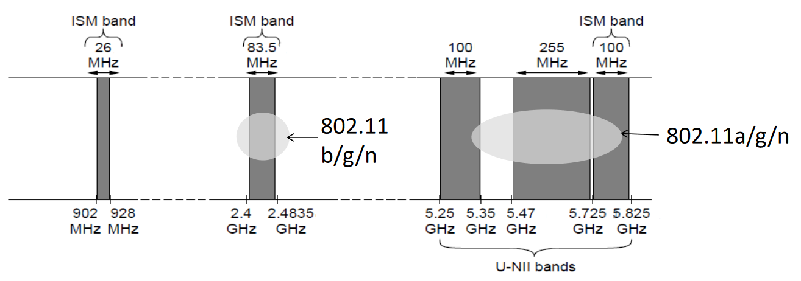
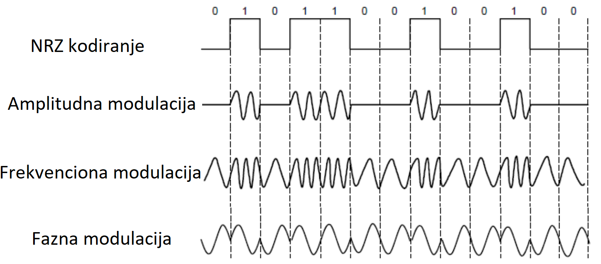

```
Autor: Mina Krivokuća
Februar 2021.

Skripta je pisana na osnovu snimaka predavanja prof. dr Aleksandra Kartelja i prezentacija.
```

- [Uvod u računarske mreže](#uvod-u-računarske-mreže)
  - [Počeci, širenje](#počeci-širenje)
  - [O računarskim mrežama](#o-računarskim-mrežama)
  - [Primeri upotreba mreža](#primeri-upotreba-mreža)
  - [Komunikacija](#komunikacija)
  - [1. Komponente mreže, tipovi veza, primeri mreža, mreže prema dimenziji, međumreže](#1-komponente-mreže-tipovi-veza-primeri-mreža-mreže-prema-dimenziji-međumreže)
      - [Komponente mreže](#komponente-mreže)
      - [Tipovi veze](#tipovi-veze)
      - [Primeri mreža](#primeri-mreža)
      - [Podela prema dimenziji](#podela-prema-dimenziji)
  - [Mreža-aplikacija interfejs](#mreža-aplikacija-interfejs)
  - [2. Protokoli i slojevi](#2-protokoli-i-slojevi)
  - [3. Referentni modeli protokola i slojeva, jedinice podataka, organizacije za standarde](#3-referentni-modeli-protokola-i-slojeva-jedinice-podataka-organizacije-za-standarde)
      - [Referentni modeli protokola i slojeva](#referentni-modeli-protokola-i-slojeva)
      - [Organizacije za standarde](#organizacije-za-standarde)
      - [Jedinice podataka](#jedinice-podataka)
- [Fizički sloj](#fizički-sloj)
  - [4. Uloga fizičkog sloja, pojednostavljen model, kašnjenja, BDP, primeri](#4-uloga-fizičkog-sloja-pojednostavljen-model-kašnjenja-bdp-primeri)
      - [Uloga](#uloga)
      - [Pojednostavljen model](#pojednostavljen-model)
      - [Kašnjenje](#kašnjenje)
      - [Primeri računanja kašnjenja](#primeri-računanja-kašnjenja)
      - [BDP - Bandwith-Delay Product](#bdp---bandwith-delay-product)
      - [BDP primer](#bdp-primer)
  - [5. (Žičani i optički) komunikacioni medijumi](#5-žičani-i-optički-komunikacioni-medijumi)
      - [Uvod](#uvod)
      - [Žičani komunikacioni medijumi](#žičani-komunikacioni-medijumi)
      - [Optički komunikacioni medijumi](#optički-komunikacioni-medijumi)
  - [6. Bežični komunikacioni medijumi](#6-bežični-komunikacioni-medijumi)
  - [Bežične ili žičane komunikacije - šta koristiti?](#bežične-ili-žičane-komunikacije---šta-koristiti)
  - [7. Komunikacioni sateliti](#7-komunikacioni-sateliti)
      - [Geostacionirani sateliti](#geostacionirani-sateliti)
      - [Nisko-orbitni sateliti](#nisko-orbitni-sateliti)
      - [Satelit ili optika?](#satelit-ili-optika)
  - [8. Signali, prenos, frekvenciona reprezentacija, signal u žičanim, optičkim, bežičnim medijumima](#8-signali-prenos-frekvenciona-reprezentacija-signal-u-žičanim-optičkim-bežičnim-medijumima)
      - [Signali, prenos i frekvenciona reprezentacija](#signali-prenos-i-frekvenciona-reprezentacija)
      - [Signal preko žice](#signal-preko-žice)
      - [Signal preko optike](#signal-preko-optike)
      - [Signal u bežičnim medijumima](#signal-u-bežičnim-medijumima)
  - [9. Modulacija i multipleksiranje signala](#9-modulacija-i-multipleksiranje-signala)
      - [Modulacija](#modulacija)
      - [Demodulacija](#demodulacija)
      - [Modulacija preko nosača](#modulacija-preko-nosača)
      - [Multipleksiranje](#multipleksiranje)
  - [10. Prirodna ograničenja prenosa signala](#10-prirodna-ograničenja-prenosa-signala)
      - [Najkvistov limit](#najkvistov-limit)
      - [Šenonov kapacitet](#šenonov-kapacitet)
      - [Žičane i bežične komunikacije](#žičane-i-bežične-komunikacije)
  - [11. Pregled relevantnijih sistema komunikacija](#11-pregled-relevantnijih-sistema-komunikacija)
      - [Sistem fiksne telefonije](#sistem-fiksne-telefonije)
      - [Generacije sistema mobilne telefonije](#generacije-sistema-mobilne-telefonije)
- [Sloj veze](#sloj-veze)
  - [12. Sloj veze, uloga, komunikacija sa slojem ispod i iznad, kratko objašnjenje spiska aktivnosti na sloju veze](#12-sloj-veze-uloga-komunikacija-sa-slojem-ispod-i-iznad-kratko-objašnjenje-spiska-aktivnosti-na-sloju-veze)
  - [13. Uokvirivanje u sloju veze](#13-uokvirivanje-u-sloju-veze)
  - [14. Kodiranje grešaka u sloju veze](#14-kodiranje-grešaka-u-sloju-veze)
      - [Pristup - dodavanje redudantnosti](#pristup---dodavanje-redudantnosti)
      - [Hamingovo rastojanje](#hamingovo-rastojanje)
  - [15. Detekcija grešaka u sloju veze](#15-detekcija-grešaka-u-sloju-veze)
      - [Provera parnosti](#provera-parnosti)
      - [Kontrolni zbirovi](#kontrolni-zbirovi)
      - [Ciklička provera redu(n?)danse (CRC)](#ciklička-provera-redundanse-crc)


<div style="page-break-after: always"></div>


# Uvod u računarske mreže 

## Počeci, širenje

**Projekat Arpanet, 1970.** - Amerika, američka vojna agencija Darpa. Projekat je imao za cilj da stvori pouzdanije sisteme komunikacije od fiksne telefonije koje bi koristili tokom nezgodnih situacija. Motivacija je bila Hladni rat i strah od presečenih komunikacija - jer je fiksna telefonija bazirana na konceptu drveta i potpuno je hijerarhijska. Izbacivanjem nekog unutrašnjeg čvora ili grane drvo se preseca na dva dela. Takav sistem je bio relativno jednostavan za implementaciju i instalaciju, ali je predstavljao veliki problem u pouzdanosti i slabu tačku u situacijama gde je komunikacija i blagovremena sinhronizacija bila ključna. 

Ideja novog sistema nije bila previše deterministička - grafovi komunikacije nisu izgledali kao da su planirani, već su podsećali na slučajne grafove (princip: dodaj granu tamo gde misliš da treba, pravile su se prečice tamo gde se osećala potreba). Ideja je prvo prihvaćena od strane univerziteta u Americi, naučnicima se dopala ideja stalne međusobne komunikacije. Najpoznatiji softver koji je korišćen za pristup udaljenom čvoru je Teolnet (?). Najveća motivacija za širenje je bila laka dostupnost udaljenih baza znanja i informacija. Kao druga "aplikacija" pojavljuje se mejl.

<p align="center">
  
</p>

Na slici iznad je površna ilustracija izgleda Internet mreže 2005. godine. Ono što je jasno je da izgleda poprilično haotično i puna redudantnosti - što za nas znači da je razbijanje mreže na više delova presecanjem komunikacija značajno teže. Čvorovi koji deluju izolovaniji i manje povezani sa ostalima nisu nužno loše isplanirani - već su pre čvorovi koji pripadaju nekim vladinim organizacijama, vojsci, itd. Ovakvi čvorovi često imaju sisteme nezavisne komunikacije i za njih je bitno da budu i fizički udaljeni od ostalih, pored korišćenja drugačijih softvera i sistema enkripcije i zaštite.


## O računarskim mrežama

Vrlo složena i raznorodna računarska disciplina - zahteva ekspertizu različitih struka: fizičara, elektrotehničara, tehnologa, matematičara, hemičara, programera... Teško ih je učiti na monolitni način. 

* **Fizički sloj** - prenos signala, medijumi (komunikacija oprema, kablovi, hardver), teorija signala, bežični i žični prenos, optički kablovi, komunikacioni sateliti, sistem mobilne telefonije, kablovske televizije. Fizički sloj **se bavi omogućavanjem prenosa bitova između dve povezane tačke.**
* **Sloj veze podataka** - nadograđuje se na fizički sloj. Svaki naredni sloj koristi usluge prethodnog, i nijedan sloj ne mora da razmišlja o problemima koje je rešio prethodni. Sloj veze podataka koristi sistem za prenos bitova između tačaka koji je obezbedio fizički sloj (point to point protokol), a onda dodaje tom sistemu neke aspekte koji bi mu povećali pouzdanost i efikasnost. Konkretno, grupisaće bitove na određen način jer nema toliko smisla raditi nad pojedinačnim bitovima, pa se nad tim grupama bitova softverski vrši detekcija i korekcija grešaka. Dakle, podizanje pouzdanosti prenosa softverskim putem. Možemo zaključiti da je realan scenario u praksi da je fizički sloj loše implementiran (žice nisu dobro izolovane od šuma npr.), ali da se softverskim algoritmima to može ispraviti. Osim što povećava pouzdanost point to point komunikacije, sloj veze podataka povećava i njenu efikasnost, npr. postoje situacije u kojima jedna strana šalje drugoj veće količine podataka za koje druga strana nema odgovarajući softver da prihvati, što se rešava na nivou sloja veze podataka. Sloj veze podataka **isporučuje narednim slojevima pouzdan i efikasan sistem za prenos podataka između dve povezane tačke**.
* **Podsloj za upravljanje pristupom medijumima** - u slučaju nepostojanja point to point protokola, već je n korisnika povezano u neku topologiju mreže, tj. nije jasno ko šta kome šalje i kada šalje (moguće je da je medijum zauzet u trenutku kada se poruka šalje). Ovaj podsloj je tehnološki prevaziđen (zastareo) i danas postoje drugi načini za rešavanje ovakvih problema. U ovom podsloju je bitna upotreba MAC adrese (hardverski identifikator uređaja u lokalnoj mreži).
*  **Mrežni sloj** - koristi usluge sloja veze. Od ovog sloja pa nadalje radi se samo softverski. Dosta je apstraktniji od prethodnih slojeva i manje je opterećen elektrotehničkim detaljima. Na mrežnom sloju su ruteri. Glavna uloga mrežnog sloja (tj. rutera generalno) je da odredi optimalnu putanju u mreži kojom će se kretati paketi. Ovakav algoritam ne sme da bude centralizovan jer ukoliko bi postojali ruteri koji bi vršili usluge rutiranja za druge, ubrzo bi baš oni postali usko grlo (eng. *bottleneck*) jer bi većina zahteva stizalo upravo do njih, i odlazilo od njih. Ovakvi ruteri su prirodno distribuirani geografski i nalaze se relativno blizu svojih korisnika. Postoje ruteri i udaljeniji od krajnjeg korisnika, a oni služe uglavnom za povezivanje sa većim brojem sledećih rutera. Jedan ruter može da zna trenutno koja je najbolja putanja za paket koji mu je pristigao, ali ne može da naređuje drugim ruterima kako će dalje da ga rutiraju. Potrebno je implementirati odluke rutera tako da se odluka trenutnog poklapa sa odlukom koju bi doneo sledeći ruter u putanji ("razmišljaj globalno, deluj lokalno"). Mrežni sloj **se generalno bavi algoritmima rutiranja, upravljanja zagušenjem i povezivanjem različitih mreža**.
*  **Transportni sloj** - najveći sloj, najveći napor uložen u ovaj sloj. Transportni sloj omogućava da krajnje tačke nisu sami računari, već uvodimo novi logički nivo - procese. Cilj transportnog sloja je da **apstrahuje komunikaciju između dva procesa na takav način da mi kao korisnici ne razlikujemo komunikaciju između dva procesa na istom računaru, i dva procesa na različitom računaru (ako se izuzme kašnjenje)**. TCP/UDP protokoli.
*  **Aplikativni sloj** - koristi usluge transportnog sloja. Protokoli višeg nivoa. Potreba da se stvari koje se koriste na isti način definišu i automatizuju (mejl npr.). Definiše protokole za komunikaciju između aplikacija kao što su HTTP, FTP, i slično.

</br>

## Primeri upotreba mreža

* Poslovna - razmena datoteka, deljeni resursi (npr. štampači), sredstvo komunikacije (mejl, video konferencije), poslovne transakcije elektronskim putem, poslovanje sa potrošačima preko Interneta...
* Kućna - prostupanje udaljenim informacijama (filmovi, muzika, vesti, audio, video), razmena poruka, elektronska kupovina...
* Mobilna - pozivi, SMS, igrice, mape, pristup informacijama...

## Komunikacija

**Analogna komunikacija** - u kablovima za prenos nije ugrađeno prepoznavanje diskretnih brojeva (bajtova), već se radi sa kontinualnim zapisom preslikanom na promene napona. Na primer, ako hoćemo da prenesemo zvuk kao poruku između dva udaljena uređaja, taj zvuk se transformiše u promene napona, one prolaze kroz žicu i na drugoj strani postoji dekoder koji rekonstruiše originalni zvuk na osnovu promena napona.

S druge strane **digitalna komunikacija** je zasnovana na međuformatu i postoji više konverzija. Prvo analizator zvuka prevodi zvuk u neke brojeve (analogno-digitalna konverzija), brojeve šaljemo kroz mrežu i ti brojevi se čuvaju preko nekih flip flopova (digitalno-analogna konverzija), ponovo se dekodira u brojeve na drugoj strani (analogno-digitalna konverzija), pa nakon toga dekoder ponovo rekonstruiše zvuk na osnovu dobijenih brojeva (digitalno-analogna konverzija). Zaključak - konverzija se dešava više puta u oba smera. 

Može biti između dva čoveka, između čoveka i računara i između dva računara.

* **VoIP** - komunikacija između dva čoveka. Pozivi preko Interneta. Naziv VoIP je malo zastareo, pošto danas podrazumeva i slanje videa i video-pozive, ali se tradicionalno i dalje naziva VoIP. Vid je digitalne komunikacije. Razlika između mobilne telefonije i VoIP-a je što informacije putuju različitim kanalima - VoIP koristi Internet, a mobilna telefonija ima svoje kanale. Potrebno je obezbediti da paketi u VoIP-u što manje kasne, kao i da stignu ispravnim redosledom. Ređanje paketa ispravnim redosledom može dodatno povećati kašnjenje, pa se nekad preskaču paketi koji ne stignu na vreme, što dovodi do čudnih zvukova ili seckanja. Na velikim udaljenostima (npr. Srbija-Australija) se oseća kašnjenje i do par stotina milisekundi.
* **Deljenje resursa** - ekonomičan i logičan koncept, nikome ne treba sve vreme sve što poseduje. Ovo može da se odnosi i na deljenje štampača u okviru firme, a i na deljenje računarskih resursa (memorije, procesorske snage, diska, protoka...). Ne koriste svi sve resurse u isto vreme - što znači da bismo sa mnogo manjom procesorskom snagom mogli da opskrbimo više korisnika nego što bi bilo potrebno snage kada bi svako imao svoju zasebnu procesorsku jedinicu. Postoji šansa da se resursi preopterete ako ih svi korisnici okupiraju u isto vreme, ali to se statistički retko dešava kada se lepo procene potrebe korisnika. Dakle, ideja je da se obezbede isti resursi koje bi PC obezbedio istom broju korisnika, ali sa mnogo manje iskorišćene električne struje. Sistemi koji isporučuju te resurse su klaud sistemi, i njihova potrošnja električne struje je ogromna, ali je u svakom slučaju manja od potencijalne sume potrošene električne struje od strane svakog korisnika ponaosob u scenariju gde svako koristi samo svoje resurse. Nekada je postojala ideja o centralizovanim računarima u budućnosti gde bi svako kod kuće imao samo terminal, a koristio resurse udaljenog računara, ali nije zaživela. 

`Statističko multipleksiranje - deljenje mrežnog protoka među korisnicima na osnovu statistike zahteva. Potrebno je da znamo informacije
o raspodeli upotrebnih navika tog resursa krajnjih korisnika. 
Primer su Internet provajderi i korisnici u ISP mreži. Ako mreža ima protok od 100 Mbps, a svaki korisnik je aktivan samo 50% vremena, da li je zaista ova mreža može da podrži samo 20 korisnika, ili je to znatno veći broj? Pojednostavljena varijanta - imamo informacije o verovatnoći da kompletan protok bude iskorišćen. Binomnom raspodelom se može izračunati da čak i za 30 nezavisnih kosnika, šanse da će biti potrebno više od 100Mbps su i dalje jako male (2%). Dobit u ovom slučaju je 1.5x.`

<p align="center">
  
</p>

* **Dostavljanje sadržaja (content delivery)** - potreba da dostavimo neki nepromenljiv sadržaj većem broju korisnika. Trošak se uglavnom meri nekom funkcijom koja direktno zavisi od broja skokova sa čvora na čvor u mreži. Ako je svakoj grani dodeljena težina 1, za skokove kažemo da su hopovi. Ukoliko bi sadržaj putovao od izvora do svakog korisnika ponaosob, broj hopova je značajno veliki. Dakle, ideja je da se naprave kopije sadržaja u nekim čvorovima kako bi se smanjila dužina putanje kojom sadržaj putuje. Kako to izgleda:


<p align="center">
  
</p>

* **Komunikacija između računara** - elektronsko poslovanje, rezervacija karata, itd. Omogućava automatsku obradu informacija nad nezavisnim sistemima.
* **Povezivanje računara sa uređajima** - razvoji senzora, očitavanje informacija sa njih. Područje primene u konstantnom razvoju (IoT - Internet of Things, pametni uređaji), zahteva jake mrežne resurse. Npr. frižider koji čita vlažnost i temperaturu, smart satovi. 


**Vrednost povezivanja** - Metkalfov (čovek koji je osmislio Ethernet) zakon, 1980. Vrednost mreže sa N čvorova je proporcionalna vrednosti N<sup>2</sup>. Velika mreža je vrednija nego više malih sa istim ukupnim brojem čvorova, to jest, veze su te koje nose informativnost, a ne čvorovi.

<p align="center">
  
</p>

## 1. Komponente mreže, tipovi veza, primeri mreža, mreže prema dimenziji, međumreže

#### Komponente mreže

Mreže se sastoje iz čvorova, veza i aplikacija. 

<p align="center">
  
</p>


Listovi (krajnji računari) mogu biti krajnji korisnici ili serverski računari, a unutrašnji čvorovi ruteri. Mi se bavimo ruterima (i sličnim uređajima koji su unutrašnji čvorovi, pomenućemo kasnije). 


<p align="center">
  
</p>

1. **Aplikacija**, korisnik - koristi mrežu (Skype, iTunes, Amazon)
2. **Završni čvor**, računar, serverski računar, izvor, uređaj - podržava aplikaciju (laptop, mobilni telefon, dekstop računar)
3. **Ruter** ili usmerivač, unutrašnji čvor - prosleđuje poruke između čvorova (pristupna tačka, kablovski/DSL modem)
4. **Veza** ili kanal - spaja čvorove (žične, bežične)

#### Tipovi veze

Podela po smeru toka informacija:

* Simpleks veza - jednosmerna, nema povratnih informacija. Primer: televizor.
* Polu-dupleks - moguća komunikacija u oba smera, ali ne istovremeno. Primer: voki-toki, radio stanice. Koristi se jedan frekvencioni opseg za slanje i primanje, što znači da se istovremenim korišćenjem signali mogu izmešati i nastao bi neki signal koji nije preterano koristan.
* Puni dupleks - moguća komunikacija u oba smera istovremeno. Primer: mobilna telefonija (istovremeno pričanje) ili mogućnost downloada/uploada istovremeno. Koristi se frekvenciona podela. 

Podela po mobilnoj fleksibilnosti:

* Bežične - na ovom predmetu mislimo na mreže u kojima ne postoji tačno određen smer (vektor) u kom se šalju poruke (za razliku od lasera npr. koji je usmeren), već se one emituju. Prihvataju je svi čvorovi u opsegu. Korisnik može da se kreće i da i dalje ne izgubi vezu, što ne bi bilo moguće da je veza usmerena.
* Žične 

#### Primeri mreža

- WiFi - bežična tehnologija, lokalna mreža
- Ethernet - žična tehnologija, lokalna mreža
- ISP mreže - mreža provajdera/usluge, nešto su veće, obuhvataju veće regije
- Kablovska/DSL
- Mobilna telefonija (2G, 3G, 4G, 5G)
- Bluetooth

#### Podela prema dimenziji

| Tip | Dimenzija | Primer |
|-----|-----------|--------|
| PAN (Personal Area Network) | neposredna blizina | Bluetooth |
| LAN (Local Area Network) | kancelarija, sprat, zgrada | WiFi, Ethernet |
| MAN (Metropolitan Area Network) | grad | kablovska, DSL|
| WAN (Wide Area Network) | država | veliki ISP, npr. Telekom, SBB |
| Internet (mreža svih mreža) | planeta | Internet |


**Međumreža ili Internet**, se dobija povezivanjem više različitih mreža. Međumreža je bilo koja heterogena mreža, tj. mreža koja se sastoji iz podmreža koje imaju jasnu razliku u tehnologiji izrade, topologiji i drugim aspektima. Hibrid različitih mreža.  
**Internet** (velikim slovom) je Internet koji svi koristimo. Međumreža.


## Mreža-aplikacija interfejs

Utvrđeno dobri načini organizovanja mreža. Apstraktni sloj, model upotrebe mreže iz aspekta transportnog sloja. Softverske apstrakcije na mreži.

**Klijent-server koncept upotrebe (model)**

Zasniva se na tome da imamo računare koji nude neke usluge, i računare koji zahtevaju neke usluge. Serveri su obično hardverski bolje i naprednije mašine kako bi mogli da usluže veći broj klijenata (zahteva) istovremeno. Najveći deo posla se izvršava na serveru, dok se na klijentu izvršava samo prikaz (grafički deo). Dakle, aplikacije implementirane na klijentu nemaju nešto specijalnu/naprednu logiku, dok se na serveru dešavaju algoritmi koji zahtevaju jaku procesorsku moć. 

Da bi klijent-server model funkcionisao, potrebno je da klijent-server sa implementacijom ne ide do nivoa bitova, priča direktno sa fizičkim slojem ili karticom, već će pričati sa slojem ispod - transportnim slojem, i koristi njegove usluge, tj. sokete. Socket API je programski interfejs - objekat - koji ima dupleks, tj. tokove podataka (input i output stream). To je mrežni API koji se koristi za pisanje svih Internet aplikacija i deo je svih poznatijih operativnih sistema. Soket postoji sa obe strane konekcije, i sa klijentske i sa serverske strane, i oba imaju odlazni i dolazni tok podataka. Socket API omogućava da se ostvari konekcija sa suprotnom stranom ne razmišljajući o aspektima ispod - bitovima, korekciji i detekciji grešaka, brzini slanja i primanja, itd. Soketi su vrlo univerzalan način razmišljanja koji se može posvetiti sa načinom komuniciranja između dva procesa. Dakle, ako bi dva procesa na istom računaru ostvarila komunikaciju, to bi izgledalo isto kao i korišćenje Socket API-ja za povezivanje na udaljeni računar. Output stream iz servera je zakačen za input stream klijenta, i obrnuto. Omogućena je pouzdana komunikacija u oba smera.

Za strimove su zakačene različite metode, nesimetrične jer se prirodno klijent i server ne ponašaju isto. Server se ponaša pasivno, a klijent aktivno. Klijent inicira komunikaciju, a server nikad samoinicijativno ne šalje zahtev. Ideja je da se server kreira, podesi i počne da radi, i čeka da se nešto desi, dok klijent čim se kreira treba da se zakači negde.

| Operacija | Značenje | Gde? |
|-----------|----------|------|
| SOCKET | Kreira komunikacionu tačku | oba |
| BIND | Pridružuje soketu lokalnu adresu | server |
| LISTEN | Označava da je soket spreman da prihvata konekcije | server |
| ACCEPT | Pasivno prihvata i uspostavlja dolaznu konekciju | server |
| CONNECT | Aktivno pokušava da ostvari konekciju | klijent |
| SEND | Šalje podatke preko uspostavljene konekcije | oba |
| RECEIVE | Prihvata podatke preko uspostavljene konekcije | oba |
| CLOSE| Zatvara konekciju | oba |

**Upotreba soketa, tok komunikacije**

Bitno je da server bude aktivan pre klijenta, tj. da bude aktivan u trenutku kada klijent želi na njega da se zakači. Klijent inicira komunikaciju, tj. šalje se zahtev od strane klijenta, i zatim server šalje odgovor koji klijentu stiže. Veza se prekida. Ovaj proces se često dešava iterativno.

<p align="center">
  
</p>

Blokirajuće komande čekaju na dešavanje i ne koriste računarske resurse.
Kada stigne zahtev za konekciju na server, accept se odblokirava, prihvata konekciju i kao povratnu vrednost ima deskriptor konekcije u kom se nalaze informacije o klijentu koji želi da se zakači od kojih su najbitniji adresa i port. Nakon toga, server odlučuje da li prihvata tog klijenta i odbacuje zahtev za konekciju. Serveri se najčešće implementiraju višenitno kako bi prihvatao više klijenata istovremeno. 

Aplikacije komuniciraju bez realne predstave šta je unutar mreže. `Tracert` komanda prikazuje putanju koju paketi prolaze od nas, pa do udaljenog računara (servera).

## 2. Protokoli i slojevi

Mrežama odgovara modularnost. Modularnost omogućava podelu odgovornosti, lakše održavanje, detekciju i popravljanje grešaka. Računarske mreže su kompleksne i nemoguće ih je implementirati monlitno, i na nivou hardvera i na nivou softvera. Mreža mora da obavlja razne zadatke za aplikacije:

* Pravi i prekida konekciju
* Pronalazi putanju za transfer podataka
* Pouzdano šalje podatke
* Šalje podatke proizvoljne veličine
* Brzinu slanja prilagođava mogućnostima mreže
* Deli protok među korisnicima
* Omogućava siguran prenos tokom tranzita
* Omogućava novo dodavanje računara i uređaja (čvorova)
* ...
  

Modularnost je u računarskim mrežama sprovedena upotrebom protokola i slojeva. Dakle, protokoli i slojevi su glavni mehanizam struktuiranja koji mreži daje modularnost.

Slojevi su disjunktne grupe funkcionalnosti koje se realizuju. Potrebno je razjasniti i raščlaniti šta kom sloju pripada, ali i odrediti redosled slojeva od nižeg ka višem, pri čemu se treba voditi time da se na nižim slojevima realizuju neke primitivnije funkcionalnosti, a na višim slojevima apstraktnije. Takođe, niži slojevi pružaju usluge višim slojevima, tj. viši slojevi neće sve raditi ispočetka nego će se obratiti sloju ispod i od njega zahtevati uslugu.

Što se protokola tiče, svaka instanca protokola komunicira virtuelno samo sa svojim parnjakom (peer) na istom sloju (!) upotrebom dogovorenih metoda. U stvarnosti, oni ne komuniciraju direktno, već svaka instanca koristi usluge (services) sloja koji je ispod.

<p align="center">
  
</p>

Dakle, ako pretpostavimo da X komuniciraju na nivou poruka, a Y na nivou bajtova (X su viši slojevi, Y su niži), možemo reći da instanca protokola X samo virtuelno komunicira sa svojim parnjakom. Zašto? Jer ono što se zapravo dešava je da X instanca šalje poruku svom nižem sloju (Y od instance) koji prevodi poruku u bajtove, i zatim ih šalje Y sloju parnjaka koji te bajtove prima. Parnjak se oslanja na sloj Y ispod njega, preuzima i iščitava poruku koja mu je prosleđena. Dakle, ne postoji fizička komunikacija u protokolu X, već samo u protokolu Y. Protokol Y je fizički protokol.


Neki od primera realnih protokola:
- HTTP na aplikativnom sloju
- TCP na transportnom sloju
- IP na mrežnom sloju
- IEEE 802.11 (Wifi) na sloju veze

Protokol stek je čest naziv za skup protokola u upotrebi. Npr. skup protokola koji koristi web browser na računaru koji je putem WiFi-a povezan na Internet.

Mehanizam slaganja slojeva protokola: niži sloj pravi omotač oko sadržaja višeg sloja i dodaje sopstvene informacije poruci, kao slanje pošte u koverti u kom slučaju poštari nemaju pristup unutrašnjosti koverte. Svaki sloj dodaje svoje zaglavlje.

<p align="center">
  
</p>

Mehanizam slaganja slojeva protokola je vid enkapsulacije.

`-------------` 

`Multipleksiranje i demultipleksiranje - konfuzan deo koji prof. dr. Kartelj ima u prezentacijama, ali je preskočio da objasni na času, informacije su uzete iz drugih izvora.`

Priprema segmenata koji se prosleđuju mrežnom sloju je proces **multipleksiranja** (kombinovanja), a njihovo primanje od strane mrežnog sloja, raspakivanje i prosleđivanje protokolima višeg sloja je **demultipleksiranje**. 

Proces multipleksiranja se odvija tokom slanja podataka - podaci se preuzimaju od aplikacijskih procesa i enkapsuliraju se zaglavljem, čime se od njih prave segmenti. Ovi segmenti se predaju mrežnom sloju. Sa druge strane, ti primljeni segmenti se od strane mrežnog sloja na osnovu odgovarajućeg polja u zaglavlju predaju odgovarajućem procesu - što je demultipleksiranje.

`-------------`

Prednosti raslojavanja:
- elegantniji sistem, prikrivanje informacija i ponovna upotreba
- povezivanje različitih sistema
- lakše uočavanje problema i identifikacija problematičnog sloja ili protokola
- lakše debagovanje

Mane raslojavanja:
- previše raslojavanja dovodi do više komunikacije između slojeva, što je dodatni trošak, gubi se na performansama
- prikrivanje informacija, jer neke aplikacije možda žele da znaju stvari koje im nisu dostupne, npr. da li se podaci prenose putem kabla ili bežično

## 3. Referentni modeli protokola i slojeva, jedinice podataka, organizacije za standarde

#### Referentni modeli protokola i slojeva

Ključna pitanja kod dizajna modela su koju funkcionalnost implementira svaki sloj i kako ih najbolje povezati. Referentni modeli odgovaraju na njih. Najpoznatiji referentni modeli:

* OSI model sa 7 slojeva - internacionalni standard za povezivanje sistema. Uticajan, ali ne i previše korišćen u praksi.

<p align="center">
  
</p>

* Internet (TCP/IP) model - 4 sloja, zasnovan na praksi. Poslednji sloj, tj. sloj veze grupiše funkcionalnosti tradicionalnog sloja veze i fizičkog sloja. Isprepletane su aktivnosti uređaja koji moduliraju i demoduliraju signal i mrežne kartice koja radi  detekciju i korekciju grešaka, usaglašavanje brzina slanja i primanja, itd.

<p align="center">
  
</p>


#### Organizacije za standarde

Neke poznatije organizacije koje se bave standardizacijom i protokolima:

| Organizacija | Oblast | Primeri standarda|
|--------------|--------|------------------|
|ITU (International Communication Union)|Telekomunikacije|G.992, ADSL, H.264, MPEG4|
|IEEE (Institute of Electrical and Electronics Engineers)|Komunikacije i reprezentacije podataka|802.3,Ethernet, 802.11, WiFi|
|IETF (Internet Engineering Task Force)|Internet, aplikativni protokoli niskog nivoa|RFC 2616, HTTP/1.1, RFC 1034/1035, DNS|
|W3C (World Wide Web Consortium)|Veb, aplikativni protokoli visokog nivoa|HTML5, CSS|

#### Jedinice podataka

| Sloj | Jedinica | Opis |
|------|----------|--|
|Aplikativni|Poruka| Predstavlja neku smislenu jedinicu za korisnika, npr. HTML sadržaj ili GET zahtev|
|Transportni|Segment| Nemaju semantiku, potrebno ih je rekonstruisati, uklopiti, spojiti da bi se dobilo značenje|
|Mrežni|Paket| Još manje značenja...|
|Sloj veze|Okvir| Još manje... |
|Fizički|Bit| 0 značenja|


<div style="page-break-after: always"></div>


Kako će se posmatrati hijerarhija slojeva i protokola na kursu/u skripti:

<p align="center">
  
</p>

<div style="page-break-after: always"></div>


# Fizički sloj

## 4. Uloga fizičkog sloja, pojednostavljen model, kašnjenja, BDP, primeri 

#### Uloga

Najjednostavniji opis nadležnosti fizičkog sloja je slanje bitova između dve tačke povezane komunikacionim medijumom. 

Najbitnije teme koje se tiču fizičkog sloja:
- **Karakteristike prenosnog medijuma** - električna žica, optički kabl, bežično slanje.
- **Slanje signala** - protok, matematička pozadina, entropija, slabljenje, šum.
- **Tehnike modulacije i multipleksiranja** - prenos signala, reprezentacija bitova, šum.
- **Prirodna (gornja) ograničenja** - Najkvist-Šenon teorema, teorija informacija, npr. koliko bitova možemo najviše da prosledimo kroz određeni komunikacioni kanal imajući u vidu njegove fizičke karakteristike, veza između fizičkih i informacionih karakteristika, tj. između analognog i digitalnog sveta.

#### Pojednostavljen model

Svojstva kojima se opisuje svaki komunikacioni kanal:
- **Protok** (ili brzina, kapacitet) - nije fizička veličina u tradicionalnom smislu, već informaciona (digitalna). Ne govori se o metrima u sekundi, već o broju bita u sekundi. Može se uspostaviti veza između informacionih veličina i fizičkog sveta, tako da je brzina vezana za neke fizičke karakteristike poput frekvencije, komunikacionog kanala, opsega frekvencija, brzine svetlosti i slično.
- **Kašnjenje** - mora da postoji jer brzina prenosa nije beskonačna. Gornja (fizička, matematička) granica bi bila brzina svetlosti. Meri se u sekundama.
- **Da li kanal emituje**
- **Raspodela verovatnoća grešaka** 

#### Kašnjenje

Ukupno kašnjenje podrazumeva vreme potrebno da poruka stigne sa polazne adrese na ciljnu adresu, odnosno od pošiljaoca do primaoca. Kašnjenje ima dve bitne komponente:
- **kašnjenje prenosa (transmission delay)** - vreme potrebno da se M-bitovna poruka postavi na komunikacioni kanal. Vezano je sa količinom informacija koje šaljemo i sa brzinom prenosa komunikacionog kanala. Dakle, ako imamo malu brzinu prenosa u komunikacionom kanalu, a šaljemo veliku poruku, prirodno je da će vreme trajanja prenosa biti duže. Kašnjenje prenosa računamo kao <p align="center">  </p> to jest tako što dužinu poruke (M) izraženu u bitovima (b) delimo sa brzinom komunikacionog kanala (B) izražene u bitima po sekundi (b/s). Možemo ga shvatiti kao apsorpcionu moće komunikacionog kanala, tj. koliko informacija on može da uhvati.
- **kašnjenje propagacije (propagation delay, ping)** - vreme potrebno da bitovi prođu kroz komunikacioni kanal. Ne zavisi od brzine prenosa ili manipulacija veličinama poruka, već je inherentna karakteristika komunikacionog kanala i posledica gornje fizičke granice - brzine svetlosti. Svi moderni komunikacioni sistemi su zasnovani na elektromagnetnim talasima čija je brzina kretanja reda veličine brzine svetlosti, odnosno između <sup>2</sup>/<sub>3</sub>c i c (zavisi da li je u pitanju WiFi, optika...). Dakle, kašnjenje propagacije je neminovno i primetno je prilikom slanja na veće daljine. Računamo je kao <p align="center">  </p> gde je brzina signala u opsegu (<sup>2</sup>/<sub>3</sub>c, c)
- **ukupno kašnjenje** dobijamo sabiranjem pomenuta dva: <p align="center">  </p>
  


| Oznaka | Vrednost | Oznaka | Vrednost|
|--------|----------|--------|---------|
|K(ilo)|10<sup>3</sup>|m(ili)|10<sup>-3</sup>|
|M(ega)|10<sup>6</sup>|μ(micro)|10<sup>-6</sup>|
|G(iga)|10<sup>9</sup>|n(ano)|10<sup>-9</sup>|

#### Primeri računanja kašnjenja

* Dialup sa telefonskim modemom (slanje ka račuanru u istom gradu): 
  * P = 5ms, B = 56kb/s, M = 1250B
  * L = 5ms + (1250x8)/(56 x 10<sup>3</sup>)s = 5ms + 179ms = 184 ms
  
  Treba imati u vidu da se zvuk koji šaljemo telefonskim komunikacionim kanalom ne kreće brzinom zvuka, već brzinom električne struje zbog primarnog konvertovanja u promene napona radi putovanja kroz kanal.

* Širokopojasna veza - kablovska ili DSL (slanje kroz državu)
  * P = 50ms, B = 10Mb/s, M = 1250B
  * L = 50ms + (1250x8)/(10 x 10<sup>6</sup>)s = 50ms + 1ms= 51 ms

Dakle, dugačka veza ili mali protok proizvode veće kašnjenje. Obično jedna od komponenti kašnjenja (P ili T) biva dominantna. Kod Dialup-a, usko grlo je komunikacioni kanal, a kod kablovske/DSL-a je to ping. 

Ono što je bitno napomenuti i imati u vidu je da se ping odnosi samo na inicijalno kašnjenje, to jest kašnjenje prvog bita koji stiže. Svi ostali bitovi koji stižu za njim imaju samo apsolutno, ali ne i relativno kašnjenje. Kod kašnjenja fajlova to nije značajno, ali u realtime sistemu jeste, npr. VoIP, video pozivi, live stream.

#### BDP - Bandwith-Delay Product

Predstavlja umnožak protoka i kašnjenja. Prosto rečeno - koliko smo popunili komunikacioni kanal, tj. količina podataka prisutnih na kanalu u nekom momentu. Ako bismo posmatrali podatak kao materiju, onda je ovo zapremina materije. Meri se u bitovima. Mali je za kanale u lokalnim mrežama, npr. WiFi, a veliki za "velike debele" (long fat networks, sa BDP-om većim od 10<sup>5</sup> bitova) kanale.

BDP = B x D, gde je B vreme zadržavanja na komunikacionom kanalu, a D propusni opseg.

#### BDP primer

* Slanje od Perta do Sidneja dugačkim optičkim kanalom.
  * B = 40Mb/s, D = 50ms 
  * BDP = 40 x 10<sup>6</sup> x 50 x 10<sup>-3</sup>b = 2000Kb = 250KB
  * Ovo se smatra velikim BDP-om.

## 5. (Žičani i optički) komunikacioni medijumi

#### Uvod

Medijum propagira signal sa informacijama u vidu bitova. Tri osnovna tipa:
- žičani
- optički (kablovi)
- bežični

Žičani i optički su samo naizgled slični, ali suština im je potpuno različita i bitno ih je izdvojiti u zasebne tipove. 

Četvrti tip je tip koji podrazumeva fizički transport memorija na kojima se nalaze podaci (slanje diskova poštom, transport kamionom :D). Kutija sa 1000 diskova od po 800Gb se može isporučiti za jedan dan (86400s). Protok je, dakle, oko 70 Gb/s, što će jako teško ostvariti bilo koja mreža. Dobre strane su pouzdanost, cena. Problem je pre svega ping, koji je ovom slučaju kašnjenje od 86400s, što niko ne želi.

#### Žičani komunikacioni medijumi

Zasnovani na prenosu jedne varijante elektromagnetnog talasa, tj. prenosu električne struje manjih i većih frekvencija.

1. **Upredena parica (UTP - unshielded twisted pair)** - veoma čest, koristi se za LAN kablove i kod telefonskih linija. Inicijalno bio zamišljen kao komunikacioni medijum za prenos telefonskog signala u doba ekspanzije fiksne telefonije, ali su vremenom unapređivane tako da podržavaju i prenos podataka. Zapravo je i prva pomenuta mreža (početak skripte, Darpa priča) koristila upredene parice. Vremenom su i kompanije koje pružaju usluge fiksne telefonije polako počele da se bave i pružanjem usluga Interneta. Tako nastaje ADSL. 
Upredene parice su izuvrtane (zbog umanjivanja smetnji) bakarne žice za izolacionim slojem okolo, sve zajedno obložene još jednim, glavnim izolacionim slojem. UTP kabl kategorije 5 sa 4 upredena para:
<p align="center">  </p>

2. **Koaksijalni kabl** - dosta veći prenosni kapacitet i bolje performanse. Nastao u doba ekspanzije kablovske televizije, za čiji se prenos primarno koristio. Inicijalno, po svom dizajnu su imali manje smetnji i bili sjajni u prenosu video signala, samim tim su i imali veliki propusni opseg. Koristi se i danas.
U sredini je deblja bakarna žica, oko nje izolacioni materijal, oko njega metalna mrežica koja, poput faradejevog kaveza, služi da spreči spoljne signale da ulaze unutra i da spreči kretanje signala u suprotnom smeru. Oko nje je još jedna izolaciona plastična opna.
<p align="center">  </p>

3. **Električne žice za prevođenje struje** - praktičan za upotrebu i skoro svuda je već instaliran (retko koje mesto na svetu gde ljudi žive nema struju :D). Loš je u svim ostalim aspektima. Dizajn samih žica nije povoljan po prenos podataka - imaju ogroman šum, puno grešaka. Ali, čak i kroz nepouzdan komunikacioni medijum moguće je pouzdano prenositi podatke, ne u tehnološkom smislu, već je moguće nadomestiti ove nedostatke na logičkom nivou, npr. tako što će se slati redudantni podaci na osnovu kojih će se sa druge strane oni rekonstruisati u ispravno stanje.
<p align="center">  </p>

#### Optički komunikacioni medijumi

Liče spolja na žičane, ali su potpuno drugačiji. Optička vlakna su dugačka, tanka i čista vlakna stakla. Tehnološki proces pravljenja optičkih kablova je katastrofalno komplikovan i znatno su skuplji u odnosu na ostale. Ono što je poželjno kod njih i zbog čega su danas dominantni su sjajne performanse po pitanju protoka (zbog velikog opsega frekvencija) i kašnjenja.
Prenos podataka se vrši tako što sa strane pošiljaoca imamo izvor svetlosti, ta svetlost se propušta kroz optičko vlakno. Unutra je ona zarobljena i kreće se, pravolinijski i udara u zidove. Sa suprotne strane postoji fotodetektor, tj. inverzni mehanizam koji kodiranu svetlost dekodira i prebacuje nazad u podatke.
<p align="center">  </p>
Postoje i određeni gubici - ako se koriste za velike udaljenosti, na određene pozicije postavljaju se pojačivači koji stanje podataka vraćaju na originalno, ili blisko originalnom stanju.
Dva tipa vlakana:


1. Višemodalno vlakno - jeftinije, kraće dužine. Obično se dovodi do krajnjih korisnika. Svetlost se sudara sa zidovima.
2. Unimodalno - skuplje, dužine do 100km. Jako tanko, svetlost praktično ide pravo, ali je nezgodno postaviti ga.


Česta je praksa da se vlakna pakuju, pogotovo kada se optičkim kablovima povezuju međusobno gradovi.

<p align="center">  </p>

<p align="center">  </p>

2007. godina, sve najbitniji putevi komunikacije su optika, uključujući i veze između svih kontinenata, a i one preko okeana:

<p align="center">  </p>

Sistem za zaštitu prekookeanskih kablova je skup i komplikovan. Uglavnom je moguća autodijagnostika i reparacija, ali često je potrebno i doći i popraviti. Na slici se vidi da kablova ima dosta, ali ih je ipak teško provući kroz neke države iz političkih razloga - npr. kroz države Afrike. Kako su prekookeanski jako skupi, kompanije koje su ih provukle skupo naplaćuju saobraćaj koji kroz njih teče. Novac počinje od malih korisnika, odlazi do malih internet provajdera, oni plaćaju putarine npr. evropskim provajderima.

## 6. Bežični komunikacioni medijumi

Potpuno drugačiji od žičanih. Usmerena bežična komunikacija su laseri, veoma efikasni

Na računarskim mrežama, ipak, govorimo o neusmerenom bežičnom prenosu - pošiljalac emituje signal kroz prostor u svim pravcima, potencijalno veliki broj primalaca. 

**Elektromagnetni spektar** - spektar elektromagnetnih talasa u rastućem poretku prema frekvenciji. Generalno značajan opseg je između 10<sup>4</sup> i 10<sup>16</sup>, a za mreže su najznačajniji WiFi, 3G, 4G, 5G.

X zraci i gama zraci bi potencijalno mogli da budu sjajni prenosnici, ali su jako štetni.

<p align="center">  </p>

Iz komercijalnog aspekta, većina frekvencija su već licencirane/dodeljene na upotrebu, i to se radi pažljivo kako ne bi došlo do mešanja signala. Velika je potražnja i često se prodaju na aukcijama za najveće ponude. 

<p align="center">  </p>

Postoje i neke nedodeljeni delovi spektra (bendovi) koji nisu licencirani, što znači da ljudi mogu da ih koriste za svoje namene. To je najčešće komunikacija 2G, 3G, 4G, 5G, WiFi mrežama.

<p align="center">  </p>


**Radiotalasi**

Iz aspekta računarskih mreža ne preterano bitni, imaju mali prenosni kapacitet koji je korelisan sa opsegom frekvencija koji je moguć. Mogu da prolaze kroz zgrade, ali im signal slabi iz raznih razloga, biva apsorbovan, zbog odbijanja, itd.

Dva podtipa:

1. zemaljski - imaju niže frekvencije i antene bi za njih trebalo da se postavljaju tako da pokrivaju određeno područje i svojim pozicijama prate zakrivljenost zemlje.
<p align="center">  </p>

2. nezemaljski - više frekvencije, antene se usmeravaju prema jonosferi tako da se talasi odbijaju od nje. Koriste se da šalju signale na veće udaljenosti.
<p align="center">  </p>


**Mikrotalasi**

Najznačiji za računarske mreže. Imaju veliki frekventni opseg i koriste se često za zatvorene namene poput WiFi, kao i za otvorene poput 3G i satelite. Signal slabi i reflektuje se od objekata iz okruženja. Jačina varira zbog udaljenosti, sabiranja signala, itd. 

**Svetlost**

Svetlosni signali se mogu koristiti kao komunikacioni medijum (ne misli se na optička vlakna). Svetlost je vrlo usmeren talas i ima veliki frekventni opseg (protok u elektroinženjerskom smislu). Može se iskoristiti upotrebom lasera i fotodetektora. Ovaj metod je nepouzdan jer čak i vremenske prilike, kapljice kiše npr. bi mogle da poremete odlazni ugao, i time bi podaci do fotodetektora stigli u nekoj izmenjenoj varijanti.

<p align="center">  </p>


## Bežične ili žičane komunikacije - šta koristiti?

Bežične:
- jednostavne za postavljanje i jeftine
- prirodno podržavaju mobilnost
- prirodno podržavaju emitovanje
- mešanje signala se mora razrešavati
- jačina signala, pa samim tim i protok izuzetno varira

Žičane/optika:
- lako se projektuje na fiksni protok duž odabranih ruta
- skup za postavljanje, posebno na većim udaljenostima
- nije projektovan za mobilnosti ili emitovanje

Bežične treba koristiti ukoliko postoje potrebe emitovanja, ili mobilnosti mreže. Žične ipak imaju najstabilniji protok i treba ih koristiti kad god je to moguće.

## 7. Komunikacioni sateliti

Sateliti su efikasni za emitovanja i komunikaciju bilo kada i bilo gde. Dakle, primarna upotreba je za emitovanje, a ne za slanje podataka između dve tačke. Tipovi satelita:

1. Geostacionarni (GEO) 
2. Srednje-orbitni (MEO) 
3. Nisko-orbitni (LEO)

Sats needed je koliko je potrebno tih satelita da bi se pokrila zemljina kora:

<p align="center">  </p>


#### Geostacionirani sateliti

Značajno drugačiji od druga dva tipa. Obično se postavlja na visine oko 35000km, što je poprilično daleko od Zemljine površine. Ima istu ugaonu brzinu kretanja kao i Zemlja. Drugim rečima, pomera se za isti ugao u jedinici vremena, što znači da će u datom momentu kada se postavi u odgovarajuću poziciju uvek biti iznad iste tačke na Zemlji. Druga dva tipa nemaju ovu sposobnost, već mora da postoji mreža koordinisanih satelita kako bi se pokrila određena površina.

Da bi se sateliti ispravno koristili, potrebno je da postoji nešto što satelitu šalje informaciju, a satelit se onda ponaša kao relej - reflektuje tu informaciju ka drugim prijemnicima. Primer za ovo su satelitske televizije - RTS usmerava svoju antenu (mikrostanicu) prema satelitu, koja je otpremnik signala. Satelit emituje taj signal određenom području koji zemaljska antena ne bi mogla da obuhvati. Antene (mikrostanice) primaju signal nazad. Često se koriste centralni uređaji - habovi, koji su u stvari zemaljske antene visokog učinka i služe da olakšaju komunikaciju između običnih antena (mikrostanica) i satelite, a i između mikrostanica međusobno. 

<p align="center">  </p>


#### Nisko-orbitni sateliti

Nisu geostacionirani, ali ako ih ima više, mogu da garantuju stalnu pokrivenost na odabranim regijama. Imaju brži odziv u odnosu na GEO, jer su bliži Zemlji.

#### Satelit ili optika?

Satelit:
- nakon lansiranja satelita, komunikacija se može brzo uspostaviti bilo gde i bilo kada
- emitovanje na velika područja
- ograničeni protok i mešanje signala

Optika:
- ogroman protok duž velikih udaljenosti
- instalacija skupa i komplikovana

## 8. Signali, prenos, frekvenciona reprezentacija, signal u žičanim, optičkim, bežičnim medijumima

#### Signali, prenos i frekvenciona reprezentacija

Signal koji mi želimo da pošaljemo je digitalni signal. Analogni signali kodiraju digitalne. U prirodi je vrlo teško da propagacijom dobijemo signal nekog pravilnog ili smislenog oblika, i uvek je ono što dobijemo diferencijabilno. Ono što očekujemo da izvedemo izgleda otprilike ovako:

<p align="center">  </p>

Način kodiranja ciljanog digitalnog signala u analogni signal je putem Furijeove analize. U suštini, radimo deo po deo frekvencije koja će na svakom svom delu imati sumu nekih sinusa i kosinusa. Svaki sinus i kosinus će biti vezan za konkretan interval. Kvalitet dobijene reprezentacije zavisi od broja sabiraka koje koristimo u sumi. Što više "ovih sinusa i kosinusa" imamo, to je vernija reprezentacija.

`----- TODO: ovde fali poneka slika i dodatno objašnjenje, nije ni meni jasno -----`

Dakle, ako želimo da pošaljemo neki signal sa visokim stepenom preciznosti, to će se desiti na uštrb broja signala koje želimo da pošaljemo. Ako uštedimo na kvalitetu, možemo ih poslati više. Može se desiti i da je prijemnik loš i da ne može da rekonstruiše signal. Praksa je da se šalju signali dovoljno kvalitetni u odnosu na njegove tehničke mogućnosti.

#### Signal preko žice

1. Signal kasni - brzina je ~<sup>2</sup>/<sub>3</sub>c, a ne beskonačna.
2. Signal slabi sa porastom udaljenosti i mora se pojačavati.
3. Frekvencija iznad neke granice brže slabe, i to ne linearno
4. Dešava se šum zbog spoljnih efekata.

U elektroinženjerstvu: protok = širina frekvencionog opsega (Hz)

U računarstvu: protok = kapacitet prenosa informacija (b/s)

U realnosti, signal nikad neće stići u obliku u kom ga šaljemo. Problemi sa šumom nisu strašni ukoliko je taj šum ravnomeran jer se signal ipak na drugoj strani može rekonstruisati:

<p align="center">  </p>

Dok sa druge strane, postoje šumovi koji prave dovoljan problem da su signali koji stignu neupotrebljivi, npr. varničenje.

#### Signal preko optike

Nisu ni sve frekvencije idealne za slanje korišćenjem svetlosti. Postoje tri široka frekventna opsega u kojima se svetlost prenosi sa veoma malim gubitkom:

<p align="center">  </p>

Postoje lokalni optimumi koji se koriste za prenos. Ovde je predstavljena talasna dužina, a ne frekvencija, ali to su inverzne stvari. Ako posmatramo talas (talas predstavlja neku periodičnu funkciju), na tom talasu možemo da očitamo frekvenciju i talasnu dužinu. Frekvencija talasa bi bila broj napravljenih perioda u jedinici vremena, gde je perioda šablon koji se ponavlja. Talasna dužina je inverzna veličina frekvenciji, i to je zapravo dužina koju talas napravi u jednoj periodi.

<p align="center">  </p>


#### Signal u bežičnim medijumima

Nezgodniji za rad. Zbog visokih frekvencija bežičnih prenosa, nije moguće digitalni signal direktno kodirati u analogni, već se koristi koncept signala nosača. Signal nosača je neki signal koji oscilira na datoj frekvenciji, a onda ga mi modifikujemo, tj. modifikujemo mu fazu i amplitudu, koristi se neko deljenje vremena da bi se detektovalo šta se dešava (to se priča kasnije u tehnikama modulacije, tako da je okej ako sad nije jasno). 

Signal u bežičnim medijumima putuje brzinom svetlosti, ali jako brzo slabi (sa kvadratom rastojanja). Višestruki signali na istoj frekvenciji se mešaju kod primaoca. Ako su lokacije dovoljno udaljene, moguće je koristiti istu frekvenciju.

Otežavajući efekti:
- Propagacija bežičnog signala je složena i zavisi od okruženja
- Karakteristike zavise i od frekvencije - ne prenose se isto zvuk i svetlost. 
- Postoji problem sa sabiranjem odbijenih signala kod mikrotalasa - signali mogu da se odbijaju od objekata i putuju kroz više nezavisnih putanja. Kada stignu višestruki signali kod primaoca, može se desiti da se loše saberu.

## 9. Modulacija i multipleksiranje signala

#### Modulacija

Modulacija je kodiranje digitalnih informacija u analogne, tj. nešto što je fizički opipljivo. 

Fizička veličina koja nosi te informacije može da bude različita. Da bi se ispravno izvršile ove dve operacije, mora se ugovoriti konvencija između pošiljaoca i primaoca tako da obe strane znaju šta predstavljaju podaci i u kom su obliku.

Najjednostavniji primer modulacije je jednostavna modulacija - kodiranje informacija na promene napona. Visoki napon (+V) predstavlja 1, niski (-V) predstavlja 0. Ovo se zove NRZ kodna šema (Non-Return to Zero).

<p align="center">  </p>

Postoje i druge šeme kodiranja, i one se biraju u zavisnosti od tehnoloških karakteristika medijuma i mogućnosti dekodiranja. Recimo, može se koristiti i više od dva nivoa, odnosno simbola. Npr. 4 nivoa = 2 bita.

#### Demodulacija

Demodulacija je obrnut, tj. inverzan proces modulaciji. Primalac, tj. druga strana koja je svesna načina kodiranja, čita fizičku veličinu koristeći neki uređaj koji je u stanju da prepozna vrednosti te fizičke veličine (npr. kod stanja napona je to potenciometar), i na određeni način ih dekodira nazad u digitalnu formu. 

Kod demodulacije se javljaju i neki problemi, npr. dugačke sekvence nula ili jedinica. Ukoliko se informacije razmenjuju na sinhronizovan način, tj. bez metapodataka, može doći do akumulacije kašnjenja. Može se desiti da primalac nije siguran koliko ih je (npr. poslato je 50, a primalac misli da ih je 49 ili 51 u zavisnosti od smera). Neka od mogućih rešenja za to su sinhronizacija satova, Mančestersko kodiranje, i dr.

Još jedan način rešavanja ovog problema je 4B/5B (Clock encoding) šema. Dizajnirana je tako da nikad ne dozvoljava više od tri uzastopne nule.

`4b/5b encoding is a type of 'Block coding'. This processes groups of bits rather than outputting a signal for each individual bit. A group of 4 bits is encoded so that an extra 5th bit is added. Since the input data is taken 4-bits at a time, there are 2^4, or 16 different bit patterns. The encoded bits use 5-bit, and hence have 2^5 or 32 different bit patterns. As a result, the 5-bit patterns can always have two '1's in them even if the data is all '0's a translation occurs to another of the bit patterns. This enables clock synchronisations required for reliable data transfer.`

Bitovi se sa druge strane prevode na osnovu tabele kodiranja (ovo ne treba da se uči, tu je zbog demonstracije):

<p align="center">  </p>

Posledica korišćenja ove šeme je manja iskoriščenost - imamo jedan bit redudantnosti, dakle iskorišćenost je 80%.

#### Modulacija preko nosača

U dosadašnjoj priči, modulacija se vršila tako što smo menjali stanje neke fizičke veličine u odnosu na digitalni signal. Ova strategija nije uvek moguća i praktična. To je slučaj kod signala koji rade na mnogo visokim frekvencijama, npr. mikrotalasi. Direktno prebacivanje bita u stanje amplitude je nemoguće pri visokim frekvencijama jer nemamo dovoljno dobre i osetljive uređaje koji bi mogli tako brzo da modifikuju takve signale. Iz ovih razloga, koristi se modulacija preko nosača (passband, a ono što smo pričali ranije je baseband).

Modulacija preko nosača praktikuje drugačiju ideju, a to je da ne menjamo fizičku veličinu za svako stanje narednog bita, već držimo određenu karakteristiku našeg elektromagnetnog talasa (signala nosača) konstantnom u nekom vremenskom intervalu, i menjamo je po potrebi. Vremenski interval se određuje po potrebama/dogovoru, na nivou uređaja. Dakle, signal nosač oscilira na željenoj frekvenciji, a potom se modulira promenom amplitude, frekvencije ili faze.

<p align="center">  </p>

Ove modulacije se mogu i kombinovati. Na sledećoj slici prikazane su šeme za faznu modulaciju i kombinovanu amplitudno-faznu modulaciju:

<p align="center">  </p>


#### Multipleksiranje

Multipleksiranje se bavi pitanjem - kako logički podeliti jedan kanal između više korisnika?

Inicijalno nismo imali logički pristup podeli komunikacionog kanala, već smo (npr. kao ranije kod fiksnih telefona) imali žice koje su to radile fizički. Taj pristup je dosta skup i neefikasan. Danas je prirodno da kroz isti kanal protiču podaci raznih korisnika.

Postoje tri standardna pristupa:

1. Frekvenciono multipleksiranje
2. Vremensko multipleksiranje
3. Multipleksiranje zasnovano na kodovima

Analogija za ovaj problem je soba u kojoj ima puno ljudi, i trebalo bi da neki među njima mogu da komuniciraju.


**Frekvenciono multipleksiranje (FDM - Frequency Division Multiplexing)**

Ovaj pristup se zasniva na jednoj dosta lepoj karakteristici talasa (i drugih, ne samo elektromagnetnih) u prirodi. Kada bismo pričali o problemu pomenute sobe, kao prisutna osoba u trećem licu mi bismo mogli da se fokusiramo na glasove konkretnih ljudi od interesa i razumemo ono što pričaju. Ono što nam olakšava taj proces je to što se glasovi međusobno razlikuju - neko priča sporo, neko brzo, neko ima piskav glas, itd. Ovo nije nužno vezano za jačinu tona, može biti, ali ne mora da znači.

Dakle, slična situacija je i sa elektromagnetnim talasima. Ovaj pristup deli kanal tako što različite korisnike postavlja na različite frekvencione opsege. Koriste se uređaji koji su u stanju da filtriraju talase koji nisu relevantni i da ih potpuno ignorišu, tako da ne dolazi do njihovog mešanja (sabiranja, oduzimanja...). U pitanju su filteri i jedan od načina na koji rade je filtriranje prema opsezima frekvencija.

Ovim pristupom se omogućava paralelno iskorišćenje dela kapaciteta komunikacionog kanala, znači ne celog, već dela koji je proporcionalan širini frekvencionog opsega koji je njemu dodeljen.

<p align="center">  </p>


**Vremensko multipleksiranje (TDM - Time Division Multiplexing)**

Blisko konceptu time sharing-a, pomenuto na operativnim sistemima. Upotrebljava se u sistemima fiksne i mobilne telefonije. U sobi punoj ljudi ovo bi značilo da svi ćute dok priča neka podgrupa, pa nakon njih priča sledeća, itd.

Korisnici se drže fiksnog rasporeda. Raspored može da se prati korišćenjem sata, nekih tokena (korisnici ih razmenjuju i samo jedna osoba kod koje je token koristi komunikacioni kanal) i slično.

<p align="center">  </p>


**Kodno multipleksiranje (CDMA - Code Division Multiple Access)**


Podseća na frekvenciono multipleksiranje iz aspekta istovremenosti - omogućava paralelno slanje informacija od strane različitih korisnika kroz isti komunikacioni kanal. U pomenutoj sobi, ovo bi bilo kao da ljudi pričaju različitim jezicima.

Korisnicima se dodeljuju ključevi koji su među sobom jedinstveni i ortogonalni. Ako posmatramo sekvencu bitova kao nekakav vektor, ključ svakog pošiljaoca bi morao da bude ortogonalan u odnosu na sve ostale, što znači da ti ključevi formiraju bazu vektorskog prostora. Kada se šalju signali, prave se agregacije ključeva, tj. ukoliko korisnik šalje jedinicu, njegov ključ se sabira, a oduzima se ukoliko šalje nulu. Na taj način se formira novi vektor iz kog se može zaključiti koji korisnik je šta poslao i mogu se lako izvući informacije o potrebnom korisniku - tako što se množi ključ sa rezultujućim signalom (radi se skalarni proizvod) i dobija se pozitivna vrednost ukoliko je korisnik poslao 1, i negativna ako je poslao 0.


<p align="center">  </p>


## 10. Prirodna ograničenja prenosa signala

Ograničenja su nam bitna jer želimo da znamo koliko smo dobri, odnosno koliko smo blizu krajnjih granica teorijskog protoka koji možemo da ostvarimo na osnovu fizičkih karakteristika komunikacionog medijuma. Realni sistemi su dobro realizovani ako nisu mnogo daleko od ovih ograničenja.

Teorija informacija - Šenon se smatra začetnikom/osnivačem. Neki koncepti su postojali i ranije, pa su se kasnije uvrstili u tu oblast.

Teoreme koje odgovaraju na pitanje - koliko često se može slati podatak kroz kanal? Odnose se na prenosni kapacitet komunikacionog medijuma, tj. određivanje njegovih informacionih karakteristika na osnovu fizičkih.

* Najkvistov limit (~1924)
* Šenonov kapacitet (1948)

Ključni fizički koncepti za prenos signala:

- **Protok (Bandwith, B)** - elektroinženjeri ga interpretiraju kao opseg frekvencija, tj. fizičku veličinu, a matematičari/računarci kao informacionu veličinu. Između ova dva postoji jaka veza (što je slučaj i npr. sa entropijom u matematici i termodinamici). Protok u stvari ograničava brzinu promena - frekvenciju, i to je karakteristika kanala. 
- **Jačina signala (S)** - karakteristika primaoca. Ograničava broj razlučivih nivoa signala.
- **Jačina šuma (N)** - karakteristika primaoca. Ograničava broj razlučivih nivoa signala (isto kao i jačina).

#### Najkvistov limit

Maksimalan broj promena simbola je 2B. 

<p align="center">  </p>

Ako postoji V nivoa signala (pritom ignorišemo greške, tj. šum), onda je maksimalan protok u bitima (označen sa R, informaciona veličina, biti u sekundi):

<p align="center">  </p>

Nivo signala (V) je broj varijacija signala. Na slici iznad (ovaj plavi signal) ima 2 varijacije samo, nisi i visoki napon.

Dakle, po Najkvistovoj teoremi, u datom trenutku je moguće preneti najviše log<sub>2</sub> V, što znači da u jednom momentu datim nivoom prenosimo jedan bit informacija. Da smo npr. imali 4 nivoa napona, imali bismo dva bita informacija. Jasno je da na formulu utiče logaritamski.

Drugi deo formule (2B) se odnosi na opseg frekvencija i on je direktno proporcionalan protoku, što je veća frekvencija to je veći prenos u bitima. 

#### Šenonov kapacitet

Bliži realnosti od Najkvista. Kod Najkvista ga broj razlučivih nivoa signala pretpostavljamo, a ovde ga računamo.

Broj razlučivih nivoa signala zavisi od odnosa jačine signala i jačine šuma S/N, što je logično. Veći šum - otežana rekonstrukcija podataka. Odnos signala i šuma (SNR) može jako da varira i iz tog razloga se koristi logaritamska skala. SNR se meri u decibelima:

**SNR<sub>dB</sub> = 10 log <sub>10</sub> (S/N)**


Znači za 10dB odnos signala i šuma je 10, što je solidno loše, šum je jako prisutan. Za 20dB odnos signala i šuma je deset puta bolji od 10dB, za 30dB sto puta... itd.

Formula za Šenonov kapacitet:

<p align="center">  </p>

Broj razlučivih signala se dobija iz odnosa: (S + N)/N = 1 + S/N , što zaista zavisi od karakteristika komunikacionog medijuma, za razliku od Najkvista.


#### Žičane i bežične komunikacije

- **Žice i optika** - mogu se projektovati ciljni SNR i B, samim tim je i ciljni prenos u b/s. Tj. na osnovu fizičkih karakteristika se planira protok.
- **Bežični kanali** - vrlo neizvesni kad su u pitanju planirani protoci, SNR varira zbog raznih faktora, npr. prepreka, atmosferskih prilika i sl. Nije isplativo projektovati za najgori slučaj, već se mora "živeti" sa visokim varijacijama prenosa.


## 11. Pregled relevantnijih sistema komunikacija

#### Sistem fiksne telefonije

Ima dugu istoriju. Inicijalno zamišljen da se preko njega prenosi govor. Govor nije preterano informativna stvar, mnogo manje u odnosu na video sadržaj. Najlakše je shvatiti to kao razliku između kompresovanog audio i video sadržaja do neke najjednostavnije forme - i dalje će video sadržaj nositi mnogo više informacija. Drugim rečima, prenos govora je zanemarljiv problem u odnosu na televizijski prenos npr. 

Primenjivao se hijerarhijski sistem, skromna infrastruktura. Lokalne konekcije (unutar jednog mesta) su  upredene parice, međumesne konekcije optički kablovi novijeg datuma, a centrale preusmeravaju i održavaju konekcije. 

Kada se pojavila potreba za Internetom, ovaj sistem je unapređen tako da se preko njega može realizovati i DSL (odnosno ADSL). DSL - Digital Subscriber Line. Asimetrično podeljen propusni opseg frekvencija, znači veći download nego upload, što je i prirodno u odnosu na potrebe korisnika.

#### Generacije sistema mobilne telefonije

- **1G** - mogućnost prenosa analognog glasa, FM modulacija (kao kod radija), odvojene frekvencije za slanje i primanje govora.
- **2G** - mogućnost prenosa digitalnog glasa, nastaje zbog mogućnosti skladištenja i obrade podataka (praćenje korisnika). Između pošiljaoca i primaoca dešava se veći broj konverzija. Npr. kod prenosa analognog glasa, prvo se input glas pretvara u elektromagnetne talase, pa se pre outputa elektromagnetni talasi ponovo vraćaju nazad u glas. Kod digitalnog glasa postoji 4 konverzije - prvo se analogni glas digitalizuje, pa se konvertuje u analogni format za prenos, pa se sa druge strane ponovo digitalizuje, pa pretvara u analogni glas. GSM (Global System for Mobile communications) (??), različite tehnike modulacije, jedna od njih je QPSK.
- **3G** - digitalni glas i podaci, generacija koja je napravila najveću revoluciju, mobilna mreža se konačno koristi i za prenos podataka. UMTS (Universal Mobile Telecommunications System) (??), tehnika modulacije CDMA.
- **4G** - samo su se menjali protokoli, pojačavala infrastruktura, ali suštinski ne donosi ništa novo. LTE (Long Term Evolution) (??), tehnika modulacije OFDM, što je napredna varijanta FDM.


**Bazne stanice**

Bazna stanica (geografska jedinica, ćelija) je antena sa kojom komuniciramo. To su uglavnom repetitori postavljeni kao stubovi ili na vrhovima nekih zgrada. Ima više baznih stanica na datom području. 

Svaki mobilni korisnik koristi jednu ćelijsku frekvenciju. Pri napuštanju jedne ćelije prelazi se u drugu (fizičkim kretanjem, npr. šetanjem gradom) i to se naziva handoff. Iste frekvencije se koriste na nesusednim ćelijama, kako ne bi slučajno došlo do konflikta. Za podržavanje većeg broja korisnika u gušće naseljenim mestima prirodno je da se postave jače antene ili veći broj antena, a i geografski prostor ćelije se ograničava (?).


<p align="center">  </p>

**Internet preko kablovske**

Internet kabl može da koristi postojeću infrastrukturu za kablovsku televiziju, iako joj to nije bio primarni cilj, već hvatanje video sadržaja sa satelita. U početku postavljale su se antene u obliku tanjira po potrebi koje su taj sadržaj hvatale, a kako se pojavila potreba za povezivanjem kablovskih sistema u različitim gradovima, to se i desilo. Za dovlačenje do korisnika koristili su se koaksijalni kablovi. 

Ova insfrastruktura je drugačije topologije u odnosu na telefonski sistem i više podseća na magistralu (deljeni kanal). 

Kablovi međugradsko povezanih kablovskih sistema se vremenom unapređuju optičkim, dok tamo gde nije neophodno ostaju koaksijalni. 

Vremenom kablovski operateri shvataju da mogu da pružaju i usluge interneta. Spektar frekvencija se delio tako da dobar deo opsega zauzima prenos TV signala pošto on zaista jeste zahtevan. Mali deo je zauzimao i radio, kao i upload. Dobar komad zauzima download podataka.

**Kablovska ili (A)DSL**

Nisu toliko relevantne razlike, prednosti i mane danas, ali evo ipak da se napomene:

Kablovska:
- koristi koaksijalne kablove ka korisnicima, što je dobar protok
- podaci se šalju svima jer je topologija magistrale, što je manja sigurnost
- protok je deljen među korisnicima, pa može varirati

ADSL (baš sa A, asimetrična varijanta):
- protok je posvećen svakom korisniku
- nema mogućnost emitovanja
- koristi upredene parice, znači slabiji protok

<div style="page-break-after: always"></div>

# Sloj veze

## 12. Sloj veze, uloga, komunikacija sa slojem ispod i iznad, kratko objašnjenje spiska aktivnosti na sloju veze

Koristi usluge fizičkog sloja tako što dobija gotove sekvence bitova. Fizički sloj se bavi komunikacijom između dva uzastopna uređajam tj. dve povezane tačke, tako da za sad i na sloju veze zadržavamo taj smisao.

Odgovornost sloja veze je da na hardverski i softverski način poboljša prenos bitova. Najčešći problemi koje rešava su brzina, neusaglašenost brzine primanja i slanja kod pošiljaoca i primaoca, greške na komunikacionom kanalu... 

Sa strane pošiljaoca, podaci putuju naniže, tj. od viših ka nižim slojevima, gde svaki sloj preuzima ono na čemu je radio prethodni sloj, pakuje to u svoju "kovertu" (wrappuje nekim svojim radom, funkcionalnostima, itd.) i šalje ih dalje. Sa strane primaoca, kretanje je od nižih slojeva ka višim, i ono što stigne se otpakuje iz "koverti" i šalje dalje.

Na sloju veze se dešava:

1. Uokvirivanje - sekvence bitova proizvoljne dužine se fragmentišu u struktuirane celine sa zaglavljem, porukom i znakom za kraj okvira kako bi se detekcija i korekcija grešaka radila na što efikasniji i lakši način.
2. Detekcija i korekcija grešaka 
3. Retransmisija i kontrola toka - ponovno slanje u slučaju gubitka, razrešavanje duplikata, usaglašavanje brzina pošiljaoca i primaoca, osnovni protokoli sloja veze.

Dakle, sloj veze od fizičkog sloja dobija tok bitova za koji nije jasno gde neka celina počinje, a gde se završava. Realizovan je u hardverskom smislu na nivou mrežne kartice, a neki mehanizmi su realizovani softverski na vrlo niskim nivoima, npr. jezgru operativnog sistema (protokoli).

## 13. Uokvirivanje u sloju veze

Neophodno jer se detekcija i korekcija grešaka ne isplate nad pojedinačnim bitovima, a i retransmisija nije moguća nad tokom podataka. Uokvirivanjem pravimo kompromis između efikasnosti transfera i stepena redudantnosti podataka za slučaj greške. Npr. ako imamo jako veliku dužinu okvira, veće su šanse i za grešku (raspodela grešaka zavisi od vremenskog intervala, a vreme slanja je duže sve što je poruka duža), pa će se često raditi i transmisija, tj. ponovno slanje tog ogromnog okvira. Sa druge strane, ako izaberemo prekratak okvir, imaćemo problem sa efikasnošću detekcije i korekcije grešaka zbog prevelikog udela metapodataka u onome što šaljemo.

Standardni pristupi uokvirivanja:
1. Brojanje bajtova (samo motivacioni)
2. Umetanje bajtova
3. Umetanje bitova

U teoriji, uokvirivanje je potpuno nevidljivo fizičkom sloju, ali u praksi ponekad fizički sloj pomaže u identifikaciji okvira. 

Veličina okvira je danas standardizovana i izražava se uglavnom u kb.

**Brojanje bajtova** - formiranje fragmenata proizvoljne dužine. Princip kodiranja: prvi podatak koji se pročita sa mreže je metapodatak koji predstavlja informaciju o tome koliko bajtova se nalazi u okviru nakon tog broja. Dakle, ako primimo broj 5, znači da taj broj zajedno sa narednih 5 bajtova formira prvi okvir. Ovakav mehanizam je dosta osetljiv na greške, jer ukoliko se desi greška na bitovima bajta koji predstavlja broj bajtova u okviru, to izaziva veliki problem koji ima lančani efekat.


**Umetanje bajtova** - manje fleksibilan metod, ali otporniji na greške. Ideja je da postoji indikatorska oznaka u vidu bajta koji označava početak/kraj okvira. To može biti ista oznaka jer kraj jednog označava i početak narednog okvira. Potencijalni problem: šta ako se ta ista vrednost indikatorskog bajta (flega) pojavljuje i u podacima? Ovakve situacije se rešavaju najčešće "izbegavanjem", tj. zasebnom oznakom da to NIJE fleg, već podatak, što se radi uvođenjem neke escape sekvence ili unapred ugovorene oznake. Međutim, šta ako se u podacima nalazi ugovorena escape sekvenca? U tom slučaju se escape-uje escape, a i fleg se escapeuje. :D Dakle, pravila za promenu znakova unutar podataka: 

* zameniti svaki fleg sa "ESC fleg"
* zameniti svaki ESC sa "ESC fleg"

Mehanizam rekonstrukcije na strani primaoca - ako se naleti na fleg oznaku, jasno je da je kraj prethodnog i početak sledećeg. Ako se naiđe na escape, ona se ignoriše, a ono što sledi posle escape-a se uzima kao deo podataka. Slično bi to radilo i u slučaju da se naiđe na dva escape-a - prvi se ignoriše, a drugi se uzima kao deo podataka. 


**Umetanje bitova** - radi isto kao prethodni mehanizam, samo koristi bitove umesto bajtova. Ne moramo se odlučivati na umnoške od četiri, već koristimo manji broj, i time u nekoj količini štedimo na podacima koji se šalju. Zbog toga moramo i podatke posmatrati kao tok bitova, a ne bajtova kao do sad, što može biti i razlog neke neefikasnosti (moramo da koristimo bitovske operatore u softverskom smislu, a u hardverskom bi to bilo na nivou mrežne kartice). Fleg koji se definiše u ovom slučaju nije bajt, već neka sekvenca bitova, što je značajna prostorna ušteda. Primer za ovo je šest uzastopnih jedinica. Problematičan scenario je isti kao i u prethodnom mehanizmu - šest uzastopnih jedinica se može naći i među podacima. Ovakav problem se rešava tako što se na svakih pet bitova u podacima umeće jedna nula - šta god da se između njih nalazi. Pri prihvatanju podataka, nula posle svakih 5 jedinica se briše.


## 14. Kodiranje grešaka u sloju veze

Greške su neminovna stvar i najčešće su posledica šuma u komunikacionim kanalima. 

<p align="center">  </p>


Načini poboljšanja pouzdanosti prenosa:

1. Tehnička poboljšanja komunikacione opreme - loše strane: računarci se ne bave komunikacionom opremom uglavnom, a i postoje situacije gde je šum na tom polju neizbežan, npr. varničenje
2. Logička poboljšanja komunikacione opreme - elegantniji način, vrši se i na hardverskom i na softverskom nivou, tj. bitno je naglasiti da logički ne znači softverski. Ne unapređujemo fizičke karakteristike već ih rekonstruišemo/popravljamo logički. Na hardverskom nivou to uglavnom znači da implementiramo bolje/naprednije algoritme u uređaje.

#### Pristup - dodavanje redudantnosti

Koristi se i kod detekcije i kod korekcije grešaka. Kod detekcije je u pitanju dodavanje kontrolnih bitova koji su minimalno redudantni, tj. taman toliko veliki da se uz pomoć njih može detektovati greška pod određenim pretpostavkama o distribuciji grešaka. Kod korekcije je broj tih bitova malo veći, prirodno kod za korekciju grešaka sadrži i deo sa detekcijom, pa je i kompleksniji.

**Naivni pristup:** za svaki okvir poslati još jedan isti takav. Ako se razlikuju, došlo je do greške. Stepen redudantnosti je 50% (ili 100%, zavisi kako se posmatra, svakako se na postojeće podatke dodaje još toliko). Ovakav pristup nije preterano dobar, prvenstveno zbog stepena iskorišćenosti podataka. Koliko je moćan - jeste relativno, može se utvrditi greška sa određenim stepenom pouzdanosti na svim bitovima. Ovaj pristup se ne koristi jer nije baziran na validnoj pretpostavci, skoro nemoguća je situacija da će se desiti greška na svim bitovima u jednom okviru. 


Cilj nam je u suštini da uz što manji stepen redudantnosti imamo što veću moć detekcije, tj. da što veći udeo bitova primljenih od strane primaoca koristimo kao podatke. Oblasti neophodne da se ove stvari formalno ispitaju: primenjena matematika, teorija brojeva, statistika, verovatnoća... Opšta ideja kodova za detekciju i korekciju grešaka je da ubacimo neku redudantnost u podatke, tj. pravimo neku sekvencu bitova koja ne predstavlja podatke, već metapodatak, koji se u praksi obično pravi da bude funkcija od podataka. Ono što razlikuje pametne kodove od malo manje pametnih je baš ta funkcija. I primalac i pošiljalac moraju biti svesni nje. To jest, primalac kada primi podatke on zna gde su podaci, a gde kontrolni bitovi, a zna i koju tačno funkciju je potrebno primeniti da bi se proverila validnost poruke. Dakle, primalac primenjuje tu funkciju nad podacima i proverava da li dobija istu stvar, tj. proveriće da li se primljeni kontrolni bitovi poklapaju sa onima koje je dobio primenom funkcije. Ako se ovde desila bar jedna greška, dobra funkcija će imati potpuno različite rezultate u ta dva slučaja. 

Skup validnih kodnih reči je dosta manji od skupa svih mogućih. Npr. ukoliko koristimo 3 bita za kod za korekciju, a 7 za podatke, svaka kombinacija ta dva spada u "sve kodne reči", a samo validna kombinacija spada u validnu reč. Validna kombinacija je zapravo kombinacija proizvoljnog podatka na prvih 7 bitova sa rezultatom primenjene funkcije na njega smeštenog u poslednja 3 bita. Kontrolni bitovi su jednoznačni za svaku kombinaciju bitova za podatke (?). Odnos redudantnosti u ovom slučaju je 1:8 (128:1024=2<sup>7</sup>:2<sup>10</sup>). Vrlo je mala šansa da se neka validna reč poslata od strane pošiljaoca preslika u neku drugu validnu reč koju primalac prima, što je jedini nepoželjan scenario, i scenario koji pravi ogroman problem jer primalac ne zna da primljeni podaci sadrže grešku. Zbog ovoga je bitno da funkcija redudantnosti bude pažljivo odabrana.

#### Hamingovo rastojanje

Minimalan broj inverzija bitova potrebnih da se od jedne reči dobije neka druga reč (ne umetanjem, ne brisanjem, već inverzijom bitova pod pretpostavkom da su dužine iste).

Hamingovo rastojanje koda je minimalno Hamingovo rastojanje između svih parova validnih kodnih reči. Dakle, uzimamo sve moguće parove validnih reči, merimo Hamingovo rastojanje između njih i tražimo minimalno. To minimalno rastojanje je tzv. najslabija karika u našem sistemu kodiranja, to jest najmanji broj grešaka koji treba da se desi da se jedna validna reč preslika u drugu. Cilj je maksimizovati baš to minimalno Hamingovo rastojanje.

Veza između detekcije grešaka i Hamingovog rastojanja: da bi se pouzdano otkrilo do `d` grešaka, Hamingovo rastojanje koda mora biti najmanje `d+1`. Tada je nemoguće da `d` jednobitnih grešaka promene validnu kodnu reč u neku drugu validnu kodnu reč.

Kod korekcije se vodimo probabilističkim pristupom, tj. pretpostavljamo koja je polazna reč koja je bila poslata. Dakle, ako imamo kod sa Hamingovim rastojanjem `2d+1`, najviše `d` grešaka se uvek može ispraviti do najbliže ispravne validne reči. To jest, moći ćemo sigurno da detektujemo koja je najbliža validna reč ako je ona do `d` bitova udaljena. Primer:

* validni skup: 0000000000, 0000011111, 1111100000, 1111111111
* minimalno Hamingovo rastojanje = 5 = 2d + 1 => d = 2
* vidimo da se bilo koja dvobitna greška može ispraviti, tj. jednoznačno zaključujemo koji je bio originalni podatak, npr. za 0000000111 vidimo da je to 0000011111
* ipak, ako očekujemo da se može javiti i trobitna greška, onda za 0000000111 originalni podatak može da bude i kodna reč 0000000000, što nije jednoznačno
* za ovakav pristup neophodno je da unapred znamo raspodelu grešaka, i nije dizajniran za situacije gde može da se desi veći broj grešaka od očekivanog, ali pošto su greške relativno retke, ovo je validna pretpostavka


## 15. Detekcija grešaka u sloju veze

Najpoznatiji pristupi:

1. Provera parnosti
2. Kontrolni zbirovi
3. Ciklične provere redu(n?)danse (CRC)

Sam kod za detekciju ima manju moć od koda za korekciju grešaka. On može samo odgovoriti na pitanje da li se greška desila ili ne. Ukoliko dobijemo potvrdan odgovor na to da li se greška desila, ono što možemo da uradimo je da zatražimo retransmisiju, tj. ponovo slanje. To je vid indirektne popravke. Ono što ćemo kasnije videti je da se retransmisija ne traži eksplicitno, već se obavlja automatski ukoliko nema potvrde od strane primaoca. 

#### Provera parnosti

Za `D` bitova podataka, dodamo 1 kontrolni bit koji predstavlja sumu bitova podataka. Suma je bez prenosa, odnosno suma po modulu 2. U ovom slučaju minimalno Hamingovo rastojanje koda je dva (ako se desi izmena na jednom bitu u podacima, desiće se i na kontrolnom bitu), tj. ne može se desiti situacija da promenom jednog bita pređemo iz jedne validne reči u drugu. Samim tim, najveća greška koji možemo da detektujemo je jednobitna greška. Problem sa ovim pristupom je što za greške veće od jednobitnih na parnom broju bitova radi "slučajno korektno", tj. greška se neće detektovati, iako se desila. Dakle, kada nam je raspodela grešaka takva da očekujemo grešku na više od jednog bita, ovaj pristup nema smisla primenjivati.

#### Kontrolni zbirovi

Dizajnirani za neravnomernu raspodelu grešaka. Ako imamo 100 grešaka u 100000 bitova, odnosno ako je frekvencija greške jedna u hiljadu, i ako imamo okvire dužine 1000, onda u svakom okviru očekujemo jednu grešku. S druge strane, ako se greška dešava u istoj frekvenciji, ali drugačijoj raspodeli, to znači da greške nisu ravnomerne, već da su grupisane u nekim segmentima. U pomenutim brojevima, to bi bio scenario gde se svih 100 bitova greške pojavljuju u istom okviru, i on je potpuno legitiman u praksu i može ga uzrokovati varničenje. To se zove rafalna greška. U ovakvim slučajevima koristimo mehanizam kontrolnih zbirova. On se često koristi u TCP/IP/UDP. Bolje detektuje grešku nego provera parnosti.

Računa se u aritmetici nepotpunog komplementa. Kontrolni zbir ima 16 bitova i predstavlja nepotpuni komplement sume reči po kolonama. Podatke kao 16-obitne reči slažemo u matricu, jedne ispod drugih, a  sabiramo bitove vertikalno (po pozicijama). Eventualni prenos sa pozicije najviše težine se prenosi na početak (što je sabiranje u nepotpunom komplementu). Dobijena suma se negira i time se dobija kontrolni zbir.

<p align="center">  </p>

Vertikalna funkcija nad podacima ne mora biti suma - može da bude i parnost ili bilo koji drugi mehanizam za utvrđivanje greške. Ovakav metod nam omogućava da jednu grešku koja je rafalna preraspodelimo u duže sekvence, to jest jedan bit parnosti neće kontrolisati uzastopne bitove, već bitove na većoj udaljenosti. 

Na strani primaoca, primljeni podaci se slažu na isti način kao 16-obitne reči jedna ispod druge, uključujući i reč za kontrolni zbir. Primenjuje se vertikalno ista funkcija kao na strani pošiljaoca, i prenos sa pozicije najviše težine dodajemo na najniži bit. Rezultat se negira i proverava se da li je 0, ukoliko jeste, onda je sve u redu. 

<p align="center">  </p>


#### Ciklička provera redu(n?)danse (CRC)

Složen mehanizam, naslonjen na teoriju brojeva i deljivost polinoma. Omogućava mnogo veću moć testa u poređenju sa proverom parnosti, a da ne potrošimo previše bitova. Polinomi su formirani nad nizovima bitova, tj. sekvenca bitova se smatra polinomom čiji su koeficijenti samo nule i jedinice. 